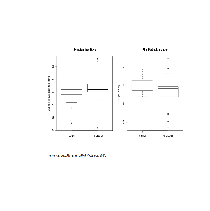
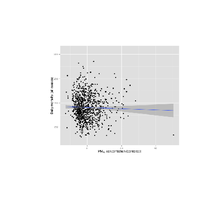
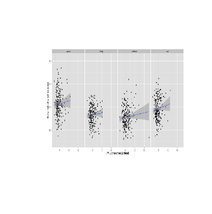
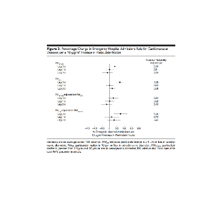

Lesson 1: Principles of Analytic Graphs
=========

  This lesson requires the ???jpeg??? package.

  Principles_of_Analytic_Graphs. (Slides for this and other Data Science courses may be found at github
  https://github.com/DataScienceSpecialization/courses/. If you care to use them, they must be downloaded as a zip file
  and viewed locally. This lesson corresponds to 04_ExploratoryAnalysis/Principles_of_Analytic_Graphics.)
  In this lesson, we'll discuss some basic principles of presenting data effectively. These will illustrate some
  fundamental concepts of displaying results in order to make them more meaningful and convincing. These principles are
  cribbed from Edward Tufte's great 2006 book, Beautiful Evidence. You can read more about them at the www.edwardtufte.com
  website.

  As a warm-up, which of the following would NOT be a good use of analytic graphing?

1: To show causality, mechanism, explanation
2: To show multivariate data
3: To decide which horse to bet on at the track
4: To show comparisons

3

  You're ready to start. Graphs give us a visual form of data, and the first principle of analytic graphs is to show some
  comparison. You'll hear more about this when you study statistical inference (another great course BTW), but evidence
  for a hypothesis is always relative to another competing or alternative hypothesis.

  Consider this boxplot which shows the relationship between the use of an air cleaner and the number of symptom-free days
  of asthmatic children. (The top and bottom lines of the box indicate the 25% and 75% quartiles of the data, and the
  horizontal line in the box shows the 50%.) Since the box is above 0, the number of symptom-free days for children with
  asthma is bigger using the air cleaner. This is good, right?

  The results for the median (50%) number of children is shown by the dark horizontal line which is around +1, so the
  improvement is about 1 day.

1: 12
2: 1
3: -2

2

  By showing the two boxplots side by side, you can clearly see that using the air cleaner increases the number of
  symptom-free days for most asthmatic children. The plot on the right (using the air cleaner) is generally higher than
  the one on the left (the control group).

4: 4

  So the first principle was to show a comparison. The second principle is to show causality or a mechanism of how your
  theory of the data works. This explanation or systematic structure shows your causal framework for thinking about the
  question you're trying to answer.

  Consider this plot which shows the dual boxplot we just showed, but next to it we have a corresponding plot of changes
  in measures of particulate matter.

  This picture tries to explain how the air cleaner increases the number of symptom-free days for asthmatic children.
  What mechanism does the graph imply?

 

1: That the air cleaner reduces pollution
2: That the air cleaner increases pollution
3: That the air in the control group is cleaner than the air in the other group
4: That the children in the control group are healthier

Selection: 1

  So the first principle was to show some comparison, the second was to show a mechanism, so what will the third
  principle say to show?
  Multivariate data!

  What is multivariate data you might ask? In technical (scientific) literature this term means more than 2 variables.
  Two-variable plots are what you saw in high school algebra.  Remember those x,y plots when you were learning about
  slopes and intercepts and equations of lines? They're valuable, but usually questions are more complicated and require
  more variables.

  Sometimes, if you restrict yourself to two variables you'll be misled and draw an incorrect conclusion.

  Consider this plot which shows the relationship between air pollution (x-axis) and mortality rates among the elderly
  (y-axis). The blue regression line shows a surprising result. (You'll learn about regression lines when you take the
  fabulous Regression Models course.)

  

  What does the blue regression line indicate?

1: As pollution increases more people die
2: As pollution increases the number of deaths doesn't change
3: As pollution increases fewer people die
4: Pollution doesn't really increase, it just gets reported more

Selection: 3

  Fewer deaths with more pollution? That's a surprise! Something's gotta be wrong, right? In fact, this is an example of
  Simpson's paradox, or the Yule???Simpson effect. Wikipedia (http://en.wikipedia.org/wiki/Simpson%27s_paradox) tells us
  that this "is a paradox in probability and statistics, in which a trend that appears in different groups of data
  disappears when these groups are combined."

  Suppose we divided this mortality/pollution data into the four seasons. Would we see different trends?

  Yes, we do! Plotting the same data for the 4 seasons individually we see a different result.

  What does the new plot indicate?

1: Pollution doesn't really increase, it just gets reported more
2: As pollution increases fewer people die in all seasons
3: As pollution increases the seasons change
4: As pollution increases more people die in all seasons

Selection: 4

  The fourth principle of analytic graphing involves integrating evidence. This means not limiting yourself to one form
  of expression. You can use words, numbers, images as well as diagrams. Graphics should make use of many modes of data
  presentation. Remember, "Don't let the tool drive the analysis!"

  To show you what we mean, here's an example of a figure taken from a paper published in the Journal of the AMA. It
  shows the relationship between pollution and hospitalization of people with heart disease. As you can see, it's a lot
  different from our previous plots. The solid circles in the center portion indicate point estimates of percentage
  changes in hospitalization rates for different levels of pollution. The lines through the circles indicate confidence
  intervals associated with these estimates. (You'll learn more about confidence intervals in another great course, the
  one on statistical inference.)

  Note that on the right side of the figure is another column of numbers, one for each of the point estimates given. This
  column shows posterior probabilities that relative risk is greater than 0. This, in effect, is a measure of the
  strength of the evidence showing the correlation between pollution and hospitalization.  The point here is that all of
  this information is located in one picture so that the reader can see the strength of not only the correlations but the
  evidence as well.

  The fifth principle of graphing involves describing and documenting the evidence with sources and appropriate labels
  and scales. Credibility is important so the data graphics should tell a complete story. Also, using R, you want to
  preserve any code you use to generate your data and graphics so that the research can be replicated if necessary. This
  allows for easy verification or finding bugs in your analysis.

  The sixth and final principle of analytic graphing is maybe the most important. Content is king! If you don't have
  something interesting to report, your graphs won't save you. Analytical presentations ultimately stand or fall
  depending on the quality, relevance, and integrity of their content.

