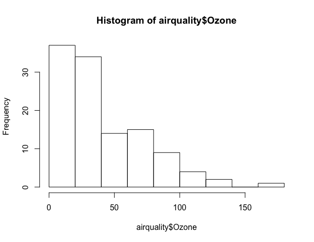
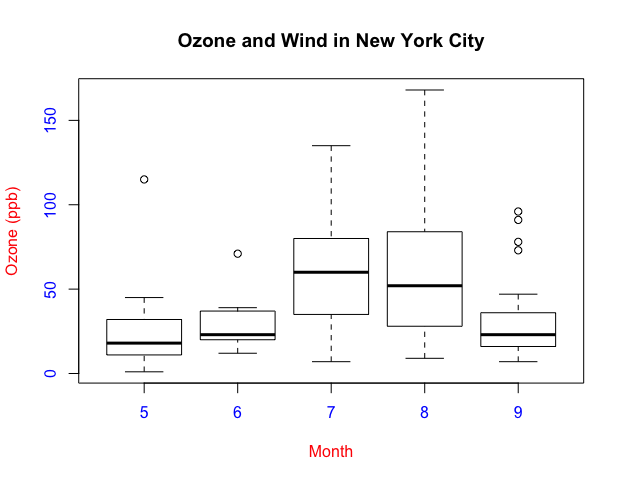
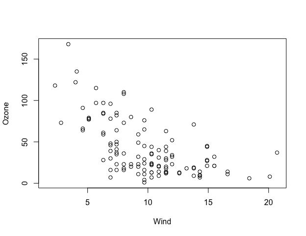
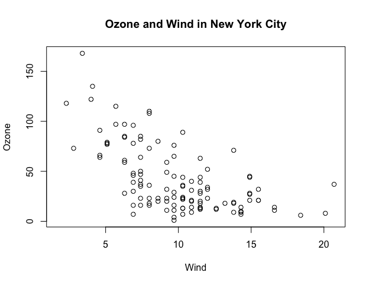
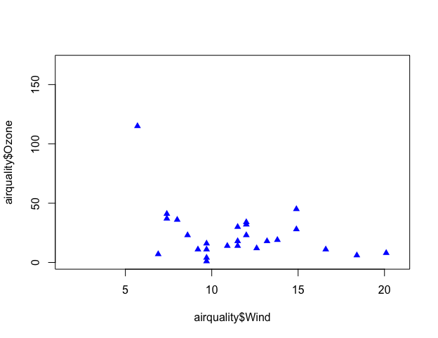
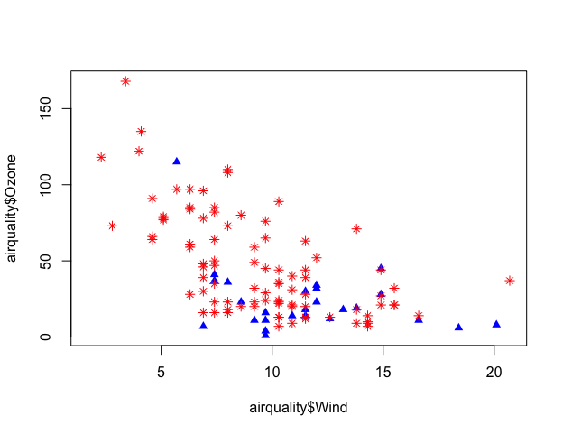
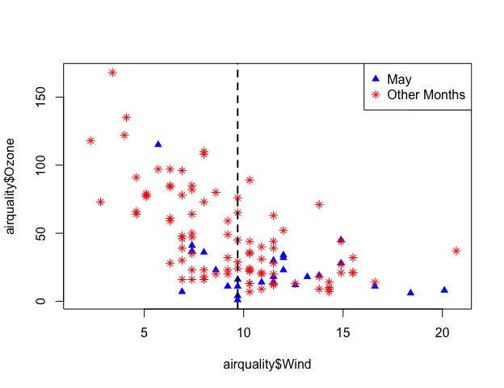
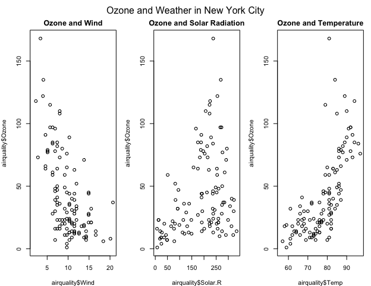

swirl Lesson 5: Base Plotting Systems
=====

  Base_Plotting_System. (Slides for this and other Data Science courses may be found at github
  https://github.com/DataScienceSpecialization/courses/. If you care to use them, they must be
  downloaded as a zip file and viewed locally. This lesson corresponds to
  04_ExploratoryAnalysis/PlottingBase.)

  In another lesson, we gave you an overview of the three plotting systems in R. In this lesson we'll
  focus on the base plotting system and talk more about how you can exploit all its many parameters to
  get the plot you want.  We'll focus on using the base plotting system to create graphics on the
  screen device rather than another graphics device.

  In another lesson, we gave you an overview of the three plotting systems in R. In this lesson we'll
  focus on the base plotting system and talk more about how you can exploit all its many parameters to
  get the plot you want.  We'll focus on using the base plotting system to create graphics on the
  screen device rather than another graphics device.

  The core plotting and graphics engine in R is encapsulated in two packages. The first is the
  graphics package which contains plotting functions for the "base" system. The functions in this
  package include plot, hist, boxplot, barplot, etc. The second package is grDevices which contains
  all the code implementing the various graphics devices, including X11, PDF, PostScript, PNG, etc.

  Base graphics are often constructed piecemeal, with each aspect of the plot handled separately
  through a particular function call. Usually you start with a plot function (such as plot, hist, or
  boxplot), then you use annotation functions (text, abline, points) to add to or modify your plot.

  Before making a plot you have to determine where the plot will appear and what it will be used for.
  Is there a large amount of data going into the plot? Or is it just a few points? Do you need to be
  able to dynamically resize the graphic?

  Calling a basic routine such as plot(x, y) or hist(x) launches a graphics device (if one is not
  already open) and draws a new plot on the device. If the arguments to plot or hist are not of some
  special class, then the default method is called.

  As you'll see, most of the base plotting functions have many arguments, for example, setting the
  title, labels of axes, plot character, etc. Some of the parameters can be set when you call the
  function or they can be added later in a separate function call.

  Now we'll go through some quick examples of basic plotting before we delve into gory details. We'll
  use the dataset airquality (part of the library datasets) which we've loaded for you. This shows
  ozone and other air measurements for New York City for 5 months in 1973.

  Use the R command head with airquality as an argument to see what the data looks like.
```r
> head(airquality)
  Ozone Solar.R Wind Temp Month Day
1    41     190  7.4   67     5   1
2    36     118  8.0   72     5   2
3    12     149 12.6   74     5   3
4    18     313 11.5   62     5   4
5    NA      NA 14.3   56     5   5
6    28      NA 14.9   66     5   6
```
  We see the dataset contains 6 columns of data. Run the command range with two arguments. The first
  is the ozone column of airquality, specified by airquality$Ozone, and the second is the boolean
  na.rm set equal to TRUE. If you don't specify this second argument, you won't get a meaningful
  result.
```r
> range(airquality$Ozone,na.rm = TRUE)
[1]   1 168
```
  So the measurements range from 1 to 168. First we'll do a simple histogram of this ozone column to
  show the distribution of measurements. Use the R command hist with the argument airquality$Ozone.
```r
> hist(airquality$Ozone)
```


  Simple, right? R put a title on the histogram and labeled both axes for you. What is the most
  frequent count?

1: Over 100
2: Between 60 and 75
3: Under 25
4: Over 150

Selection: 3

  Next we'll do a boxplot. First, though, run the R command table with the argument airquality$Month.
```r
> table(airquality$Month)

 5  6  7  8  9 
31 30 31 31 30 
```
  We see that the data covers 5 months, May through September. We'll want a boxplot of ozone as a
  function of the month in which the measurements were taken so we'll use the R formula Ozone~Month as
  the first argument of boxplot. Our second argument will be airquality, the dataset from which the
  variables of the first argument are taken.  Try this now.
```r
> boxplot(Ozone~Month,airquality)
```


  Let's call boxplot again to specify labels. (Use the up arrow to recover the previous command and
  save yourself some typing.) We'll add more arguments to the call to specify labels for the 2 axes.
  Set xlab equal to "Month" and ylab equal to "Ozone (ppb)". Specify col.axis equal to "blue" and
  col.lab equal to "red". Try this now.
```r
> boxplot(Ozone~Month,airquality, xlab="Month",ylab="Ozone (ppb)", col.axis ="blue" , col.lab="red")
```
  Nice colors, but still no title. Let's add one with the R command title. Use the argument main set
  equal to the string "Ozone and Wind in New York City".



  Now we'll show you how to plot a simple two-dimensional scatterplot using the R function plot. We'll
  show the relationship between Wind (x-axis) and Ozone (y-axis). We'll use the function plot with
  those two arguments (Wind and Ozone, in that order). To save some typing, though, we'll call the R
  command with using 2 arguments. The first argument of with will be airquality, the dataset
  containing Wind and Ozone; the second argument will be the call to plot. Doing this allows us to
  avoid using the longer notation, e.g., airquality$Wind. Try this now.
```r
> with(airquality, plot(Wind,Ozone))
```


  Add one now with the R command title. Use the argument main set equal to the string "Ozone and Wind
  in New York City". (You can use the up arrow to recover the command if you don't want to type it.)
```r
> title("Ozone and Wind in New York City")
```

  The basic plotting parameters are documented in the R help page for the function par. You can use
  par to set parameters OR to find out what values are already set. To see just how much flexibility
  you have, run the R command length with the argument par() now.



  The basic plotting parameters are documented in the R help page for the function par. You can use
  par to set parameters OR to find out what values are already set. To see just how much flexibility
  you have, run the R command length with the argument par() now.
```r
> length(par())
[1] 72
```
  So there are a boatload (72) of parameters that par() gives you access to. Run the R function names
  with par() as its argument to see what these parameters are.
```r
> names(par())
 [1] "xlog"      "ylog"      "adj"       "ann"       "ask"       "bg"        "bty"       "cex"      
 [9] "cex.axis"  "cex.lab"   "cex.main"  "cex.sub"   "cin"       "col"       "col.axis"  "col.lab"  
[17] "col.main"  "col.sub"   "cra"       "crt"       "csi"       "cxy"       "din"       "err"      
[25] "family"    "fg"        "fig"       "fin"       "font"      "font.axis" "font.lab"  "font.main"
[33] "font.sub"  "lab"       "las"       "lend"      "lheight"   "ljoin"     "lmitre"    "lty"      
[41] "lwd"       "mai"       "mar"       "mex"       "mfcol"     "mfg"       "mfrow"     "mgp"      
[49] "mkh"       "new"       "oma"       "omd"       "omi"       "page"      "pch"       "pin"      
[57] "plt"       "ps"        "pty"       "smo"       "srt"       "tck"       "tcl"       "usr"      
[65] "xaxp"      "xaxs"      "xaxt"      "xpd"       "yaxp"      "yaxs"      "yaxt"      "ylbias"   
```

  Variety is the spice of life. You might recognize some of these such as col and lwd from previous
  swirl lessons. You can always run ?par to see what they do. For now, run the command par()$pin and
  see what you get.
```r
> ?par
> par()$pin
[1] 5.260000 3.170417
```
  Alternatively, you could have gotten the same result by running par("pin") or par('pin')).  What do
  you think these two numbers represent?

1: A confidence interval
2: Coordinates of the center of the plot window
3: Random numbers
4: Plot dimensions in inches

Selection: 4

  What do you think the graphical parameter pch controls?

1: pc help
2: point control height
3: plot character
4: picture characteristics

Selection: 3


  The plot character default is the open circle, but it "can either be a single character or an
  integer code for one of a set of graphics symbols." Run the command par("pch") to see the integer
  value of the default. When you need to, you can use R's Documentation (?pch) to find what the other
  values mean.

  The par() function is used to specify global graphics parameters that affect all plots in an R
  session. (Use dev.off or plot.new to reset to the defaults.) These parameters can be overridden when
  specified as arguments to specific plotting functions. These include las (the orientation of the
  axis labels on the plot), bg (background color), mar (margin size), oma (outer margin size), mfrow
  and mfcol (number of plots per row, column).

  Before we close, let's test your ability to make a somewhat complicated scatterplot. First run plot
  with 3 arguments. airquality$Wind, airquality$Ozone, and type set equal to "n". This tells R to set
  up the plot but not to put the data in it.
```r
> plot(airquality$Wind, airquality$Ozone,  type = "n")
```
  Now for the test. (You might need to check R's documentation for some of these.) Add a title with
  the argument main set equal to the string "Wind and Ozone in NYC"
```r
> title("Wind and Ozone in NYC")
```


  Now create a variable called may by subsetting airquality appropriately. (Recall that the data
  specifies months by number and May is the fifth month of the year.)

```r
may <- subset(airquality, Month==5)
```
  Now use the R command points to plot May's wind and ozone (in that order) as solid blue triangles.
  You have to set the color and plot character with two separate arguments. Note we use points because
  we're adding to an existing plot.

```r
> points(may$Wind,may$Ozone,col="blue",pch=17) 
```


  Now create the variable notmay by subsetting airquality appropriately.
```r
> notmay <- subset(airquality, Month!=5)
```
  Now use the R command points to plot these notmay's wind and ozone (in that order) as red
  snowflakes.
```r
> points(notmay$Wind,notmay$Ozone,col="red",pch=8)
```


  Now we'll use the R command legend to clarify the plot and explain what it means. The function has a
  lot of arguments, but we'll only use 4. The first will be the string "topright" to tell R where to
  put the legend. The remaining 3 arguments will each be 2-long vectors created by R's concatenate
  function, e.g., c(). These arguments are pch, col, and legend. The first is the vector (17,8), the
  second ("blue","red"), and the third ("May","Other Months"). Try it now.
```r
> legend("topright",pch = c(17,8),col = c("blue","red"),legend = c("May","Other Months"))
```


  Now add a vertical line at the median of airquality$Wind. Make it dashed (lty=2) with a width of 2.
```r
> abline(v=median(airquality$Wind), lty=2, lwd=2)
```



  Use par with the parameter mfrow set equal to the vector (1,2) to set up the plot window for two
  plots side by side. You won't see a result.
```r
> par(mfrow=c(1,2))
```
  Now plot airquality$Wind and airquality$Ozone and use main to specify the title "Ozone and Wind".
```r
> plot(airquality$Wind, airquality$Ozone, main="Ozone and Wind" )
```
  Plot airquality$Ozone and airquality$Solar.R and use main to specify the title "Ozone and Solar
  Radiation".
```r
> plot(airquality$Ozone, airquality$Solar.R, main = "Ozone and Solar Radiation")
```


  This one with 3 plots, to illustrate inner and outer margins. First, set up the plot window by
  typing par(mfrow = c(1, 3), mar = c(4, 4, 2, 1), oma = c(0, 0, 2, 0))
```r
> par(mfrow = c(1, 3), mar = c(4, 4, 2, 1), oma = c(0, 0, 2, 0))
```
  The first plot should be familiar. Plot airquality$Wind and airquality$Ozone with the title
  (argument main) as "Ozone and Wind".
```r
> 
> plot(airquality$Wind, airquality$Ozone, main="Ozone and Wind")
```
  Plot airquality$Solar.R and airquality$Ozone with the title (argument main) as "Ozone and Solar
  Radiation".
```r
> plot(airquality$Solar.R, airquality$Ozone, main="Ozone and Solar Radiation")
```
  Plot airquality$Temp and airquality$Ozone with the title (argument main) as "Ozone and Temperature".
```r
> plot(airquality$Temp, airquality$Ozone, main="Ozone and Temperature")
```
  Since this is the main title, we specify it with the R command mtext. Call mtext with the string
  "Ozone and Weather in New York City" and the argument outer set equal to TRUE.
```r
> mtext("Ozone and Weather in New York City", outer = TRUE)
```



