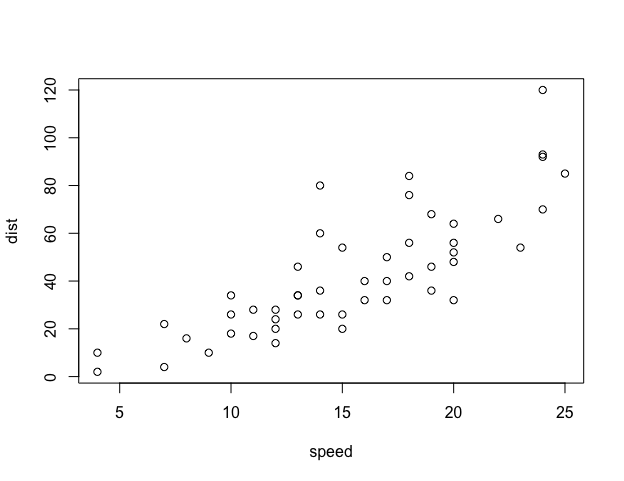
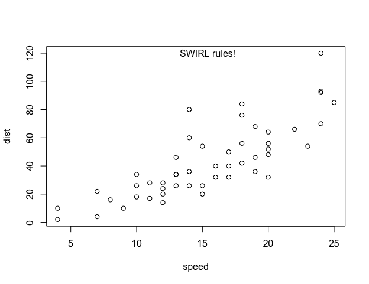
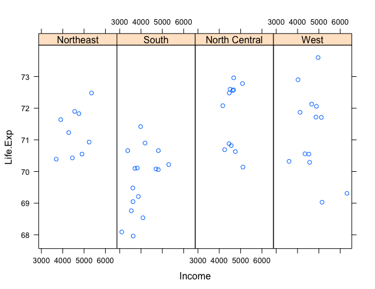

swirl Lesson 4: Plotting Systems
=====

  Plotting_Systems. (Slides for this and other Data Science courses may be found at github
  https://github.com/DataScienceSpecialization/courses/. If you care to use them, they must be
  downloaded as a zip file and viewed locally. This lesson corresponds to
  04_ExploratoryAnalysis/PlottingSystems.)

  In this lesson, we'll give you a brief overview of the three plotting systems in R, their
  differences, strengths, and weaknesses. We'll only cover the basics here to give you a general idea
  of the systems and in later lessons we'll cover each system in more depth.

  The first plotting system is the Base Plotting System which comes with R. It's the oldest system
  which uses a simple "Artist's palette" model. What this means is that you start with a blank canvas
  and build your plot up from there, step by step.

  Usually you start with a plot function (or something similar), then you use annotation functions to
  add to or modify your plot. R provides many annotating functions such as text, lines, points, and
  axis. R provides documentation for each of these. They all add to an already existing plot.

Base system 
----

The base system is very intuitive and easy to use when you're starting to do exploratory
  graphing and looking for a research direction. You can't go backwards, though, say, if you need to
  readjust margins or fix a misspelled a caption. A finished plot will be a series of R commands, so
  it's difficult to translate a finished plot into a different system.

  We've loaded the dataset cars for you to demonstrate how easy it is to plot. First, use the R
  command head with cars as an argument to see what the data looks like.
```r
> head(cars)
  speed dist
1     4    2
2     4   10
3     7    4
4     7   22
5     8   16
6     9   10
```
  So the dataset collates the speeds and distances needed to stop for 50 cars. This data was recorded
  in the 1920's.

  We'll use the R command with which takes two arguments. The first specifies a dataset or environment
  in which to run the second argument, an R expression. This will save us a bit of typing. Try running
  the command with now using cars as the first argument and a call to plot as the second. The call to
  plot will take two arguments, speed and dist. Please specify them in that order.
```r
> with(cars,plot(speed,dist))
```



  Simple, right? You can see the relationship between the two variables, speed and distance. The first
  variable is plotted along the x-axis and the second along the y-axis.

  Now we'll show you what the function text does. Run the command text with three arguments. The first
  two, x and y coordinates, specify the placement of the third argument, the text to be added to the
  plot. Let the first argument be mean(cars$speed), the second max(cars$dist), and the third the
  string "SWIRL rules!". Try it now.
```r
> text(mean(cars$speed),max(cars$dist),"SWIRL rules!")
```


the Lattice System
----

  Now we'll move on to the second plotting system, the Lattice System which comes in the package of
  the same name. Unlike the Base System, lattice plots are created with a single function call such as
  xyplot or bwplot. Margins and spacing are set automatically because the entire plot is specified at
  once.

  The lattice system is most useful for conditioning types of plots which display how y changes with x
  across levels of z. The variable z might be a categorical variable of your data. This system is also
  good for putting many plots on a screen at once.

  The lattice system has several disadvantages. First, it is sometimes awkward to specify an entire
  plot in a single function call. Annotating a plot may not be especially intuitive. Second, using
  panel functions and subscripts is somewhat difficult and requires preparation. Finally, you cannot
  "add" to the plot once it is created as you can with the base system.


  As before, we've loaded some data for you in the variable state. This data comes with the lattice
  package and it concerns various characteristics of the 50 states in the U.S. Use the R command head
  to see the first few entries of state now.
```r
> head(state)
           Population Income Illiteracy Life.Exp Murder HS.Grad Frost   Area region
Alabama          3615   3624        2.1    69.05   15.1    41.3    20  50708  South
Alaska            365   6315        1.5    69.31   11.3    66.7   152 566432   West
Arizona          2212   4530        1.8    70.55    7.8    58.1    15 113417   West
Arkansas         2110   3378        1.9    70.66   10.1    39.9    65  51945  South
California      21198   5114        1.1    71.71   10.3    62.6    20 156361   West
Colorado         2541   4884        0.7    72.06    6.8    63.9   166 103766   West
```
  As you can see state holds 9 pieces of information for each of the 50 states. The last variable,
  region, specifies a category for each state. Run the R command table with the argument state$region
  to see how many categories there are and how many states are in each.
```r
> table(state$region)

    Northeast         South North Central          West 
            9            16            12            13 
      ```      
  So there are 4 categories and the 50 states are sorted into them appropriately. Let's use the
  lattice command xyplot to see how life expectancy varies with income in each of the four regions.
  To do this we'll give xyplot 3 arguments. The first is the most complicated. It is this R formula,
  Life.Exp ~ Income   region, which indicates we're plotting life expectancy as it depends on income
  for each region. The second argument, data, is set equal to state. This allows us to use "Life.Exp"
  and "Income" in the formula instead of specifying the dataset state for each term (as in
  state$Income). The third argument, layout, is set equal to the two-long vector c(4,1). Run xyplot
  now with these three arguments.
```r
> xyplot(Life.Exp ~ Income   region,state,c(4,1))
```

```r
> xyplot(Life.Exp ~ Income   region, data = state, layout = c(4, 1))
```


  We see the data for each of the 4 regions plotted in one row. Based on this plot, which region of
  the U.S. seems to have the shortest life expectancy?

1: Northeast
2: South
3: North Central
4: West

Selection: 2


  Just for fun rerun the xyplot and this time set layout to the vector c(2,2). To save typing use the
  up arrow to recover the previous xyplot command.
```r
> xyplot(Life.Exp ~ Income   region, data = state, layout = c(2, 2))
```


The ggplot2 plotting system
----

  See how the plot changed? No need for you to worry about margins or labels. The package took care of
  all that for you.

  Now for the last plotting system, ggplot2, which is a hybrid of the base and lattice systems. It
  automatically deals with spacing, text, titles (as Lattice does) but also allows you to annotate by
  "adding" to a plot (as Base does), so it's the best of both worlds.


  Although ggplot2 bears a superficial similarity to lattice, it's generally easier and more intuitive
  to use. Its default mode makes many choices for you but you can still customize a lot. The package
  is based on a "grammar of graphics" (hence the gg in the name), so you can control the aesthetics of
  your plots. For instance, you can plot conditioning graphs and panel plots as we did in the lattice
  example.

  We'll see an example now of ggplot2 with a simple (single) command. As before, we've loaded a
  dataset for you from the ggplot2 package. This mpg data holds fuel economy data between 1999 and
  2008 for 38 different models of cars. Run head with mpg as an argument so you get an idea of what
  the data looks like.
```r
> head(mpg)
# A tibble: 6 x 11
  manufacturer model displ  year   cyl      trans   drv   cty   hwy    fl   class
         <chr> <chr> <dbl> <int> <int>      <chr> <chr> <int> <int> <chr>   <chr>
1         audi    a4   1.8  1999     4   auto(l5)     f    18    29     p compact
2         audi    a4   1.8  1999     4 manual(m5)     f    21    29     p compact
3         audi    a4   2.0  2008     4 manual(m6)     f    20    31     p compact
4         audi    a4   2.0  2008     4   auto(av)     f    21    30     p compact
5         audi    a4   2.8  1999     6   auto(l5)     f    16    26     p compact
6         audi    a4   2.8  1999     6 manual(m5)     f    18    26     p compact
```
```r
> dim(mpg)
[1] 234  11
```
  Holy cow! That's a lot of information for just 38 models of cars. Run the R command table with the
  argument mpg$model. This will tell us how many models of cars we're dealing with.
```r
> table(mpg$model)

           4runner 4wd                     a4             a4 quattro             a6 quattro 
                     6                      7                      8                      3 
                altima     c1500 suburban 2wd                  camry           camry solara 
                     6                      5                      7                      7 
           caravan 2wd                  civic                corolla               corvette 
                    11                      9                      5                      5 
     dakota pickup 4wd            durango 4wd         expedition 2wd           explorer 4wd 
                     9                      7                      3                      6 
       f150 pickup 4wd           forester awd     grand cherokee 4wd             grand prix 
                     7                      6                      8                      5 
                   gti            impreza awd                  jetta        k1500 tahoe 4wd 
                     5                      8                      9                      4 
land cruiser wagon 4wd                 malibu                 maxima        mountaineer 4wd 
                     2                      5                      3                      4 
               mustang          navigator 2wd             new beetle                 passat 
                     9                      3                      6                      7 
        pathfinder 4wd    ram 1500 pickup 4wd            range rover                 sonata 
                     4                     10                      4                      7 
               tiburon      toyota tacoma 4wd 
                     7                      7 

```
  Oh, there are 38 models. We're interested in the effect engine displacement (displ) has on highway
  gas mileage (hwy), so we'll use the ggplot2 command qplot to display this relationship. Run qplot
  now with three arguments. The first two are the variables displ and hwy we want to plot, and the
  third is the argument data set equal to mpg. As before, this allows us to avoid using the
  mpg$variable notation for the first two arguments.
```r
> qplot(displ,hwy,data=mpg)
```


