Lesson 2: Exploratory Graphs
=========

  In this lesson, we'll discuss why graphics are an important tool for data scientists and the special role that exploratory
  graphs play in the field.

  Exploratory graphs serve mostly the same functions as graphs. They help us find patterns in data and understand its
  properties. They suggest modeling strategies and help to debug analyses. We DON'T use exploratory graphs to communicate
  results.

  Instead, exploratory graphs are the initial step in an investigation, the "quick and dirty" tool used to point the data
  scientist in a fruitful direction. A scientist might need to make a lot of exploratory graphs in order to develop a personal
  understanding of the problem being studied. Plot details such as axes, legends, color and size are cleaned up later to
  convey more information in an aesthetically pleasing way.

  To demonstrate these ideas, we've copied some data for you from the U.S. Environmental Protection Agency (EPA) which sets
  national ambient air quality standards for outdoor air pollution. These Standards say that for fine particle pollution
  (PM2.5), the "annual mean, averaged over 3 years" cannot exceed 12 micro grams per cubic meter. We stored the data from the
  U.S. EPA web site in the data frame pollution. Use the R function head to see the first few entries of pollution.

```r
> head(pollution)
       pm25  fips region longitude latitude
1  9.771185 01003   east -87.74826 30.59278
2  9.993817 01027   east -85.84286 33.26581
3 10.688618 01033   east -87.72596 34.73148
4 11.337424 01049   east -85.79892 34.45913
5 12.119764 01055   east -86.03212 34.01860
6 10.827805 01069   east -85.35039 31.18973
```

  We see right away that there's at least one county exceeding the EPA's standard of 12 micrograms per cubic meter. What else
  do we see?

  We see 5 columns of data. The pollution count is in the first column labeled pm25. We'll work mostly with that. The other 4
  columns are a fips code indicating the state (first 2 digits) and county (last 3 digits) with that count, the associated
  region (east or west), and the longitude and latitude of the area. Now run the R command dim with pollution as an argument
  to see how long the table is.
```r
> dim(pollution)
[1] 576   5
```
  So there are 576 entries in pollution. We'd like to investigate the question "Are there any counties in the U.S. that exceed
  that national standard (12 micro grams per cubic meter) for fine particle pollution?" We'll look at several one dimensional
  summaries of the data to investigate this question.

  The first technique uses the R command summary, a 5-number summary which returns 6 numbers. Run it now with the pm25 column
  of pollution as its argument. Recall that the construct for this is pollution$pm25.
```r
> summary(pollution$pm25)
   Min. 1st Qu.  Median    Mean 3rd Qu.    Max. 
  3.383   8.549  10.050   9.836  11.360  18.440 
  ```
  This shows us basic info about the pm25 data, namely its Minimum (0 percentile) and Maximum (100 percentile) values, and
  three Quartiles of the data. These last indicate the pollution measures at which 25%, 50%, and 75% of the counties fall
  below. In addition to these 5 numbers we see the Mean or average measure of particulate pollution across the 576 counties.

  Half the measured counties have a pollution level less than or equal to what number of micrograms per cubic meter?
```r
1: 9.836
2: 8.549
3: 11.360
4: 10.050

Selection: 4
```
  To save you a lot of typing we've saved off pollution$pm25 for you in the variable ppm. You can use ppm now in place of the
  longer expression. Try it now as the argument of the R command quantile. See how the results look a lot like the results of
  the output of the summary command.
```r
> quantile(ppm)
       0%       25%       50%       75%      100% 
 3.382626  8.548799 10.046697 11.356012 18.440731 
```

  See how the results are similar to those returned by summary? Quantile gives the quartiles, right? What is the one value
  missing from this quantile output that summary gave you?
```r
1: the minimum value
2: the mean
3: the maximum value
4: the median

Selection: 2
```
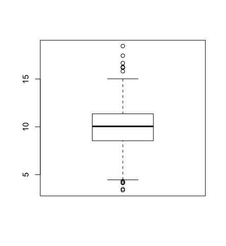

  The boxplot shows us the same quartile data that summary and quantile did. The lower and upper edges of the blue box
  respectively show the values of the 25% and 75% quantiles.

  What do you think the horizontal line inside the box represents?
```r
1: the median
2: the minimum value
3: the mean
4: the maximum value

Selection: 1
```
  The "whiskers" of the box (the vertical lines extending above and below the box) relate to the range parameter of boxplot,
  which we let default to the value 1.5 used by R. The height of the box is the interquartile range, the difference between
  the 75th and 25th quantiles. In this case that difference is 2.8. The whiskers are drawn to be a length of range*2.8 or
  1.5*2.8. This shows us roughly how many, if any, data points are outliers, that is, beyond this range of values.

  Note that boxplot is part of R's base plotting package. A nice feature that this package provides is its ability to overlay
  features. That is, you can add to (annotate) an existing plot.

  To see this, run the R command abline with the argument h equal to 12. Recall that 12 is the EPA standard for air quality.
```r
> abline(h = 12)
```
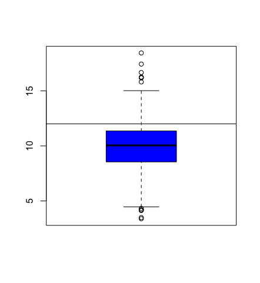

  Now use the R command hist (another function from the base package) with the argument ppm. Specify the color parameter col
  equal to "green". This will plot a histogram of the data.

                                                          

  So abline "adds one or more straight lines through the current plot." We see from the plot that the bulk of the measured
  counties comply with the standard since they fall under the line marking that standard.
                                                                            

  Now use the R command hist (another function from the base package) with the argument ppm. Specify the color parameter col
  equal to "green". This will plot a histogram of the data.
```r
> hist(ppm, col = "green")
```
                                                                          

  The histogram gives us a little more detailed information about our data, specifically the distribution of the pollution
  counts, or how many counties fall into each bucket of measurements.
```r
> rug(ppm)
```
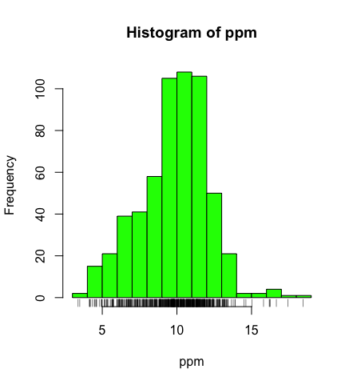

  This one-dimensional plot, with its grayscale representation, gives you a little more detailed information about how many
  data points are in each bucket and where they lie within the bucket. It shows (through density of tick marks) that the
  greatest concentration of counties has between 9 and 12 micrograms per cubic meter just as the histogram did.

  To illustrate this a little more, we've defined for you two vectors, high and low, containing pollution data of high
  (greater than 15) and low (less than 5) values respectively. Look at low now and see how it relates to the output of rug.
```r
> low
 [1] 3.494351 4.186090 4.917140 4.504539 4.793644 4.601408 4.195688 4.625279 4.460193 4.978397 4.324736 4.175901 3.382626
[14] 4.132739 4.955570 4.565808

> high
[1] 16.19452 15.80378 18.44073 16.66180 15.01573 17.42905 16.25190 16.18358
```
  Again, we see one data point greater than 18, one between 17 and 18, several between 16 and 17 and two between 15 and 16,
  verifying what rug indicated.

  Now rerun hist with 3 arguments, ppm as its first, col equal to "green", and the argument breaks equal to 100.
```r
> hist(ppm, col = "green", breaks = 100)
```
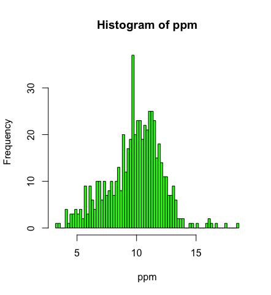

  What do you think the breaks argument specifies in this case?
```r
1: the number of data points to graph
2: the number of buckets to split the data into
3: the number of counties exceeding the EPA standard
4: the number of stars in the sky

Selection: 2
```
  So this histogram with more buckets is not nearly as smooth as the preceding one. In fact, it's a little too noisy to see
  the distribution clearly. When you're plotting histograms you might have to experiment with the argument breaks to get a
  good idea of your data's distribution. For fun now, rerun the R command rug with the argument ppm.
```r
> rug(ppm)
```
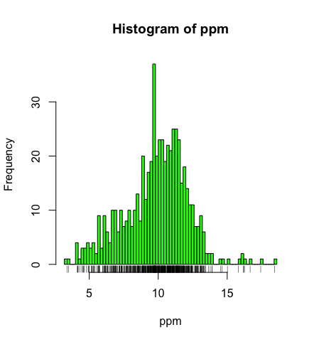

  See how rug works with the existing plot? It automatically adjusted its pocket size to that of the last plot plotted.

  Now run the command abline with the argument v equal to 12 and the argument lwd equal to 2.
```r
> abline(v=12, lwd=2)
```
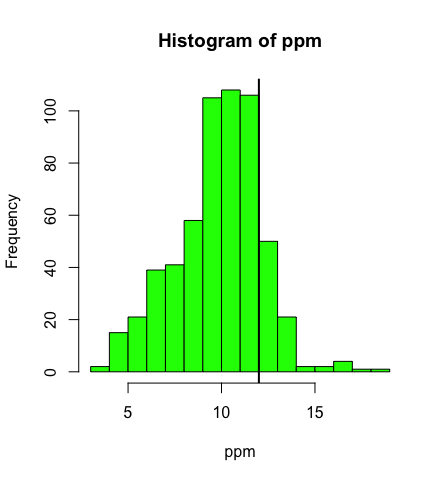

  See the vertical line at 12? Not very visible, is it, even though you specified a line width of 2? Run abline with the
  argument v equal to median(ppm), the argument col equal to "magenta", and the argument lwd equal to 4.

```r
> abline(v= median(ppm), col="magenta", lwd = 4)
```


  Better, right? Thicker and more of a contrast in color. This shows that although the median (50%) is below the standard,
  there are a fair number of counties in the U.S that have pollution levels higher than the standard.

  Now recall that our pollution data had 5 columns of information. So far we've only looked at the pm25 column. We can also
  look at other information. To remind yourself what's there run the R command names with pollution as the argument.

```r
>  names(pollution)
[1] "pm25"      "fips"      "region"    "longitude" "latitude" 
```
  Longitude and latitude don't sound interesting, and each fips is unique since it identifies states (first 2 digits) and
  counties (last 3 digits). Let's look at the region column to see what's there. Run the R command table on this column. Use
  the construct pollution$region. Store the result in the variable reg.
```r
> reg <- table(pollution$region)

> reg

east west 
 442  134 
 ```
   Lot more counties in the east than west. We'll use the R command barplot (another type of one-dimensional summary) to plot
  this information. Call barplot with reg as its first argument, the argument col equal to "wheat", and the argument main
  equal to the string "Number of Counties in Each Region".
```r
> barplot(reg, col = "wheat", main = "Number of Counties in Each Region")

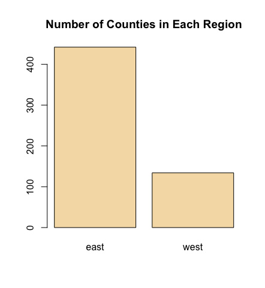
```
  So we've seen several examples of one-dimensional graphs that summarize data. Two dimensional graphs include scatterplots,
  multiple graphs which we'll see more examples of, and overlayed one-dimensional plots which the R packages such as lattice
  and ggplot2 provide.

  Some graphs have more than two-dimensions. These include overlayed or multiple two-dimensional plots and spinning plots.
  Some three-dimensional plots are tricky to understand so have limited applications. We'll see some examples now of more
  complicated graphs, in particular, we'll show two graphs together.

  First we'll show how R, in one line and using base plotting, can display multiple boxplots. We simply specify that we want
  to see the pollution data as a function of region. We know that our pollution data characterized each of the 576 entries as
  belonging to one of two regions (east and west).

  We use the R formula y ~ x to show that y (in this case pm25) depends on x (region). Since both come from the same data
  frame (pollution) we can specify a data argument set equal to pollution. By doing this, we don't have to type pollution$pm25
  (or ppm) and pollution$region. We can just specify the formula pm25~region. Call boxplot now with this formula as its
  argument, data equal to pollution, and col equal to "red".
```r
> boxplot( pm25 ~ region,pollution, col = "red")
```
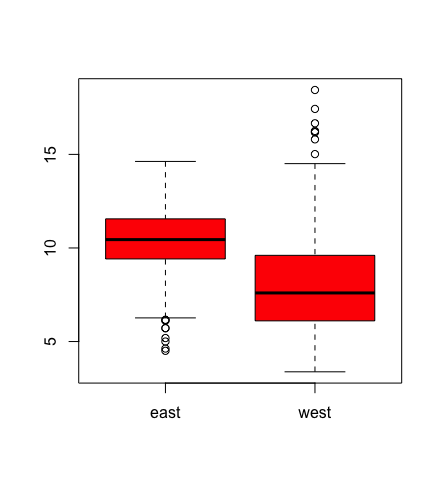

  Two for the price of one! Similarly we can plot multiple histograms in one plot, though to do this we have to use more than
  one R command. First we have to set up the plot window with the R command par which specifies how we want to lay out the
  plots, say one above the other. We also use par to specify margins, a 4-long vector which indicates the number of lines for
  the bottom, left, top and right. Type the R command par(mfrow=c(2,1),mar=c(4,4,2,1)) now. Don't expect to see any new
  result.
```r
> par(mfrow=c(2,1)
+ ,mar=c(4,4,2,1))
```
  So we set up the plot window for two rows and one column with the mfrow argument. The mar argument set up the margins.
  Before we plot the histograms let's explore the R command subset which, not surprisingly, "returns subsets of vectors,
  matrices or data frames which meet conditions". We'll use subset to pull off the data we want to plot. Call subset now with
  pollution as its first argument and a boolean expression testing region for equality with the string "east". Put the result
  in the variable east.
```r
> east <- subset(pollution, region == "east")

> head(east)
       pm25  fips region longitude latitude
1  9.771185 01003   east -87.74826 30.59278
2  9.993817 01027   east -85.84286 33.26581
3 10.688618 01033   east -87.72596 34.73148
4 11.337424 01049   east -85.79892 34.45913
5 12.119764 01055   east -86.03212 34.01860
6 10.827805 01069   east -85.35039 31.18973
```
  So east holds more information than we need. We just want to plot a histogram with the pm25 portion. Call hist now with the
  pm25 portion of east as its first argument and col equal to "green" as its second.
```r
> hist(east$pm25, col = "green")
```
  Now, here's a challenge for you. Plot the histogram of the counties from the west using just one R command. Let the
  appropriate subset command (with the pm25 portion specified) be the first argument and col (equal to "green") the second.
  To cut down on your typing, use the up arrow key to get your last command and replace "east" with the subset command. Make
  sure the boolean argument checks for equality between region and "west".
```r
> hist(subset(pollution,region=="west")$pm25, col = "green") 
```
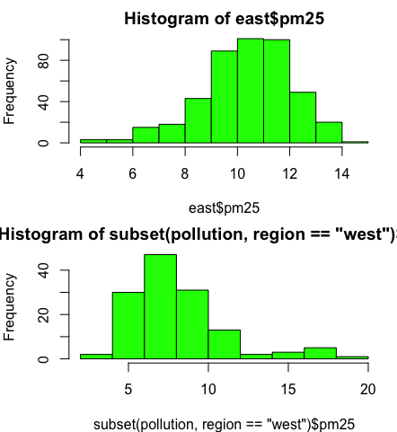

  Scatter plots are two-dimensional plots which show the relationship between two variables, usually x and y. Let's look at a
  scatterplot showing the relationship between latitude and the pm25 data. We'll use plot, a function from R's base plotting
  package.

  We've seen that we can use a function call as an argument when calling another function. We'll do this again when we call
  plot with the arguments latitude and pm25 which are both from our data frame pollution. We'll call plot from inside the R
  command with which evaluates "an R expression in an environment constructed from data". We'll use pollution as the first
  argument to with and the call to plot as the second. This allows us to avoid typing "pollution$" before the arguments to
  plot, so it saves us some typing and adds to your base of R knowledge. Try this now.

```r
> with(pollution,plot(latitude,pm25))
```
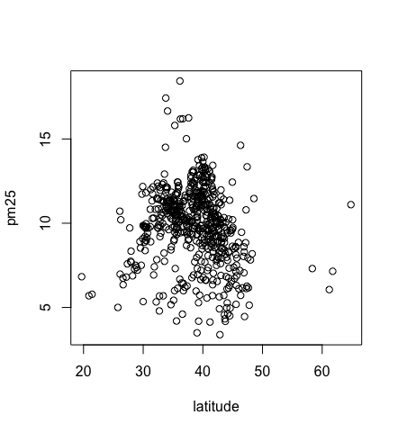

  Note that the first argument is plotted along the x-axis and the second along the y. Now use abline to add a horizontal line
  at 12. Use two additional arguments, lwd equal to 2 and lty also equal to 2. See what happens.


> abline(h=12, lwd=2,lty=2)


  See how lty=2 made the line dashed? Now let's replot the scatterplot. This time, instead of using with, call plot directly
  with 3 arguments. The first 2 are pollution$latitude and ppm. The third argument, col, we'll use to add color and more
  information to our plot. Set this argument (col) equal to pollution$region and see what happens.

```r
> plot(pollution$latitude,ppm, col = pollution$region)
```
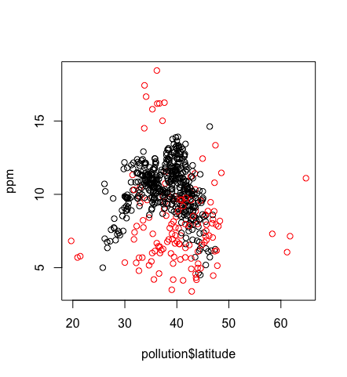

  We've got two colors on the map to distinguish between counties in the east and those in the west. Can we figure out which
  color is east and which west? See that the high (greater than 50) and low (less than 25) latitudes are both red. Latitudes
  indicate distance from the equator, so which half of the U.S. (east or west) has counties at the extreme north and south?
```r
1: east
2: west
Selection: 2
```
  As before, use abline to add a horizontal line at 12. Use two additional arguments, lwd equal to 2 and lty also equal to 2.
```r
> abline (h=12, lwd = 2, lty=2)
```
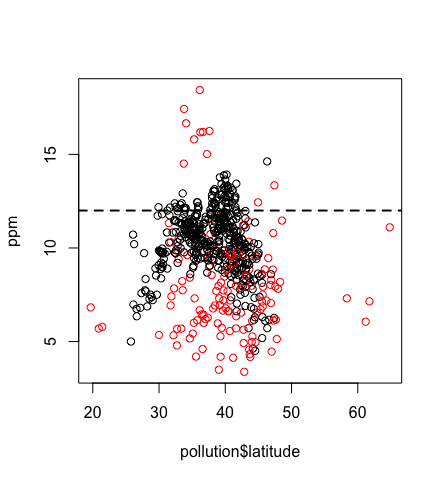

  We see many counties are above the healthy standard set by the EPA, but it's hard to tell overall, which region, east or
  west, is worse.

  Let's plot two scatterplots distinguished by region.

  As we did with multiple histograms, we first have to set up the plot window with the R command par. This time, let's plot
  the scatterplots side by side (one row and two columns). We also need to use different margins. Type the R command par(mfrow
  = c(1, 2), mar = c(5, 4, 2, 1)) now. Don't expect to see any new result.
```r
> par(mfrow = c(1, 2), mar = c(5, 4, 2, 1))
```
  For the first scatterplot, on the left, we'll plot the latitudes and pm25 counts from the west. We already pulled out the
  information for the counties in the east. Let's now get the information for the counties from the west. Create the variable
  west by using the subset command with pollution as the first argument and the appropriate boolean as the second.
```r
west <- subset(pollution,region=="west")
```
  Now call plot with three arguments. These are west$latitude (x-axis), west$pm25 (y-axis), and the argument main equal to the
  string "West" (title). Do this now.
```r
> plot(x=west$latitude, y=west$pm25, main = "West")
```

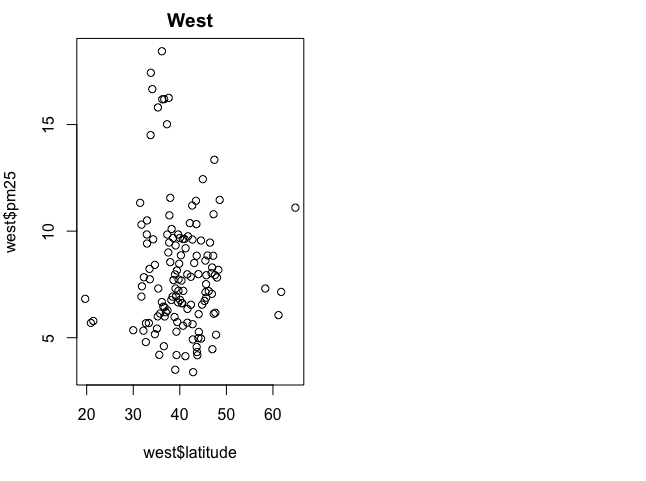

  For the second scatterplot, on the right, we'll plot the latitudes and pm25 counts from the east.

  As before, use the up arrow key and change the 3 "West" strings to "East".
```r
> plot(x=east$latitude, y=east$pm25, main = "East")
```

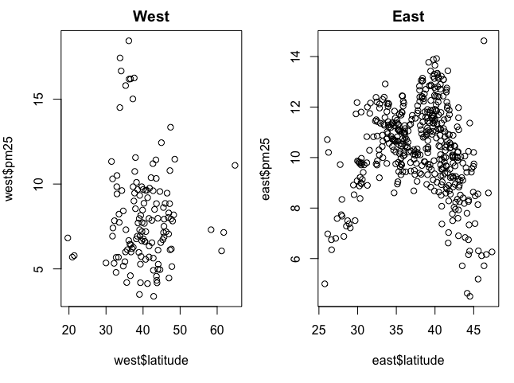

  See how R took care of all the details for you? Nice, right? It looks like there are more dirty
  counties in the east but the extreme dirt (greater than 15) is in the west.

  Which of the following characterizes exploratory plots?
```r
1: slow and steady
2: quick and dead
3: slow and clean
4: quick and dirty
Selection: 4
```
  True or false? Plots let you summarize the data (usually graphically) and highlight any broad
  features
```r
1: False
2: True

Selection: 2
```


