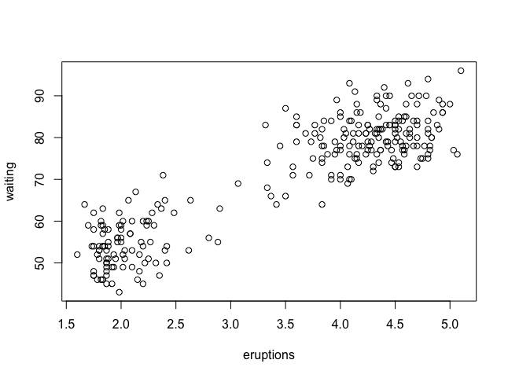
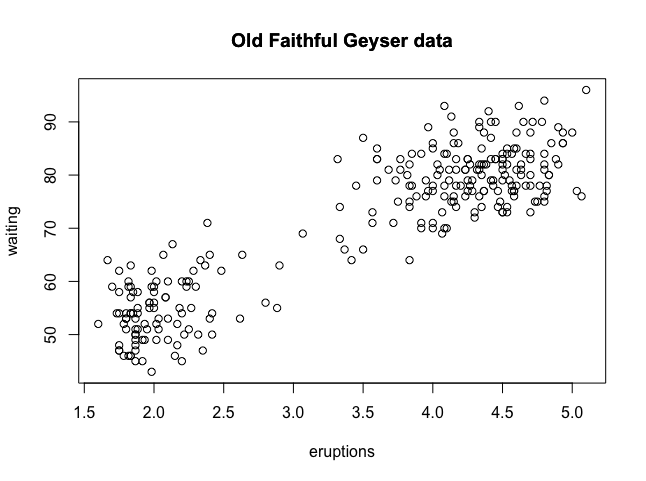
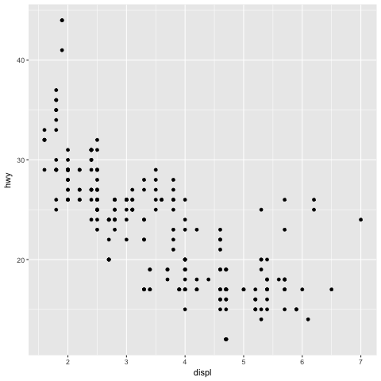

Graphics Devices in R 
================


  Graphics_Devices_in_R. (Slides for this and other Data Science courses may be found at github
  https://github.com/DataScienceSpecialization/courses/. If you care to use them, they must be
  downloaded as a zip file and viewed locally. This lesson corresponds to
  04_ExploratoryAnalysis/Graphics_Devices_in_R.)

  As the title suggests, this will be a short lesson introducing you to graphics devices in R. So,
  what IS a graphics device?

  Would you believe that it is something where you can make a plot appear, either a screen device,
  such as a window on your computer, OR a file device?

  There are several different kinds of file devices with particular characteristics and hence uses
  These include PDF, PNG, JPEG, SVG, and TIFF. We'll talk more about these later.

  To be clear, when you make a plot in R, it has to be "sent" to a specific graphics device.
  Usually this is the screen (the default device), especially when you're doing exploratory work.
  You'll send your plots to files when you're ready to publish a report, make a presentation, or
  send info to colleagues.

  How you access your screen device depends on what computer system you're using. On a Mac the
  screen device is launched with the call quartz(), on Windows you use the call windows(), and on
  Unix/Linux x11().  On a given platform (Mac, Windows, Unix/Linux) there is only one screen
  device, and obviously not all graphics devices are available on all platforms (i.e. you cannot
  launch windows() on a Mac).

The following graphics devices are currently available:

* pdf Write PDF graphics commands to a file

* postscript Writes PostScript graphics commands to a file

* xfig Device for XFIG graphics file format

* bitmap bitmap pseudo-device via Ghostscript (if available).

* pictex Writes TeX/PicTeX graphics commands to a file (of historical interest only)

The following devices will be functional if R was compiled to use them (they exist but will return with a warning on other systems):

* X11 The graphics device for the X11 windowing system

* cairo_pdf, cairo_ps PDF and PostScript devices based on cairo graphics.

* svg SVG device based on cairo graphics.

* png PNG bitmap device

* jpeg JPEG bitmap device

* bmp BMP bitmap device

* tiff TIFF bitmap device

* quartz The graphics device for the macOS native Quartz 2d graphics system. (This is only functional on macOS where it can be used from the R.app GUI and from the command line: but it will display on the local screen even for a remote session.)

  As an example, run the R command with with 2 arguments. The first is a dataset, faithful, which
  comes with R, and the second is a call to the base plotting function plot. Your call to plot
  should have two arguments, eruptions and waiting. Try this now to see what happens.

```r
> with(faithful, plot(eruptions, waiting,main =  "Old Faithful Geyser data"))
```



  See how R created a scatterplot on the screen for you? This shows that relationship between
  eruptions of the geyser Old Faithful and waiting time. Now use the R function title with the
  argument main set equal to the string "Old Faithful Geyser data". This is an annotation to the
  plot.

  Type title(main = "Old Faithful Geyser data") at the command prompt.
```r
> title(main = "Old Faithful Geyser data")
```



  Simple, right?  Now run the command dev.cur(). This will show you the current plotting device,
  the screen.
```r
> dev.cur()
RStudioGD 
        2
     ```   
  The second way to create a plot is to send it to a file device. Depending on the type of plot
  you're making, you explicitly launch a graphics device, e.g., a pdf file. Type the command
  pdf(file="myplot.pdf") to launch the file device. This will create the pdf file myplot.pdf in
  your working directory.
```r
> pdf(file="myplot.pdf")
```
  You then call the plotting function (if you are using a file device, no plot will appear on the
  screen). Run the with command again to plot the Old Faithful data. Use the up arrow key to
  recover the command and save yourself some typing.
```r
> with(faithful, plot(eruptions, waiting))
```
  Now rerun the title command and annotate the plot. (Up arrow keys are great!)
```r
> title(main = "Old Faithful Geyser data")
```
  Finally, when plotting to a file device, you have to close the device with the command dev.off().
  This is very important! Don't do it yet, though. After closing, you'll be able to view the pdf
  file on your computer.

  There are two basic types of file devices, vector and bitmap devices. These use different formats
  and have different characteristics. Vector formats are good for line drawings and plots with
  solid colors using a modest number of points, while bitmap formats are good for plots with a
  large number of points, natural scenes or web-based plots.

  We'll mention 4 specific vector formats. The first is pdf, which we've just used in our example.
  This is useful for line-type graphics and papers. It resizes well, is usually portable, but it is
  not efficient if a plot has many objects/points.

  The second is svg which is XML-based, scalable vector graphics. This supports animation and
  interactivity and is potentially useful for web-based plots.

  The last two vector formats are win.metafile, a Windows-only metafile format, and postscript
  (ps), an older format which also resizes well, is usually portable, and can be used to create
  encapsulated postscript files. Unfortunately, Windows systems often don’t have a postscript
  viewer.

  We'll also mention 4 different bitmap formats. The first is png (Portable Network Graphics) which
  is good for line drawings or images with solid colors. It uses lossless compression (like the old
  GIF format), and most web browsers can read this format natively. In addition, png is good for
  plots with many points, but it does not resize well.

  In contrast, jpeg files are good for photographs or natural scenes. They use lossy compression,
  so they're good for plots with many points. Files in jpeg format don't resize well, but they can
  be read by almost any computer and any web browser. They're not great for line drawings.

  The last two bitmap formats are tiff, an older lossless compression meta-format and bmp which is
  a native Windows bitmapped format.

  Although it is possible to open multiple graphics devices (screen, file, or both), when viewing
  multiple plots at once, plotting can only occur on one graphics device at a time.

  The currently active graphics device can be found by calling dev.cur(). Try it now to see what
  number is assigned to your pdf device.
```r
> dev.cur()
pdf 
  4 
  ```
  Now use dev.off() to close the device.
```r
> dev.off()
RStudioGD 
        2 
```
  Now rerun dev.cur() to see what integer your plotting window is assigned.
```r
> dev.cur()
RStudioGD 
        2 
        ```
  The device is back to what it was when you started. As you might have guessed, every open
  graphics device is assigned an integer greater than or equal to 2. You can change the active
  graphics device with dev.set(<integer>) where <integer> is the number associated with the
  graphics device you want to switch to.

  Now run dev.copy with the 2 arguments. The first is png, and the second is file set equal to
  "geyserplot.png". This will copy your screen plot to a png file in your working directory which you
  can view AFTER you close the device.
```r
> dev.copy(png,file = "geyserplot.png")
```


  Don't forget to close the PNG device! Do it NOW!!! Then you'll be able to view the file.
```r
> dev.off()
RStudioGD 
        2 
    ```    

