Lesson 2: The ggplot2 plotting System
=====

```r
> library(ggplot2)

> str(mpg)
Classes ‘tbl_df’, ‘tbl’ and 'data.frame':	234 obs. of  11 variables:
 $ manufacturer: chr  "audi" "audi" "audi" "audi" ...
 $ model       : chr  "a4" "a4" "a4" "a4" ...
 $ displ       : num  1.8 1.8 2 2 2.8 2.8 3.1 1.8 1.8 2 ...
 $ year        : int  1999 1999 2008 2008 1999 1999 2008 1999 1999 2008 ...
 $ cyl         : int  4 4 4 4 6 6 6 4 4 4 ...
 $ trans       : chr  "auto(l5)" "manual(m5)" "manual(m6)" "auto(av)" ...
 $ drv         : chr  "f" "f" "f" "f" ...
 $ cty         : int  18 21 20 21 16 18 18 18 16 20 ...
 $ hwy         : int  29 29 31 30 26 26 27 26 25 28 ...
 $ fl          : chr  "p" "p" "p" "p" ...
 $ class       : chr  "compact" "compact" "compact" "compact" ...
> 
```
```r
> qplot(displ,hwy,data=mpg)
```
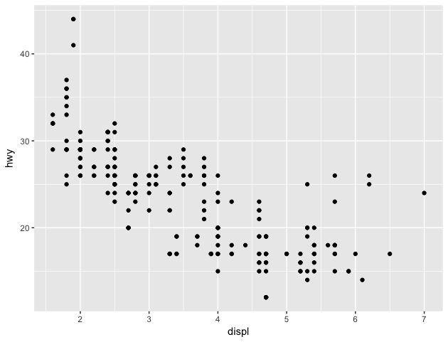
```r
> qplot(displ,hwy,data=mpg,color=drv)
```
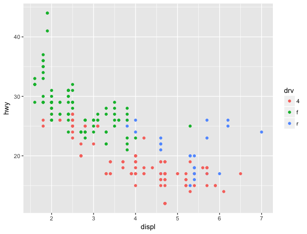
```r
> qplot(displ,hwy,data=mpg,shape=drv)
```
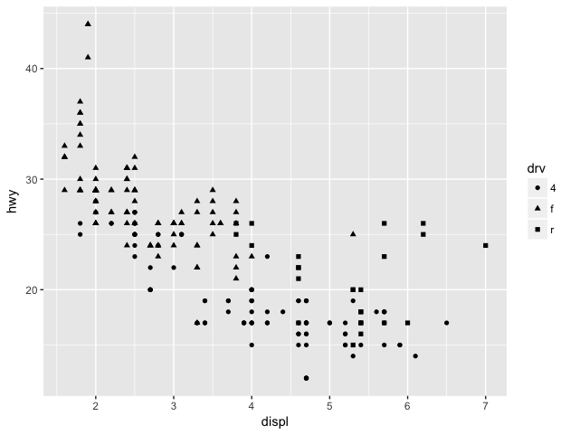
```r
> qplot(displ,hwy,data=mpg,color=drv,geom=c("point","smooth"))
```

```r
> qplot(displ,hwy,data=mpg,geom=c("point","smooth"))
```
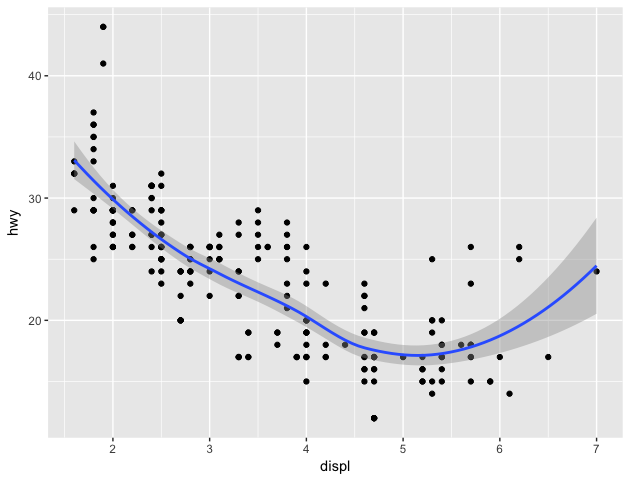
```r
> qplot(hwy,data=mpg,geom=c("density"))
```
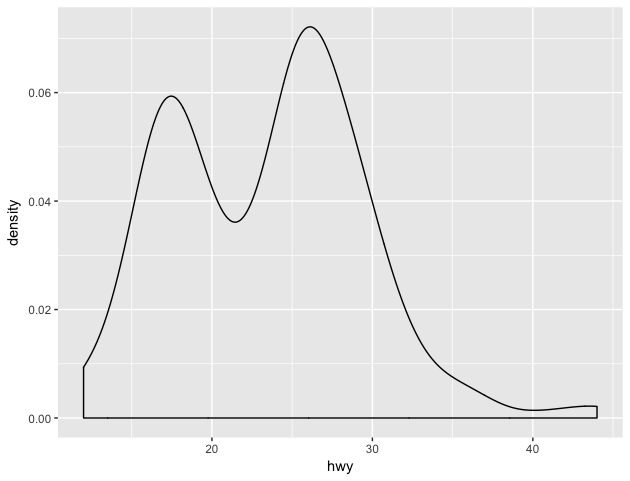
```r
> qplot(hwy,data=mpg,geom=c("density"),color=drv)
```
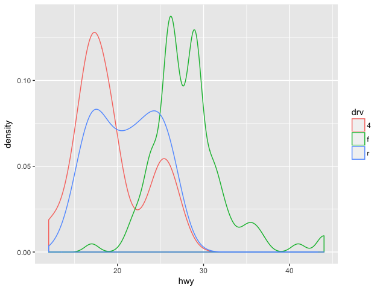
```r
> qplot(hwy,data=mpg,fill=drv)
```
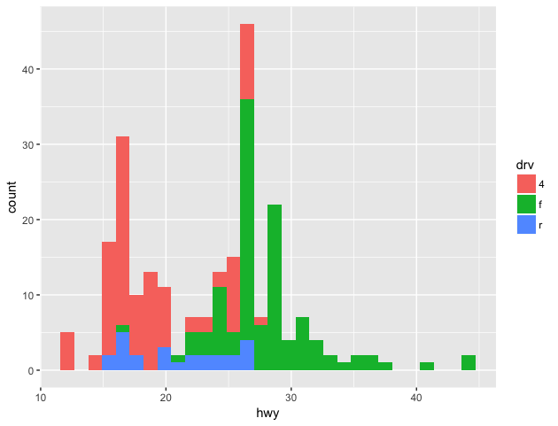

Facets
-----
```r
> qplot(displ,hwy,data=mpg,facets= .~drv)
```
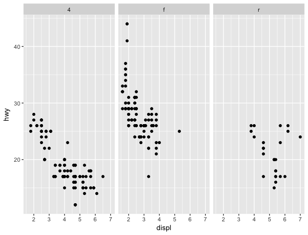
```r
> qplot(displ,hwy,data=mpg,facets= drv~.,binwidth=2)
```
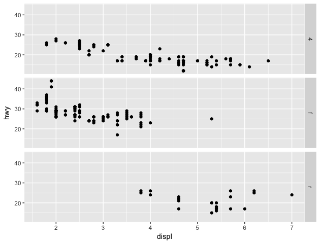
```r
> qplot(hwy,data=mpg,facets= drv~.,binwidth=2)
```
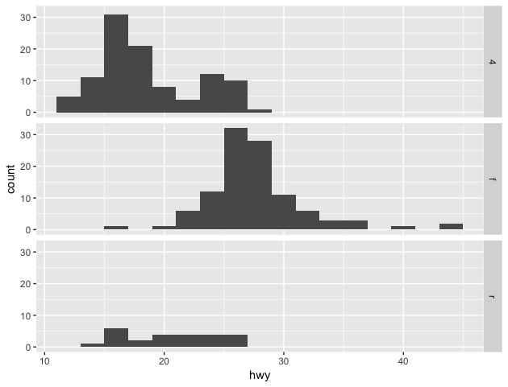
```r

> qplot(displ,hwy,data=mpg,color=drv) + geom_smooth(method = "lm")
```
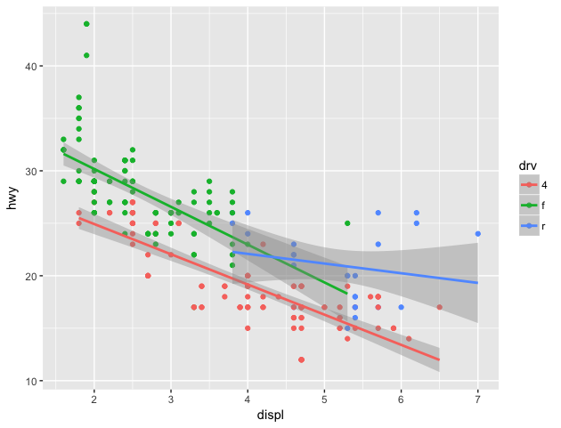
```r
> qplot(displ,hwy,data=mpg,facets = .~drv) + geom_smooth(method = "lm")
```
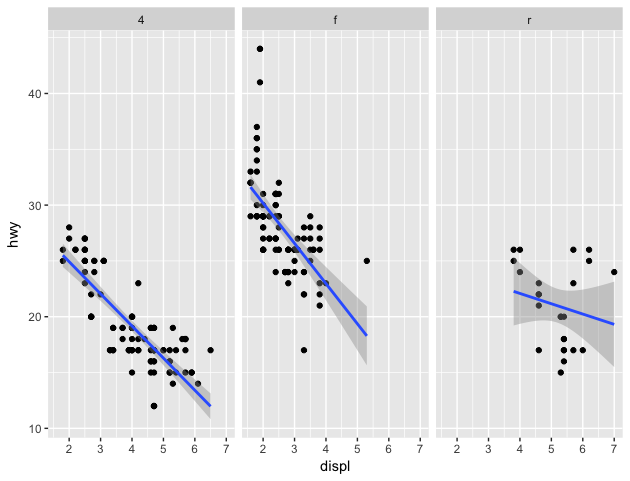
```r
> qplot(displ,hwy,data=mpg,facets = drv~.) + geom_smooth(method = "lm")
```
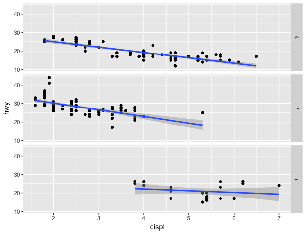


Part 3
=====

```r
> maacs <- read.csv("bmi_pm25_no2_sim.csv")
> str(maacs)
'data.frame':	517 obs. of  4 variables:
 $ logpm25       : num  1.248 1.122 1.93 1.368 0.775 ...
 $ logno2_new    : num  1.184 1.552 1.432 1.774 0.765 ...
 $ bmicat        : Factor w/ 2 levels "normal weight",..: 1 2 1 2 1 1 1 1 1 2 ...
 $ NocturnalSympt: int  1 0 0 2 0 0 0 0 0 3 ...

> head(maacs[,1:3])
    logpm25 logno2_new        bmicat
1 1.2476997  1.1837987 normal weight
2 1.1216476  1.5515362    overweight
3 1.9300429  1.4323519 normal weight
4 1.3679246  1.7736804    overweight
5 0.7753367  0.7654826 normal weight
6 1.4872785  1.1127378 normal weight
```

```r
# Initial call to ggplot
                      #aesthetic
> g <- ggplot(maacs, aes(logpm25, NocturnalSympt))
```
```r

# object summary
> summary(g)
data: logpm25, logno2_new, bmicat, NocturnalSympt [517x4]
mapping:  x = logpm25, y = NocturnalSympt
faceting: <ggproto object: Class FacetNull, Facet>
    compute_layout: function
    draw_back: function
    draw_front: function
    draw_labels: function
    draw_panels: function
    finish_data: function
    init_scales: function
    map: function
    map_data: function
    params: list
    render_back: function
    render_front: function
    render_panels: function
    setup_data: function
    setup_params: function
    shrink: TRUE
    train: function
    train_positions: function
    train_scales: function
    vars: function
    super:  <ggproto object: Class FacetNull, Facet>
```

```r
> g + geom_point()
```

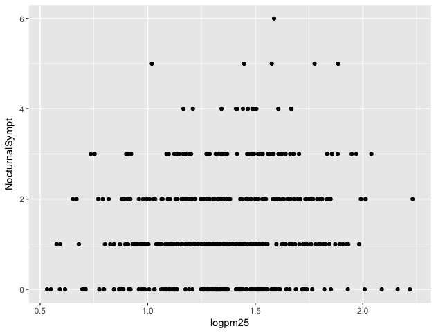

Facets
----
```r
> g + geom_point() +  geom_smooth(method = "lm")
```

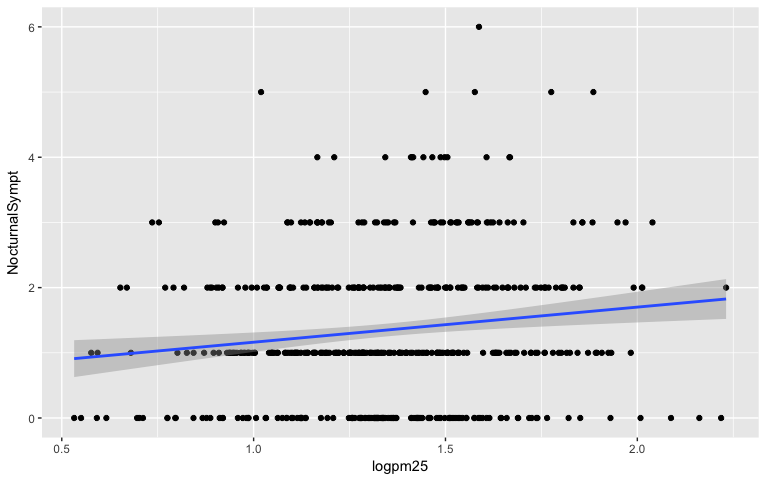

Add a categorical variable `bmicat` 
```r
> g + geom_point() + 
    geom_smooth(method = "lm") +
    facet_grid(. ~ bmicat) 
```

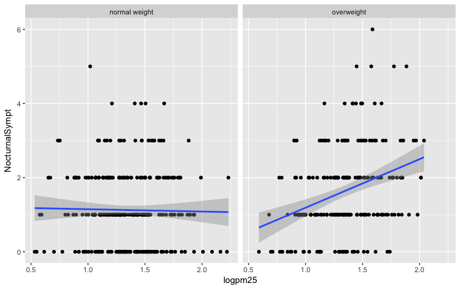
```r
> g + geom_point() + 
    geom_smooth(method = "lm") +
    facet_grid(bmicat ~ .) + 
    theme_bw()
```

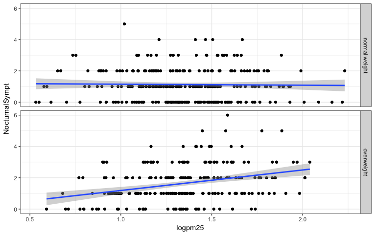

For things that only make sense globally, use theme(), i.e. theme(legend.position = "none"). Two standard appearance themes are included

theme_gray(): The default theme (gray background)

theme_bw(): More stark/plain

Modifiyng aesthetic
---
```r
> g + geom_point(color = "steelblue", size = 2, alpha = 1/2)  + theme_bw()
```
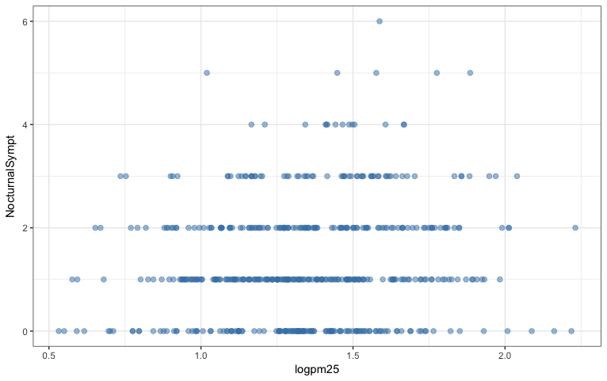
```r
> g + geom_point(aes(color = bmicat), size = 2, alpha = 1/2) + theme_bw()
```
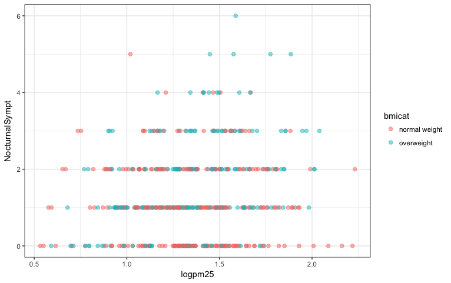
```r
> g + geom_point(aes(color = bmicat), size = 2, alpha = 1/2) + 
+     geom_smooth(method = "lm") +
+     facet_grid(. ~ bmicat)  +theme_bw()
```
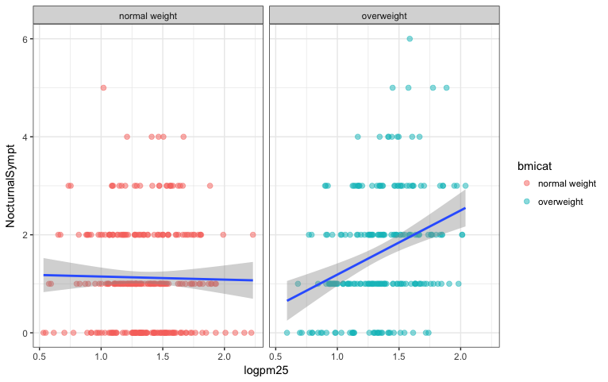


Modifiyng labels
---
```r
g + geom_point(aes(color = bmicat)) + 
        labs(title = "MAACS Cohort") + 
        labs(x = expression("log " * PM[2.5]), y = "Nocturnal Symptoms") +
        theme_bw()
```
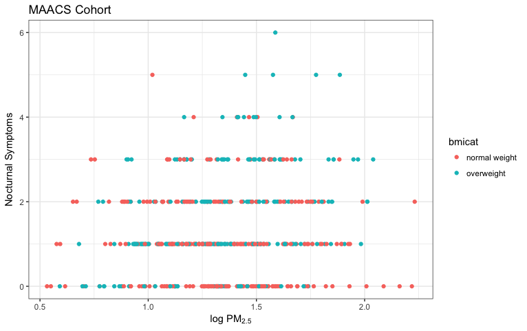

Customizing the Smooth
---
```r
> g + geom_point(aes(color = bmicat), size = 2, alpha = 1/2) + 
  geom_smooth(size = 1/2, linetype = 2, method = "lm", se = FALSE) +
  theme_bw()
  ```
  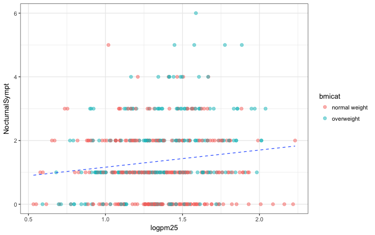
```r
> g + geom_point(aes(color = bmicat), size = 2, alpha = 1/2) + 
  geom_smooth(size = 1/2, linetype = 2, method = "lm", se = FALSE) +
  facet_grid(. ~ bmicat) +
  theme_bw()
  ```
  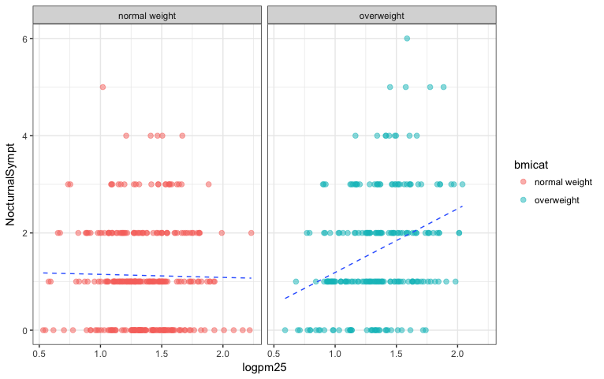
  ```r
> g + geom_point(aes(color = bmicat), size = 2, alpha = 1/2) + 
  geom_smooth(size = 1/2, linetype = 2, method = "lm", se = FALSE) +
  facet_grid(. ~ bmicat) +
  theme_bw(base_family = "Times") 
  ```
  ```r
> g + geom_point(aes(color = bmicat), size = 2, alpha = 1/2) + 
  geom_smooth(size = 1/2, linetype = 2, method = "lm", se = FALSE) +
  facet_grid(. ~ bmicat) +
  theme_linedraw()
  ```
  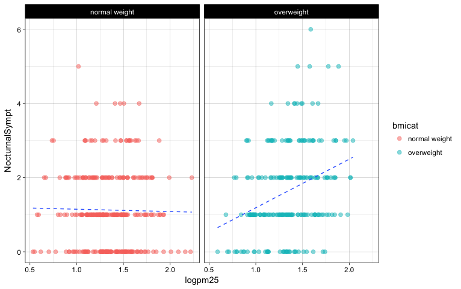
  ```r
> g + geom_point(aes(color = bmicat), size = 2, alpha = 1/2) + 
  geom_smooth(size = 1/2, linetype = 2, method = "lm", se = FALSE) +
  facet_grid(. ~ bmicat) +
 theme_light()
 ```
 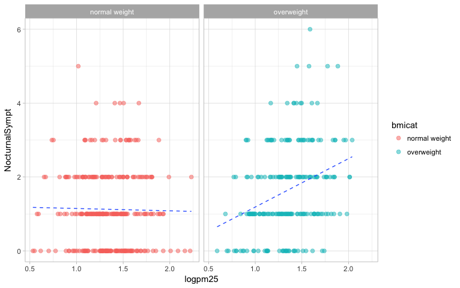
 ```r
> g + geom_point(aes(color = bmicat), size = 2, alpha = 1/2) + 
  geom_smooth(size = 1/2, linetype = 2, method = "lm", se = FALSE) +
  facet_grid(. ~ bmicat) +
 theme_dark()
```
 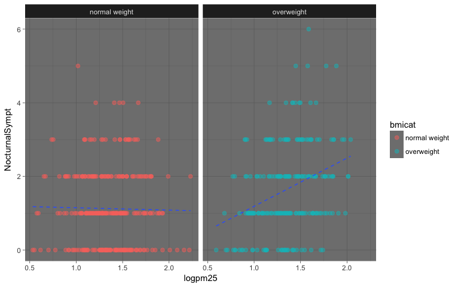
 ```r
> g + geom_point(aes(color = bmicat), size = 2, alpha = 1/2) + 
  geom_smooth(size = 1/2, linetype = 2, method = "lm", se = FALSE) +
  facet_grid(. ~ bmicat) +
 theme_minimal()
 ```
 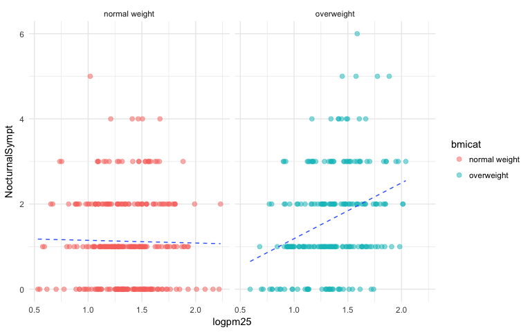
 ```r
> g + geom_point(aes(color = bmicat), size = 2, alpha = 1/2) + 
  geom_smooth(size = 1/2, linetype = 2, method = "lm", se = FALSE) +
  facet_grid(. ~ bmicat) +
 theme_classic()
```
 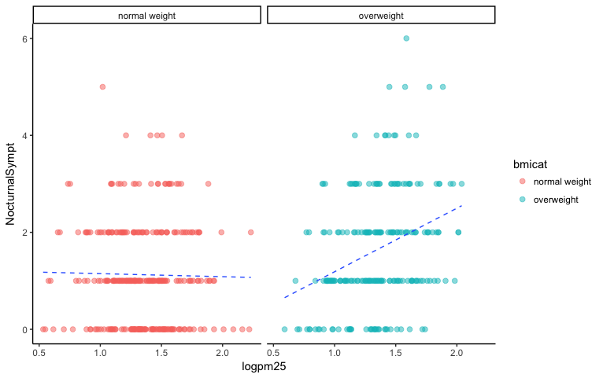
 
More Complex Example
---
```r
> cutpoints <- quantile(maacs$logno2_new, seq(0, 1, length = 4), na.rm = TRUE)
> cutpoints
       0% 33.33333% 66.66667%      100% 
0.3419452 1.2286107 1.4679603 2.1695374 

The not2tert variable is now a categorical factor variable containing 3 levels, indicating the ranges of NO2 (on the log scale).

> head(maacs)
    logpm25 logno2_new        bmicat NocturnalSympt      no2tert
1 1.2476997  1.1837987 normal weight              1 (0.342,1.23]
2 1.1216476  1.5515362    overweight              0  (1.47,2.17]
3 1.9300429  1.4323519 normal weight              0  (1.23,1.47]
4 1.3679246  1.7736804    overweight              2  (1.47,2.17]
5 0.7753367  0.7654826 normal weight              0 (0.342,1.23]
6 1.4872785  1.1127378 normal weight              0 (0.342,1.23]

> levels(maacs$no2tert)
[1] "(0.342,1.23]" "(1.23,1.47]"  "(1.47,2.17]" 
```

```r
> ## Setup ggplot with data frame
> g <- ggplot(maacs, aes(logpm25, NocturnalSympt))
```
```r
## Add layers
> g + geom_point(aes(color = bmicat ), size = 1, alpha = 1/2) + 
  facet_wrap(bmicat ~ no2tert, nrow = 2, ncol = 4) + 
  geom_smooth(size = 1/2, linetype = 1, method = "lm", se = FALSE, col="steelblue") +
  theme_bw(base_family = "Avenir", base_size = 10) + 
  labs(x = expression("log " * PM[2.5])) + 
  labs(y = "Nocturnal Symptoms") + 
  labs(title = "MAACS Cohort")
``` 
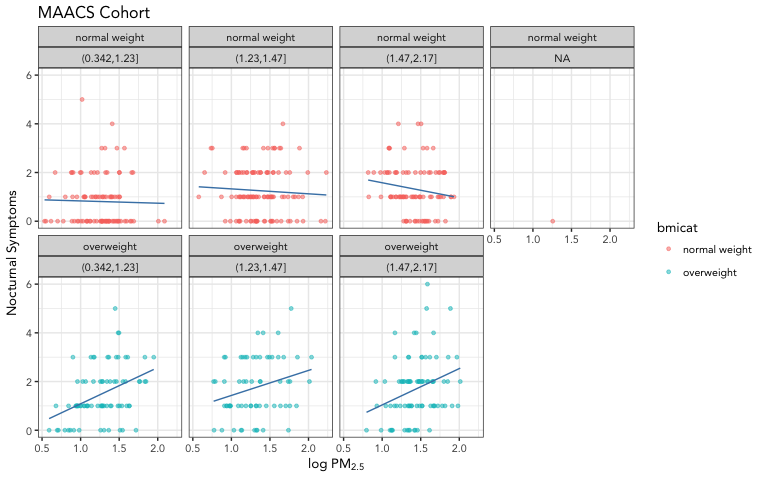

A Quick Aside about Axis Limits
---
```r
testdat <- data.frame(x = 1:100, y = rnorm(100))
testdat[50,2] <- 100  ## Outlier!

plot(testdat$x, testdat$y, type = "l", ylim = c(-3,3))
```
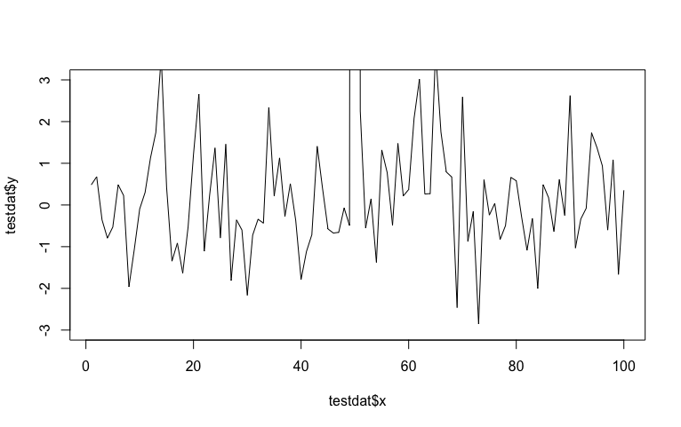


With `ggplot2` the default settings will give you this.
```r
g <- ggplot(testdat, aes(x = x, y = y))
g + geom_line()
```
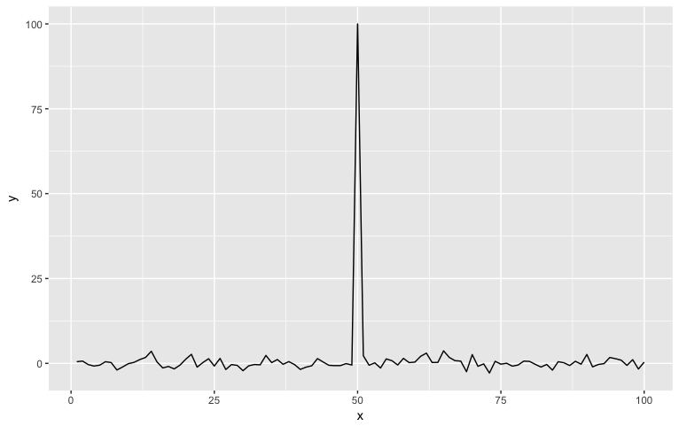


