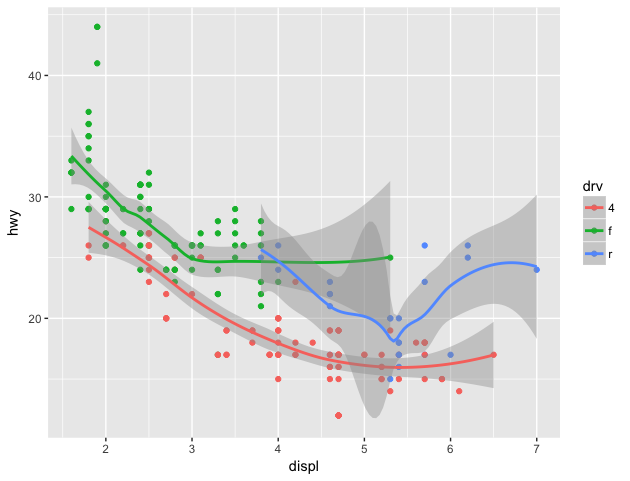

Lesson 2: ggplot2
=====

```r
> library(ggplot2)

> str(mpg)
Classes ‘tbl_df’, ‘tbl’ and 'data.frame':	234 obs. of  11 variables:
 $ manufacturer: chr  "audi" "audi" "audi" "audi" ...
 $ model       : chr  "a4" "a4" "a4" "a4" ...
 $ displ       : num  1.8 1.8 2 2 2.8 2.8 3.1 1.8 1.8 2 ...
 $ year        : int  1999 1999 2008 2008 1999 1999 2008 1999 1999 2008 ...
 $ cyl         : int  4 4 4 4 6 6 6 4 4 4 ...
 $ trans       : chr  "auto(l5)" "manual(m5)" "manual(m6)" "auto(av)" ...
 $ drv         : chr  "f" "f" "f" "f" ...
 $ cty         : int  18 21 20 21 16 18 18 18 16 20 ...
 $ hwy         : int  29 29 31 30 26 26 27 26 25 28 ...
 $ fl          : chr  "p" "p" "p" "p" ...
 $ class       : chr  "compact" "compact" "compact" "compact" ...
> 
```
```r
> qplot(displ,hwy,data=mpg)
```

```r
> qplot(displ,hwy,data=mpg,color=drv)
```

```r
> qplot(displ,hwy,data=mpg,shape=drv)
```

```r
> qplot(displ,hwy,data=mpg,color=drv,geom=c("point","smooth"))
```

```r
> qplot(displ,hwy,data=mpg,geom=c("point","smooth"))
```

```r
> qplot(hwy,data=mpg,geom=c("density"))
```

```r
> qplot(hwy,data=mpg,geom=c("density"),color=drv)
```

```r
> qplot(hwy,data=mpg,fill=drv)
```


Facets
-----
```r
> qplot(displ,hwy,data=mpg,facets= .~drv)
```

```r
> qplot(displ,hwy,data=mpg,facets= drv~.,binwidth=2)
```

```r
> qplot(hwy,data=mpg,facets= drv~.,binwidth=2)
```

```r

> qplot(displ,hwy,data=mpg,color=drv) + geom_smooth(method = "lm")
```

```r
> qplot(displ,hwy,data=mpg,facets = .~drv) + geom_smooth(method = "lm")
```

```r
> qplot(displ,hwy,data=mpg,facets = drv~.) + geom_smooth(method = "lm")
```


