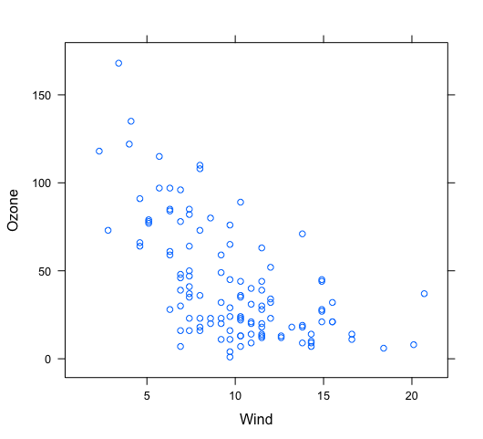
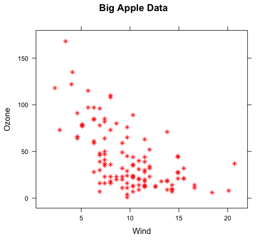
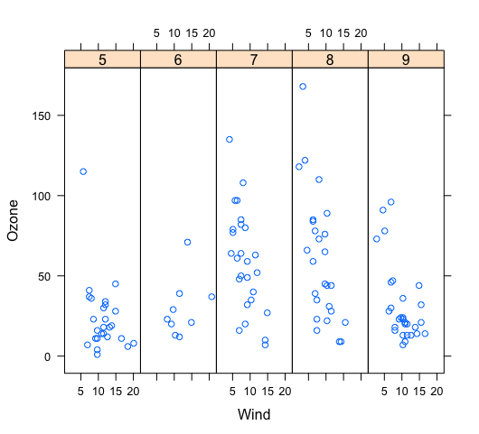
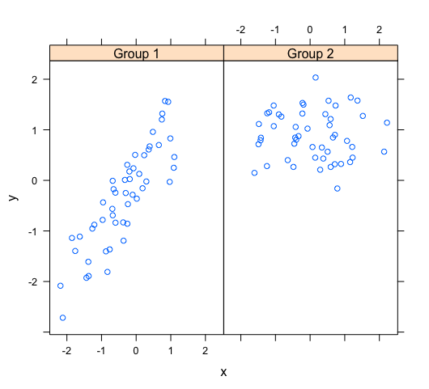
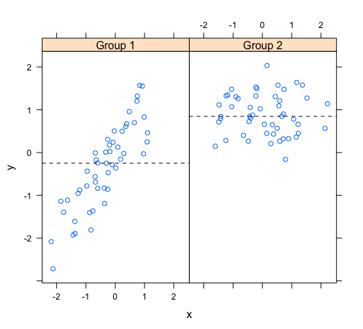
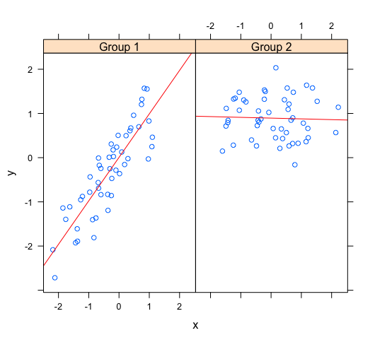
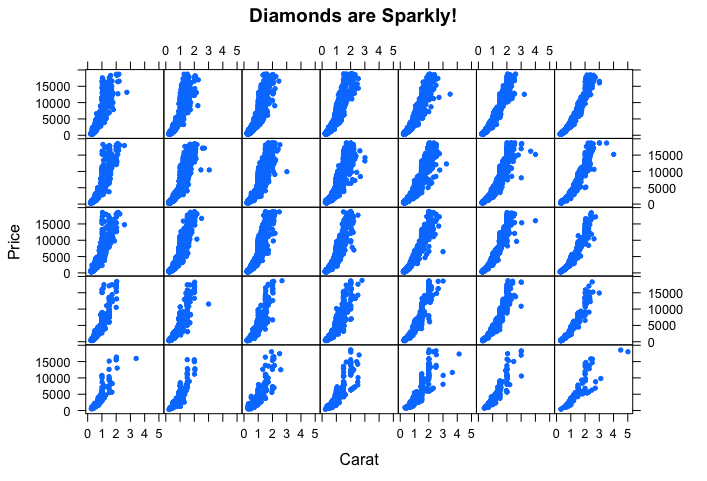

Swirl Lesson 1: Lattice Plotting System
=====

```r
> head(airquality)
  Ozone Solar.R Wind Temp Month Day
1    41     190  7.4   67     5   1
2    36     118  8.0   72     5   2
3    12     149 12.6   74     5   3
4    18     313 11.5   62     5   4
5    NA      NA 14.3   56     5   5
6    28      NA 14.9   66     5   6
```

Now try running xyplot with the formula Ozone~Wind as the first argument and the second argument data set equal to airquality.
```r
> xyplot(Ozone~Wind, data=airquality)
```



```r
> xyplot(Ozone ~ Wind, data = airquality, pch=8, col="red", main="Big Apple Data")
```



```r
> xyplot(Ozone~Wind | as.factor(Month), data = airquality, layout= c(5,1))
```



```r
> p <- xyplot(Ozone~Wind,data=airquality)
> print(p)
```
```r
> names(p)
 [1] "formula"           "as.table"          "aspect.fill"       "legend"            "panel"            
 [6] "page"              "layout"            "skip"              "strip"             "strip.left"       
[11] "xscale.components" "yscale.components" "axis"              "xlab"              "ylab"             
[16] "xlab.default"      "ylab.default"      "xlab.top"          "ylab.right"        "main"             
[21] "sub"               "x.between"         "y.between"         "par.settings"      "plot.args"        
[26] "lattice.options"   "par.strip.text"    "index.cond"        "perm.cond"         "condlevels"       
[31] "call"              "x.scales"          "y.scales"          "panel.args.common" "panel.args"       
[36] "packet.sizes"      "x.limits"          "y.limits"          "x.used.at"         "y.used.at"        
[41] "x.num.limit"       "y.num.limit"       "aspect.ratio"      "prepanel.default"  "prepanel"         
```

Run mynames[myfull] to see which entries of p are not NULL.
```r
> mynames[myfull]
 [1] "formula"           "as.table"          "aspect.fill"       "panel"             "skip"             
 [6] "strip"             "strip.left"        "xscale.components" "yscale.components" "axis"             
[11] "xlab"              "ylab"              "xlab.default"      "ylab.default"      "x.between"        
[16] "y.between"         "index.cond"        "perm.cond"         "condlevels"        "call"             
[21] "x.scales"          "y.scales"          "panel.args.common" "panel.args"        "packet.sizes"     
[26] "x.limits"          "y.limits"          "aspect.ratio"      "prepanel.default" 
```
```r
> p[["formula"]]
Ozone ~ Wind

> p[["x.limits"]]
[1]  0.37 22.03
```

Panel functions receive the x and y coordinates of the data points in their panel (along with any optional
arguments). To see this, we've created some data for you - two 100-long vectors, x and y. For its first 50
values y is a function of x, for the last 50 values, y is random. We've also defined a 100-long factor vector f
which distinguishes between the first and last 50 elements of the two vectors. Run the R command table with f as
it argument.

```r
> table(f)
f
Group 1 Group 2 
     50      50 
```
     

The first 50 entries of f are "Group 1" and the last 50 are "Group 2". Run xyplot with two arguments. The first
is the formula y~x|f, and the second is layout set equal to c(2,1). Note that we're not providing an explicit
data argument, so xyplot will look in the environment and see the x and y that we've generated for you.
```r
> xyplot(y~x|f,layout=c(2,1))
```



Again, the values match the plot. That's reassuring. We've copied some code from the slides for you. To see it,
type myedit("plot1.R"). This will open your editor and display the R code in it.
```r
> myedit("plot1.R")

p <- xyplot(y ~ x | f, panel = function(x, y, ...) {
  panel.xyplot(x, y, ...)  ## First call the default panel function for 'xyplot'
  panel.abline(h = median(y), lty = 2)  ## Add a horizontal line at the median
})
print(p)
invisible()
```

We've defined a function for you, pathtofile, which takes a filename as its argument. This makes sure R can find
the file on your computer. Now run the R command source with two arguments. The first is the call to pathtofile
with the string "plot1.R" as its argument and the second is the argument local set equal to TRUE. This command
will run the code contained in plot1.R within the swirl environment so you can see what it does.

```r
source(pathtofile("plot1.R"),local=TRUE)
```




See how the lines appear. The plot shows two panels because...?

1: lattice can handle at most 2 panels
2: there are 2 variables
3: there are 2 calls to panel methods
4: f contains 2 factors
Selection: 4


```r
> myedit("plot2.R")

p2 <- xyplot(y ~ x | f, panel = function(x, y, ...) {
    panel.xyplot(x, y, ...)  ## First call default panel function
    panel.lmline(x, y, col = 2)  ## Overlay a simple linear regression line
})
print(p2)
invisible()


source(pathtofile("plot2.R"),local=TRUE)
```



The regression lines are red because ...?

1: R is the first letter of the word red
2: R always plots regression lines in red
3: the custom panel function specified a col argument

Selection: 3
```r
> str(diamonds)
Classes ‘tbl_df’, ‘tbl’ and 'data.frame':	53940 obs. of  10 variables:
 $ carat  : num  0.23 0.21 0.23 0.29 0.31 0.24 0.24 0.26 0.22 0.23 ...
 $ cut    : Ord.factor w/ 5 levels "Fair"<"Good"<..: 5 4 2 4 2 3 3 3 1 3 ...
 $ color  : Ord.factor w/ 7 levels "D"<"E"<"F"<"G"<..: 2 2 2 6 7 7 6 5 2 5 ...
 $ clarity: Ord.factor w/ 8 levels "I1"<"SI2"<"SI1"<..: 2 3 5 4 2 6 7 3 4 5 ...
 $ depth  : num  61.5 59.8 56.9 62.4 63.3 62.8 62.3 61.9 65.1 59.4 ...
 $ table  : num  55 61 65 58 58 57 57 55 61 61 ...
 $ price  : int  326 326 327 334 335 336 336 337 337 338 ...
 $ x      : num  3.95 3.89 4.05 4.2 4.34 3.94 3.95 4.07 3.87 4 ...
 $ y      : num  3.98 3.84 4.07 4.23 4.35 3.96 3.98 4.11 3.78 4.05 ...
 $ z      : num  2.43 2.31 2.31 2.63 2.75 2.48 2.47 2.53 2.49 2.39 ...

```

So the data frame contains 10 pieces of information for each of 53940 diamonds. Run the R command table with
diamonds$color as an argument.

```r
> table(diamonds$color)

    D     E     F     G     H     I     J 
 6775  9797  9542 11292  8304  5422  2808 
 ```
 
We see 7 colors each represented by a letter. Now run the R command table with two arguments, ´diamonds$color and
`diamonds$cut`.

```r
> table(diamonds$color, diamonds$cut)
   
    Fair Good Very Good Premium Ideal
  D  163  662      1513    1603  2834
  E  224  933      2400    2337  3903
  F  312  909      2164    2331  3826
  G  314  871      2299    2924  4884
  H  303  702      1824    2360  3115
  I  175  522      1204    1428  2093
  J  119  307       678     808   896
```

```r
> source(pathtofile("myLabels.R"),local=TRUE)

myxlab <- "Carat"
myylab <- "Price"
mymain <- "Diamonds are Sparkly!"
```

35 panels, one for each combination of color and cut. The dots (pch=20) show how prices for the diamonds in each category (panel) vary depending on carat.

```r
> xyplot(price~carat | color*cut, data = diamonds, strip=FALSE,pch=20,xlab = myxlab,ylab = myylab,main=mymain)
```



Are colors defining the rows or columns of the plot? Recall that there were 7 colors and 5 cuts in the data.

1: rows
2: columns


True or False? Lattice plots are constructed by a series of calls to core functions.

1: False
2: True

Selection: 1

True or False? Lattice plots are constructed with a single function call to a core
lattice function (e.g. xyplot)

1: True
2: False

Selection: 1

True or False? Aspects like margins and spacing are automatically handled and defaults
are usually sufficient.

1: True
2: False

Selection: 1

True or False? The lattice system is ideal for creating conditioning plots where you
examine the same kind of plot under many different conditions.

1: False
2: True

Selection: 2

True or False? The lattice system, like the base plotting system, returns a trellis plot
object.

1: False
2: True

Selection: 1


True or False?  Panel functions can NEVER be customized to modify what is plotted in
each of the plot panels.

1: False
2: True

Selection: 1

True or False?  Lattice plots can display at most 20 panels in a single plot.

1: False
2: True

Selection: 1
