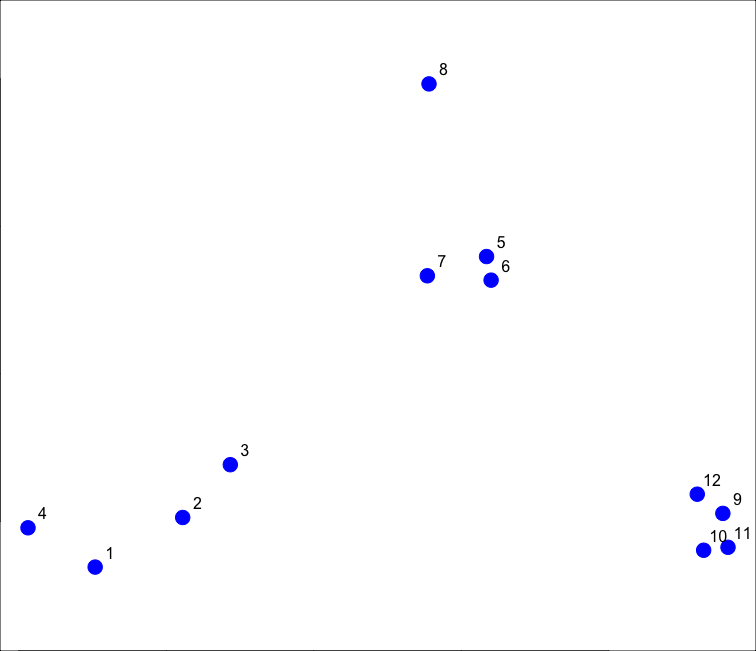
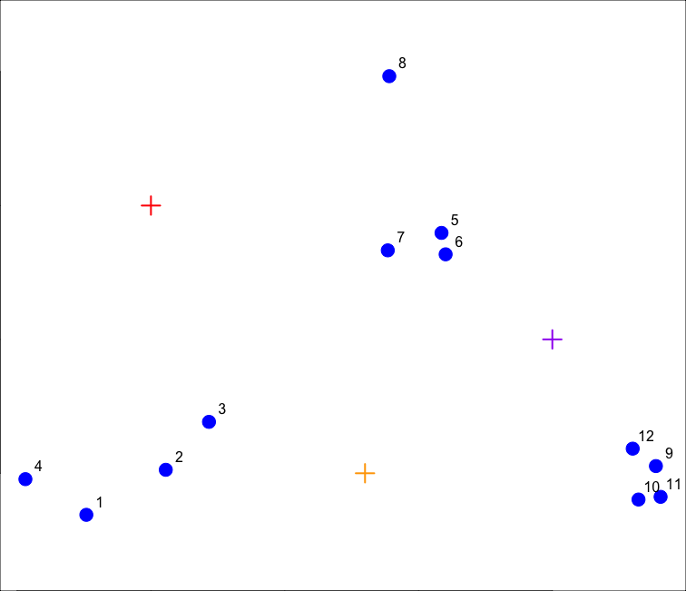
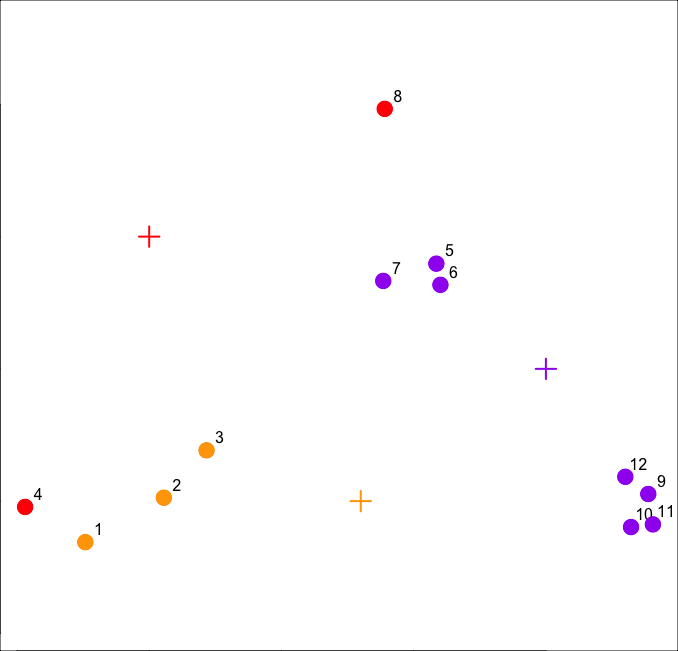
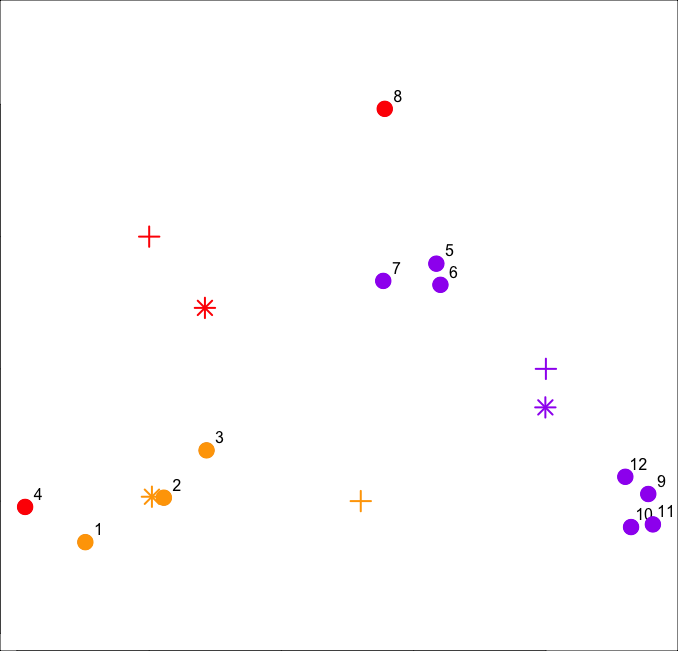
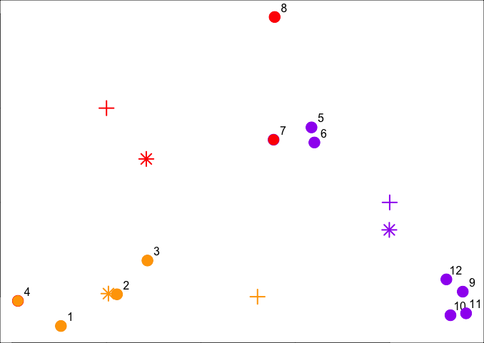
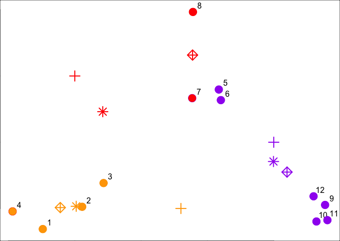
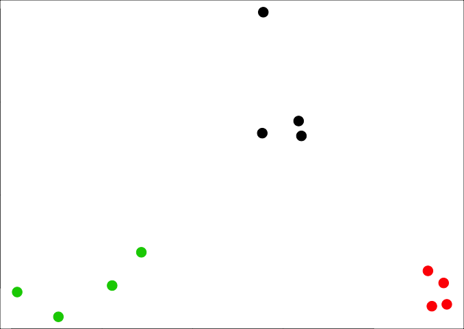
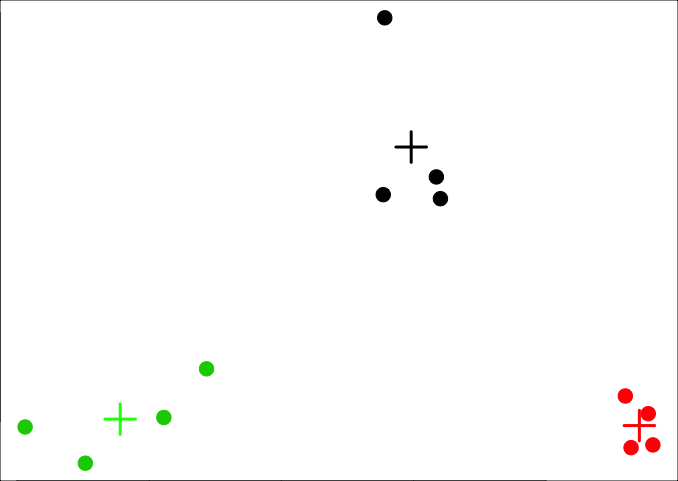

swirl Lesson 2: K Means Clustering
=============================

   K_Means_Clustering. (Slides for this and other Data Science courses may be found
   at github https://github.com/DataScienceSpecialization/courses/. If you care to
   use them, they must be downloaded as a zip file and viewed locally. This lesson
   corresponds to 04_ExploratoryAnalysis/kmeansClustering.)

In this lesson we'll learn about k-means clustering, another simple way of
   examining and organizing multi-dimensional data. As with hierarchical clustering,
   this technique is most useful in the early stages of analysis when you're trying
   to get an understanding of the data, e.g., finding some pattern or relationship
   between different factors or variables.

   R documentation tells us that the k-means method **"aims to partition the points
   into k groups such that the sum of squares from points to the assigned cluster
   centres is minimized."**

   To illustrate the method, we'll use these random points we generated, familiar to
   you if you've already gone through the hierarchical clustering lesson. We'll
   demonstrate k-means clustering in several steps, but first we'll explain the
   general idea.

   As we said, k-means is a partioning approach which requires that you first guess
   how many clusters you have (or want). Once you fix this number, you randomly
   create a "centroid" (a phantom point) for each cluster and assign each point or
   observation in your dataset to the centroid to which it is closest. Once each
   point is assigned a centroid, you readjust the centroid's position by making it
   the average of the points assigned to it.

   Once you have repositioned the centroids, you must recalculate the distance of the
   observations to the centroids and reassign any, if necessary, to the centroid
   closest to them. Again, once the reassignments are done, readjust the positions of
   the centroids based on the new cluster membership. The process stops once you
   reach an iteration in which no adjustments are made or when you've reached some
   predetermined maximum number of iterations.

 So k-means clustering requires some distance metric (say Euclidean), a
   hypothesized fixed number of clusters, and an initial guess as to cluster
   centroids. As described, what does this process produce?

1: A final estimate of cluster centroids
2: All of the others
3: An assignment of each point to a cluster

 When it's finished k-means clustering returns a final position of each cluster's
   centroid as well as the assignment of each data point or observation to a cluster.

We've created two 3-long vectors for you, cx and cy. These respectively hold the
   x- and y- coordinates for 3 proposed centroids. For convenience, we've also stored
   them in a 2 by 3 matrix cmat. The x coordinates are in the first row and the y
   coordinates in the second. Look at cmat now.


```r
> cmat
     [,1] [,2] [,3]
[1,]    1  1.8  2.5
[2,]    2  1.0  1.5
```

The coordinates of these points are (1,2), (1.8,1) and (2.5,1.5). We'll add these
   centroids to the plot of our points. Do this by calling the R command points with
   6 arguments. The first 2 are cx and cy, and the third is col set equal to the
   concatenation of 3 colors, "red", "orange", and "purple". The fourth argument is
   pch set equal to 3 (a plus sign), the fifth is cex set equal to 2 (expansion of
   character), and the final is lwd (line width) also set equal to 2.
```r
> points(cx,cy,col=c("red", "orange",  "purple"),pch=3,cex=2,lwd=2)
```
   We see the first centroid (1,2) is in red. The second (1.8,1), to the right and
   below the first, is orange, and the final centroid (2.5,1.5), the furthest to the
   right, is purple.



Now we have to calculate distances between each point and every centroid. There
   are 12 data points and 3 centroids. How many distances do we have to calculate?

We've written a function for you called mdist which takes 4 arguments. The vectors
   of data points (x and y) are the first two and the two vectors of centroid
   coordinates (cx and cy) are the last two. Call mdist now with these arguments.
```r
> mdist(x,y,cx,cy)
         [,1]      [,2]      [,3]     [,4]      [,5]      [,6]      [,7]     [,8]
[1,] 1.392885 0.9774614 0.7000680 1.264693 1.1894610 1.2458771 0.8113513 1.026750
[2,] 1.108644 0.5544675 0.3768445 1.611202 0.8877373 0.7594611 0.7003994 2.208006
[3,] 3.461873 2.3238956 1.7413021 4.150054 0.3297843 0.2600045 0.4887610 1.337896
          [,9]     [,10]     [,11]     [,12]
[1,] 4.5082665 4.5255617 4.8113368 4.0657750
[2,] 1.1825265 1.0540994 1.2278193 1.0090944
[3,] 0.3737554 0.4614472 0.5095428 0.2567247
```

 We've stored these distances in the matrix distTmp for you. Now we have to assign
   a cluster to each point. To do that we'll look at each column and ?

1: add up the 3 entries.
2: pick the minimum entry
3: pick the maximum entry


From the distTmp entries, which cluster would point 6 be assigned to?

1: none of the above
2: 1
3: 2
4: 3

R has a handy function which.min which you can apply to ALL the columns of distTmp
   with one call. Simply call the R function apply with 3 arguments. The first is
   distTmp, the second is 2 meaning the columns of distTmp, and the third is
   which.min, the function you want to apply to the columns of distTmp. Try this now.
```r
> apply(distTmp,2,which.min)
 [1] 2 2 2 1 3 3 3 1 3 3 3 3
```
We've stored the vector of cluster colors ("red","orange","purple") in the array
   cols1 for you and we've also stored the cluster assignments in the array newClust.
   Let's color the 12 data points according to their assignments. Again, use the
   command points with 5 arguments. The first 2 are x and y. The third is pch set to
   19, the fourth is cex set to 2, and the last, col is set to cols1[newClust].
```r
> cols1
[1] "red"    "orange" "purple"

> newClust
 [1] 2 2 2 1 3 3 3 1 3 3 3 3
 
> points(x,y,pch=19,cex=2,col=cols1[newClust]) 
```



Now we have to recalculate our centroids so they are the average (center of gravity) of the
   cluster of points assigned to them. We have to do the x and y coordinates separately. We'll
   do the x coordinate first. Recall that the vectors x and y hold the respective coordinates
   of our 12 data points.

We can use the R function tapply which applies "a function over a ragged array". This means
   that every element of the array is assigned a factor and the function is applied to subsets
   of the array (identified by the factor vector). This allows us to take advantage of the
   factor vector newClust we calculated. Call tapply now with 3 arguments, x (the data),
   newClust (the factor array), and mean (the function to apply).
```r
> tapply(x,newClust,mean)
       1        2        3 
1.210767 1.010320 2.498011 

> tapply(y,newClust,mean)
       1        2        3 
1.730555 1.016513 1.354373 
```

Now that we have new x and new y coordinates for the 3 centroids we can plot them. We've
   stored off the coordinates for you in variables newCx and newCy. Use the R command points
   with these as the first 2 arguments. In addition, use the arguments col set equal to cols1,
   pch equal to 8, cex equal to 2 and lwd also equal to 2.
```r
> points(newCx,newCy,col=cols1,pch=8,cex=2,lwd=2) 
```


We see how the centroids have moved closer to their respective clusters. This is especially
   true of the second (orange) cluster. Now call the distance function mdist with the 4
   arguments x, y, newCx, and newCy. This will allow us to reassign the data points to new
   clusters if necessary.
```r
> mdist(x,y,newCx,newCy)
           [,1]        [,2]      [,3]      [,4]      [,5]      [,6]      [,7]     [,8]
[1,] 0.98911875 0.539152725 0.2901879 1.0286979 0.7936966 0.8004956 0.4650664 1.028698
[2,] 0.09287262 0.002053041 0.0734304 0.2313694 1.9333732 1.8320407 1.4310971 2.926095
[3,] 3.28531180 2.197487387 1.6676725 4.0113796 0.4652075 0.3721778 0.6043861 1.643033
          [,9]    [,10]     [,11]     [,12]
[1,] 3.3053706 3.282778 3.5391512 2.9345445
[2,] 3.5224442 3.295301 3.5990955 3.2097944
[3,] 0.2586908 0.309730 0.3610747 0.1602755
```

We've stored off this new matrix of distances in the matrix distTmp2 for you. Recall that
   the first cluster is red, the second orange and the third purple. Look closely at columns 4
   and 7 of distTmp2. What will happen to points 4 and 7?

1: They will both change clusters
2: Nothing
3: They're the only points that won't change clusters
4: They will both change to cluster 2

1: They will both change clusters


Now call apply with 3 arguments, distTmp2, 2, and which.min to find the new cluster
   assignments for the points.
```r
> apply(distTmp2,2,which.min)
 [1] 2 2 2 2 3 3 1 1 3 3 3 3
 
> newClust2
 [1] 2 2 2 2 3 3 1 1 3 3 3 3

```
We've stored off the new cluster assignments in a vector of factors called newClust2. Use
   the R function points to recolor the points with their new assignments. Again, there are 5
   arguments, x and y are first, followed by pch set to 19, cex to 2, and col to
   cols1[newClust2].
```r
> points(x,y,pch=19,cex=2,col=cols1[newClust2]) 
```


Notice that points 4 and 7 both changed clusters, 4 moved from 1 to 2 (red to orange), and
   point 7 switched from 3 to 2 (purple to red).

Now use tapply to find the x coordinate of the new centroid. Recall there are 3 arguments,
   x, newClust2, and mean.
```r
> tapply(x,newClust2,mean)
        1         2         3 
1.8878628 0.8904553 2.6001704 

> tapply(y,newClust2,mean)
       1        2        3 
2.157866 1.006871 1.274675 

> points(finalCx,finalCy,col=cols1,pch=9,cex=2,lwd=2) 

```



It should be obvious that if we continued this process points 5 through 8 would all turn
   red, while points 1 through 4 stay orange, and points 9 through 12 purple.

   Now that you've gone through an example step by step, you'll be relieved to hear that R
   provides a command to do all this work for you. Unsurprisingly it's called kmeans and,
   although it has several parameters, we'll just mention four. These are x, (the numeric
   matrix of data), centers, iter.max, and nstart. The second of these (centers) can be either
   a number of clusters or a set of initial centroids. The third, iter.max, specifies the
   maximum number of iterations to go through, and nstart is the number of random starts you
   want to try if you specify centers as a number.

Call kmeans now with 2 arguments, dataFrame (which holds the x and y coordinates of our 12
   points) and centers set equal to 3.

```r
> dataFrame
           x         y
1  0.7585869 0.8447492
2  1.0554858 1.0128918
3  1.2168882 1.1918988
4  0.5308605 0.9779429
5  2.0858249 1.8977981
6  2.1012112 1.8177609
7  1.8850520 1.8325657
8  1.8906736 2.4831670
9  2.8871096 1.0268176
10 2.8219924 0.9018628
11 2.9045615 0.9118904
12 2.8003227 1.0919179
```

```r
> kmeans(dataFrame,centers = 3)
K-means clustering with 3 clusters of sizes 4, 4, 4

Cluster means:
          x         y
1 2.8534966 0.9831222
2 0.8904553 1.0068707
3 1.9906904 2.0078229

Clustering vector:
 [1] 2 2 2 2 3 3 3 3 1 1 1 1

Within cluster sum of squares by cluster:
[1] 0.03298027 0.34188313 0.34732441
 (between_SS / total_SS =  93.6 %)

Available components:

[1] "cluster"      "centers"      "totss"        "withinss"     "tot.withinss" "betweenss"   
[7] "size"         "iter"         "ifault"      
```

The program returns the information that the data clustered into 3 clusters each of size 4.
   It also returns the coordinates of the 3 cluster means, a vector named cluster indicating
   how the 12 points were partitioned into the clusters, and the sum of squares within each
   cluster. It also shows all the available components returned by the function. We've stored
   off this data for you in a kmeans object called kmObj. Look at kmObj$iter to see how many
   iterations the algorithm went through.
```r
> kmObj$iter
[1] 2

> kmObj$cluster
 [1] 3 3 3 3 1 1 1 1 2 2 2 2
 ```
Two iterations as we did before. We just want to emphasize how you can access the
   information available to you. Let's plot the data points color coded according to their
   cluster. This was stored in kmObj$cluster. Run plot with 5 arguments. The data, x and y, are
   the first two; the third, col is set equal to kmObj$cluster, and the last two are pch and
   cex. The first of these should be set to 19 and the last to 2.
```r
> plot(x,y,col=kmObj$cluster,pch=19,cex=2)
```


Now add the centroids which are stored in kmObj$centers. Use the points function with 5
   arguments. The first two are kmObj$centers and col=c("black","red","green"). The last three,
   pch, cex, and lwd, should all equal 3.
```r
> points(kmObj$centers,col=c("black","red","green"),pch=3,cex=3,lwd=3) 
```


Now for some fun! We want to show you how the output of the kmeans function is affected by
   its random start (when you just ask for a number of clusters). With random starts you might
   want to run the function several times to get an idea of the relationships between your
   observations. We'll call kmeans with the same data points (stored in dataFrame), but ask for
   6 clusters instead of 3.

We'll plot our data points several times and each time we'll just change the argument col
   which will show us how the R function kmeans is clustering them. So, call plot now with 5
   arguments. The first 2 are x and y. The third is col set equal to the call
   kmeans(dataFrame,6)$cluster. The last two (pch and cex) are set to 19 and 2 respectively.
```r
> plot(x,y,col=kmeans(dataFrame,6)$cluster,pch=19,cex=2)

> plot(x,y,col=kmeans(dataFrame,6)$cluster,pch=19,cex=2)

> plot(x,y,col=kmeans(dataFrame,6)$cluster,pch=19,cex=2)
```
