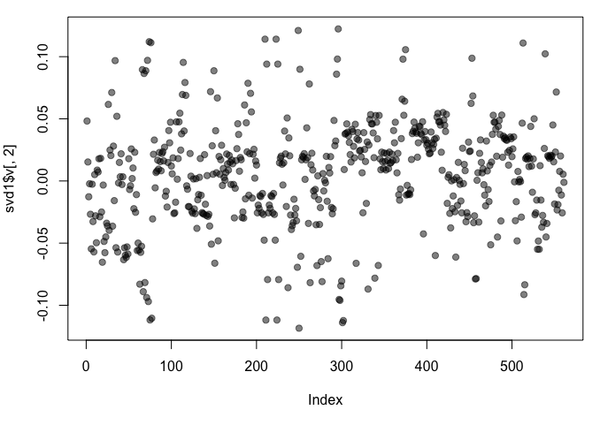

swirl Lesson 4: Clustering Example
=============================

In this lesson we'll apply some of the analytic techniques we learned in this course to data
   from the University of California, Irvine. Specifically, the data we'll use is from UCI's
   Center for Machine Learning and Intelligent Systems. You can find out more about the data at
   http://archive.ics.uci.edu/ml/datasets/Human+Activity+Recognition+Using+Smartphones. As this
   address indicates, the data involves smartphones and recognizing human activity. Cool,
   right?

We also hope to show you that "real-world" research isn't always neat and well-defined like
   textbook questions with clearcut answers.

We've loaded data from this study for you in a matrix called ssd.  Run the R command dim now
   to see its dimensions.
```r
> dim(ssd)
[1] 7352  563
```
The study creating this database involved 30 volunteers "performing activities of daily
   living (ADL) while carrying a waist-mounted smartphone with embedded inertial sensors. ...
   Each person performed six activities ... wearing a smartphone (Samsung Galaxy S II) on the
   waist. ... The experiments have been video-recorded to label the data manually.  The
   obtained dataset has been randomly partitioned into two sets, where 70% of the volunteers
   was selected for generating the training data and 30% the test data."


   Use the R command names with just the last two columns (562 and 563) of ssd to see what data
   they contain.
```r
> names(ssd[,562:563])
[1] "subject"  "activity"
```
 These last 2 columns contain subject and activity information. We saw above that the
   gathered data had "been randomly partitioned into two sets, where 70% of the volunteers was
   selected for generating the training data and 30% the test data." Run the R command table
   with ssd$subject as its argument to see if the data in ssd contains training or test data.
```r
> table(ssd$subject)

> sum(table(ssd$subject))
[1] 7352
```
So we're looking at training data from a machine learning repository. We can infer that this
   data is supposed to train machines to recognize activity collected from the accelerometers
   and gyroscopes built into the smartphones that the subjects had strapped to their waists.
   Run the R command table on ssd$activity to see what activities have been characterized by
   this data.
```r
> table(ssd$activity)

  laying  sitting standing     walk walkdown   walkup 
    1407     1286     1374     1226      986     1073 
```

 Because it's training data, each row is labeled with the correct activity (from the 6
   possible) and associated with the column measurements (from the accelerometer and
   gyroscope). We're interested in questions such as, "Is the correlation between the
   measurements and activities good enough to train a machine?" so that "Given a set of 561
   measurements, would a trained machine be able to determine which of the 6 activities the
   person was doing?"

First, let's massage the data a little so it's easier to work with. We've already run the R
   command transform on the data so that activities are factors. This will let us color code
   them when we generate plots. Let's look at only the first subject (numbered 1). Create the
   variable sub1 by assigning to it the output of the R command subset with ssd as the first
   argument and the boolean, subject equal to 1, as the second.
```r
> sub1 <- subset(ssd, subject==1)

> dim(sub1)
[1] 347 563
```
 So sub1 has fewer than 400 rows now, but still a lot of columns which contain measurements.
   Use names on the first 12 columns of sub1 to see what kind of data we have.

```r
> names(sub1[1:12])
 [1] "tBodyAcc.mean...X" "tBodyAcc.mean...Y" "tBodyAcc.mean...Z" "tBodyAcc.std...X" 
 [5] "tBodyAcc.std...Y"  "tBodyAcc.std...Z"  "tBodyAcc.mad...X"  "tBodyAcc.mad...Y" 
 [9] "tBodyAcc.mad...Z"  "tBodyAcc.max...X"  "tBodyAcc.max...Y"  "tBodyAcc.max...Z" 
```
We see X, Y, and Z (3 dimensions) of different aspects of body acceleration measurements,
   such as mean and standard deviation. Let's do some comparisons of activities now by looking
   at plots of mean body acceleration in the X and Y directions. Call the function myedit with
   the string "showXY.R" to see the code generating the plots. Make sure your cursor is back in
   the console window before you hit any more buttons.
```r
> myedit("showXY.R")

par(mfrow=c(1, 2), mar = c(5, 4, 1, 1))
plot(sub1[, 1], col = sub1$activity, ylab = names(sub1)[1])
plot(sub1[, 2], col = sub1$activity, ylab = names(sub1)[2])
legend("bottomright",legend=unique(sub1$activity),col=unique(sub1$activity), pch = 1)
par(mfrow=c(1,1))
```


You see both the code and its output! The plots are a little squished, but we see that the
   active activities related to walking (shown in the two blues and magenta) show more
   variability than the passive activities (shown in black, red, and green), particularly in
   the X dimension.

We'll still focus on the 3 dimensions of mean acceleration. (The plot we just saw looked at
   the first 2 dimensions.) Create a distance matrix, mdist, of the first 3 columns of sub1, by
   using the R command dist. Use the x[,1:3] notation to specify the columns.
"tBodyAcc.mean...X" "tBodyAcc.mean...Y"  "tBodyAcc.mean...Z"
```r
> mdist <- dist(sub1[,1:3])
```
Now create the variable hclustering by calling the R command hclust and passing it mdist as
   an argument. This will use the Euclidean distance as its default metric.
```r
> hclustering <- hclust(mdist)
```
Now call the pretty plotting function (which we've already sourced) myplclust with 2
   arguments. The first is hclustering, and the second is the argument lab.col set equal to
   unclass(sub1$activity).
```r
> myplclust(hclustering,lab.col = unclass(sub1$activity))

```


Well that dendrogram doesn't look too helpful, does it? There's no clear grouping of colors,
   except that active colors (blues and magenta) are near each other as are the passive (black,
   red, and green). So average acceleration doesn't tell us much. How about maximum
   acceleration? Let's look at that for the first subject (in our array sub1) for the X and Y
   dimensions. These are in column 10 and 11.


Here they are plotted side by side, X dimension on the left and Y on the right. The x-axis
   of each show the 300+ observations and the y-axis indicates the maximum acceleration.


1: passive activities mostly fall below the walking activities
2: passive activities generate the most acceleration
3: there is no pattern
4: laying generates the most acceleration in the X dimension

Selection: 1

Finally we're seeing something vaguely interesting! Let's focus then on the 3 dimensions of
   maximum acceleration, stored in columns 10 through 12 of sub1. Create a new distance matrix,
   mdist, of these 3 columns of sub1, by using the R command dist. Again, use the x[,10:12]
   notation to catch the columns.

"tBodyAcc.max...X" "tBodyAcc.max...Y"  "tBodyAcc.max...Z" 
 ```r
> mdist <- dist(sub1[,10:12])
```
Now create the variable hclustering by calling hclust with mdist as the argument.
```r
> hclustering <- hclust(mdist)
```


Now we see clearly that the data splits into 2 clusters, active and passive activities.
   Moreover, the light blue (walking down) is clearly distinct from the other walking
   activities. The dark blue (walking level) also seems to be somewhat clustered. The passive
   activities, however, seem all jumbled together with no clear pattern visible.

   Let's try some SVD now. Create the variable svd1 by assigning to it the output of a call to
   the R command svd. The argument to svd should be scale(sub1[,-c(562,563)]). This will remove
   the last 2 columns from sub1 and scale the data. Recall that the last 2 columns contain
   activity and subject information which we won't need.
```r
> svd1 <- svd(scale(sub1[,-c(562,563)]))
```
To see LEFT singular vectors of sub1, which component of svd1 would we examine?

1: d
2: u
3: v
4: x
Selection: 2

   Call the R command dim with svd1$u as an argument.
```r
> dim(svd1$u)
[1] 347 347
```
We see that the u matrix is a 347 by 347 matrix. Each row in u corresponds to a row in the
   matrix sub1. Recall that in sub1 each row has an associated activity.


Here we're looking at the 2 left singular vectors of svd1 (the first 2 columns of svd1$u).
   Each entry of the columns belongs to a particular row with one of the 6 activities assigned
   to it. We see the activities distinguished by color. Moving from left to right, the first
   section of rows are green (standing), the second red (sitting), the third black (laying),
   etc.  The first column of u shows separation of the nonmoving (black, red, and green) from
   the walking activities. The second column is harder to interpret. However, the magenta
   cluster, which represents walking up, seems separate from the others.

 We'll try to figure out why that is. To do that we'll have to find which of the 500+
   measurements (represented by the columns of sub1) contributes to the variation of that
   component. Since we're interested in sub1 columns, we'll look at the RIGHT singular vectors
   (the columns of svd1$v), and in particular, the second one since the separation of the
   magenta cluster stood out in the second column of svd1$u.



   Here's a plot of the second column of svd1$v. We used transparency in our plotting but
   nothing clearly stands out here. Let's use clustering to find the feature (out of the 500+)
   which contributes the most to the variation of this second column of svd1$v.

Create the variable maxCon by assigning to it the output of the R command which.max using
   the second column of svd1$v as an argument.
```r
> maxCon <- which.max(svd1$v[,2])
```
 Now create a distance matrix mdist by assigning to it the output of the R command dist using
   4 columns of sub1 as the arguments. These 4 columns are 10 through 12 (10:12) and maxCon.
   Recall that you'll have to concatenate these 2 column expressions when specifying them.
```r
> mdist <- dist(sub1[,c(10:12,maxCon)])
```
Now create hclustering, the output of the R command hclust using mdist as the argument.
```r
> hclustering <- hclust(mdist)
```
 Call the myplclust with 2 arguments, hclustering, and lab.col set equal to
   unclass(sub1$activity).
```r
> myplclust(hclustering,lab.col = unclass(sub1$activity))
```


Now we see some real separation. Magenta (walking up) is on the far left, and the two other
   walking activities, the two blues, are on the far right, but in separate clusters from one
   another. The nonmoving activities still are jumbled together.

 Run the R command names with the argument sub1[maxCon] to see what measurement is associated
   with this maximum contributor.
```r
> names(sub1[maxCon] )
[1] "fBodyAcc.meanFreq...Z"
```
So the mean body acceleration in the frequency domain in the Z direction is the main
   contributor to this clustering phenomenon we're seeing. Let's move on to k-means clustering
   to see if this technique can distinguish between the activities.

Create the variable kClust by assigning to it the output of the R command kmeans with 2
   arguments. The first is sub1 with the last 2 columns removed. (Recall these don't have
   pertinent information for clustering analysis.) The second argument to kmeans is centers set
   equal to 6, the number of activities we know we have.
```r
> kClust <- kmeans(sub1[,-c(562,563)],centers = 6)
```
Recall that without specifying coordinates for the cluster centroids (as we did), kmeans
   will generate starting points randomly. Here we did only 1 random start (the default). To
   see the output, run the R command table with 2 arguments. The first is kClust$cluster (part
   of the output from kmeans), and the second is sub1$activity.
```r
> table(kClust$cluster,sub1$activity)
   
    laying sitting standing walk walkdown walkup
  1      5       0        0    0        0     53
  2      0       0        0   95        0      0
  3     26      34       48    0        0      0
  4      0       0        0    0       26      0
  5      0       0        0    0       23      0
  6     19      13        5    0        0      0
  ```
Your exact output will depend on the state of your random number generator. We notice that
   when we just run with 1 random start, the clusters tend to group the nonmoving activities
   together in one cluster. The walking activities seem to cluster individually by themselves.
   You could run the call to kmeans with one random start again and you'll probably get a
   slightly different result, but....

... instead call kmeans with 3 arguments, the last of which will tell it to try more random
   starts and return the best one. The first 2 arguments should be the same as before (sub1
   with the last 2 columns removed and centers set equal to 6). The third is nstart set equal
   to 100. Put the result in kClust again.
```r
> kClust <- kmeans(sub1[,-c(562,563)],centers = 6, nstart = 100)

> table(kClust$cluster,sub1$activity)
   
    laying sitting standing walk walkdown walkup
  1     29       0        0    0        0      0
  2     18      10        2    0        0      0
  3      0       0        0   95        0      0
  4      0      37       51    0        0      0
  5      0       0        0    0       49      0
  6      3       0        0    0        0     53
```  
  We see that even with 100 random starts, the passive activities tend to cluster together.
   One of the clusters contains only laying, but in another cluster, standing and sitting group
   together.

   Use dim to find the dimensions of kClust's centers. Use the x$y notation to access them.
```r
> dim(kClust$centers)
[1]   6 561
```
 So the centers are a 6 by 561 array. Sometimes it's a good idea to look at the features
   (columns) of these centers to see if any dominate.

   Create the variable laying and assign to it the output of the call to the R command which
   with the argument kClust$size==29.

Now call plot with 3 arguments. The first is kClust$centers[laying,1:12], and the second is
   pch set to 19. The third is ylab set equal to "Laying Cluster"
```r
> plot(kClust$centers[laying,1:12],pch=19,ylab = "Laying Cluster")
```


We see the first 3 columns dominate this cluster center. Run names with the first 3 columns
   of sub1 as the argument to remind yourself of what these columns contain.
```r
> names(sub1[,1:3])
[1] "tBodyAcc.mean...X" "tBodyAcc.mean...Y" "tBodyAcc.mean...Z"
```
Create the variable walkdown and assign to it the output of the call to the R command which
   with the argument kClust$size==49.
```r
> walkdown <- which(kClust$size==49)
```


Now call plot with 3 arguments. The first is kClust$centers[walkdown,1:12], and the second
   is pch set to 19. The third is ylab set equal to "Walkdown Cluster"
```r
> plot(kClust$centers[walkdown, 1:12],pch=19,ylab="Walkdown Cluster") 
```


We see an interesting pattern here. From left to right, looking at the 12 acceleration
   measurements in groups of 3, the points decrease in value. The X direction dominates,
   followed by Y then Z. This might tell us something more about the walking down activity.

We'll wrap up here and hope this example convinced you that real world analysis can be
   frustrating sometimes and not always obvious. You might have to try several techniques of
   exploratory data analysis before you hit one that pays off and leads you to the questioms
   that will be the most promising to explore.

   We saw here that the sensor measurements were pretty good at discriminating between the 3
   walking activities, but the passive activities were harder to distinguish from one another.
   These might require more analysis or an entirely different set of sensory measurements.


