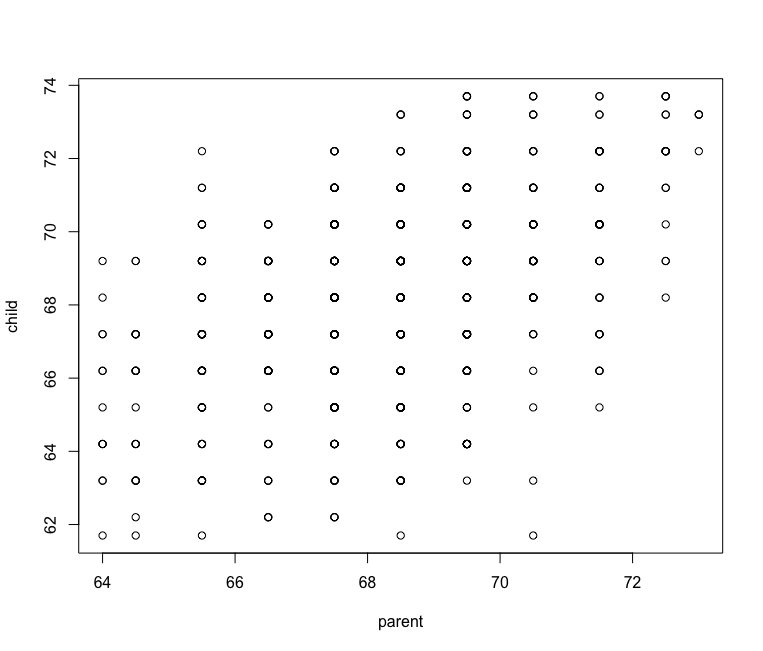

Practice Programming Assignment: swirl Lesson : Introduction to Regression Models.
=========================

 (Slides for this and other Data Science
 courses may be found at github
 https://github.com/DataScienceSpecialization/courses if you want to use them.
 They must be downloaded as a zip file and viewed locally. This lesson corresponds
 to Regression_Models/01_01_introduction.)

 This is the first lesson on Regression Models. We'll begin with the concept of
 "regression toward the mean" and illustrate it with some pioneering work of the
 father of forensic science, Sir Francis Galton.

 Sir Francis studied the relationship between heights of parents and their
 children. His work showed that parents who were taller than average had children
 who were also tall but closer to the average height. Similarly, parents who were
 shorter than average had children who were also shorter than average but less so
 than mom and dad. That is, they were closer to the average height. From one
 generation to the next the heights moved closer to the average or regressed
 toward the mean.

 For this lesson we'll use Sir Francis's parent/child height data which we've
 taken the liberty to load for you as the variable, galton. (Data is from John
 Verzani's website, http://wiener.math.csi.cuny.edu/UsingR/.) So let's get
 started!

 Here is a plot of Galton's data, a set of 928 parent/child height pairs. Moms'
 and dads' heights were averaged together (after moms' heights were adjusted by a
 factor of 1.08). In our plot we used the R function "jitter" on the children's
 heights to highlight heights that occurred most frequently. The dark spots in
 each column rise from left to right suggesting that children's heights do depend
 on their parents'. Tall parents have tall children and short parents have short
 children.

CONTEXT_SHOW_BACKTRACE environmental variable.


 Here we add a red (45 degree) line of slope 1 and intercept 0 to the plot. If
 children tended to be the same height as their parents, we would expect the data
 to vary evenly about this line. We see this isn't the case. On the left half of
 the plot we see a concentration of heights above the line, and on the right half
 we see the concentration below the line.

 Now we've added a blue regression line to the plot. This is the line which has
 the minimum variation of the data around it. (For theory see the slides.) Its
 slope is greater than zero indicating that parents' heights do affect their
 children's. The slope is also less than 1 as would have been the case if children
 tended to be the same height as their parents.


```r
> plot(child ~ parent, galton)
```

 You'll notice that this plot looks a lot different than the original we
 displayed. Why? Many people are the same height to within measurement error, so
 points fall on top of one another. You can see that some circles appear darker
 than others. However, by using R's function "jitter" on the children's heights,
 we can spread out the data to simulate the measurement errors and make high
 frequency heights more visible.




 Now for the regression line. This is quite easy in R. The function lm (linear
 model) needs a "formula" and dataset. You can type "?formula" for more
 information, but, in simple terms, we just need to specify the dependent variable
 (children's heights) ~ the independent variable (parents' heights).

So generate the regression line and store it in the variable regrline. Type
 "regrline <- lm(child ~ parent, galton)"

```r
regrline <- lm(child ~ parent, galton)
```

 The regression line will have a slope and intercept which are estimated from
 data. Estimates are not exact. Their accuracy is gauged by theoretical techniques
 and expressed in terms of "standard error." You can use "summary(regrline)" to
 examine the Galton regression line. Do this now.


 The regression line will have a slope and intercept which are estimated from
 data. Estimates are not exact. Their accuracy is gauged by theoretical techniques
 and expressed in terms of "standard error." You can use "summary(regrline)" to
 examine the Galton regression line. Do this now.
 
```r
> summary(regrline)

Call:
lm(formula = child ~ parent, data = galton)

Residuals:
    Min      1Q  Median      3Q     Max 
-7.8050 -1.3661  0.0487  1.6339  5.9264 

Coefficients:
            Estimate Std. Error t value Pr(>t)    
(Intercept) 23.94153    2.81088   8.517   <2e-16 ***
parent       0.64629    0.04114  15.711   <2e-16 ***
---
Signif. codes:  0 ‘***’ 0.001 ‘**’ 0.01 ‘*’ 0.05 ‘.’ 0.1 ‘ ’ 1

Residual standard error: 2.239 on 926 degrees of freedom
Multiple R-squared:  0.2105,	Adjusted R-squared:  0.2096 
F-statistic: 246.8 on 1 and 926 DF,  p-value: < 2.2e-16

```

 The slope of the line is the estimate of the coefficient, or multiplier, of
 "parent", the independent variable of our data (in this case, the parents'
 heights). From the output of "summary" what is the slope of the regression line?

1: .04114
2: 23.94153
3: .64629

Selection: 1

 A coefficient will be within 2 standard errors of its estimate about 95% of the
 time. This means the slope of our regression is significantly different than
 either 0 or 1 since (.64629) +/- (2*.04114) is near neither 0 nor 1.


 We're now adding two blue lines to indicate the means of the children's heights
 (horizontal) and the parents' (vertical). Note that these lines and the
 regression line all intersect in a point. Pretty cool, huh? We'll talk more about
 this in a later lesson. (Something you can look forward to.)


 The slope of a line shows how much of a change in the vertical direction is
 produced by a change in the horizontal direction. So, parents "1 inch" above the
 mean in height tend to have children who are only .65 inches above the mean. The
 green triangle illustrates this point. From the mean, moving a "1 inch distance"
 horizontally to the right (increasing the parents' height) produces a ".65 inch"
 increase in the vertical direction (children's height).


 

 Similarly, parents who are 1 inch below average in height have children who are
 only .65 inches below average height. The purple triangle illustrates this. From
 the mean, moving a "1 inch distance" horizontally to the left (decreasing the
 parents' height) produces a ".65 inch" decrease in the vertical direction
 (children's height).


