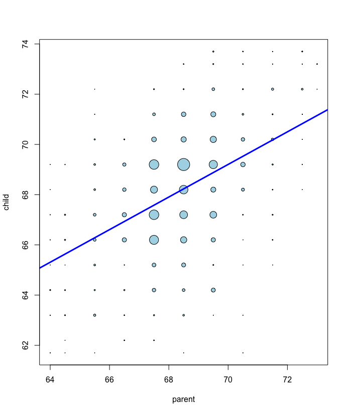
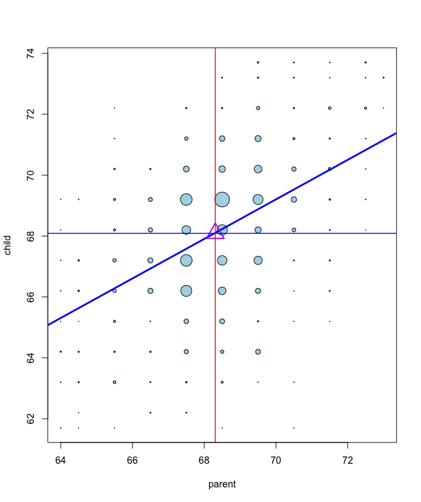
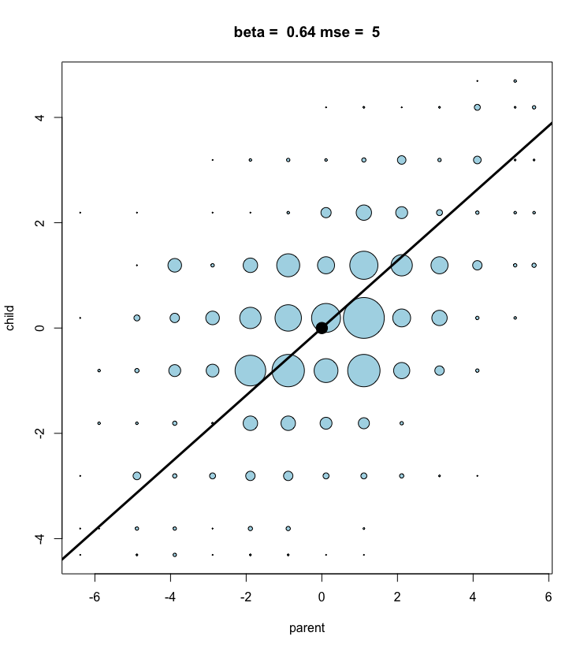
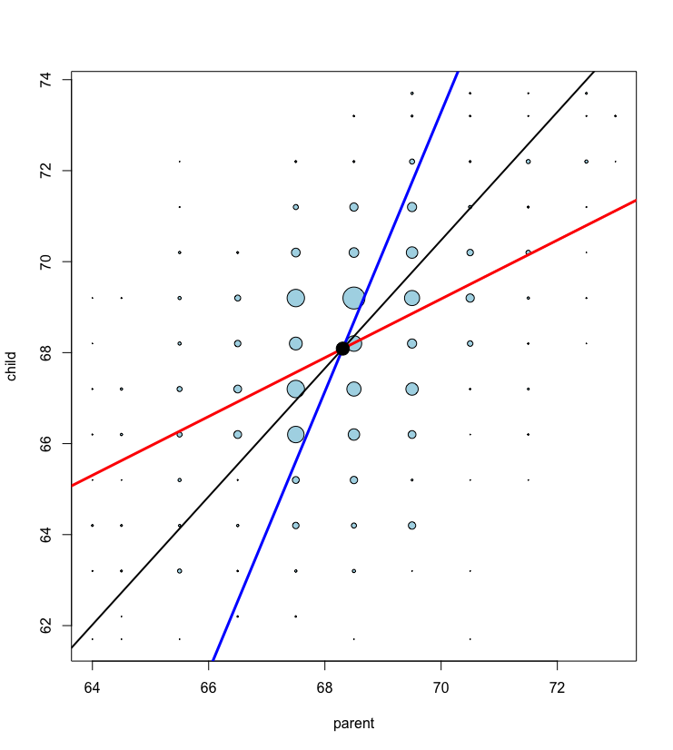

Practice Programming Assignment: swirl Lesson : Least Square.
=========================

In this lesson, if you're using RStudio, you'll be able to play with some of the code which appears in the
  slides. If you're not using RStudio, you can look at the code but you won't be able to experiment with the
  function "manipulate". We provide the code for you so you can examine it without having to type it all out.  In
  RStudio, when the edit window displays code, make sure your flashing cursor is back in the console window
  before you hit "Enter" or any keyboard buttons, otherwise you might accidentally alter the code. If you
  
  do
  alter the file, in RStudio, you can hit Ctrl z in the editor until all the unwanted changes disappear. In other
  editors, you'll have to use whatever key combination performs "undo" to remove all your unwanted changes.


In this lesson, if you're using RStudio, you'll be able to play with some of the code which appears in the
  slides. If you're not using RStudio, you can look at the code but you won't be able to experiment with the
  function "manipulate". We provide the code for you so you can examine it without having to type it all out.  In
  RStudio, when the edit window displays code, make sure your flashing cursor is back in the console window
  before you hit "Enter" or any keyboard buttons, otherwise you might accidentally alter the code. If you do
  alter the file, in RStudio, you can hit Ctrl z in the editor until all the unwanted changes disappear. In other
  editors, you'll have to use whatever key combination performs "undo" to remove all your unwanted changes.

Here are the Galton data and the regression line seen in the Introduction. The regression line summarizes the
  relationship between parents' heights (the predictors) and their children's (the outcomes).




We learned in the last lesson that the regression line is the line through the data which has the minimum (least)
  squared "error", the vertical distance between the 928 actual children's heights and the heights predicted by the
  line. Squaring the distances ensures that data points above and below the line are treated the same. This method of
  choosing the 'best' regression line (or 'fitting' a line to the data) is known as ordinary least squares.



As shown in the slides, the regression line contains the point representing the means of the two sets of heights.
  These are shown by the thin horizontal and vertical lines. The intersection point is shown by the triangle on the
  plot. Its x-coordinate is the mean of the parents' heights and y-coordinate is the mean of the childrens' heights.

As shown in the slides, the slope of the regression line is the correlation between the two sets of heights
  multiplied by the ratio of the standard deviations (childrens' to parents' or outcomes to predictors).


  Here we show code which demonstrates how changing the slope of the regression line affects the mean squared error
  between actual and predicted values. Look it over to see how straightforward it is.

```r
myPlot <- function(beta){
  y <- galton$child - mean(galton$child)
  x <- galton$parent - mean(galton$parent)
  freqData <- as.data.frame(table(x, y))
  names(freqData) <- c("child", "parent", "freq")
  plot(
    as.numeric(as.vector(freqData$parent)), 
    as.numeric(as.vector(freqData$child)),
    pch = 21, col = "black", bg = "lightblue",
    cex = .15 * freqData$freq, 
    xlab = "parent", 
    ylab = "child"
  )
  abline(0, beta, lwd = 3)
  points(0, 0, cex = 2, pch = 19)
  mse <- mean( (y - beta * x)^2 )
  title(paste("beta = ", beta, "mse = ", round(mse, 3)))
}
manipulate(myPlot(beta), beta = slider(0.4, .8, step = 0.02))
```

Now you can actually play with the code to use R's manipulate function and find the minimum squared error.
  You can adjust the slider with the left mouse button or use the right and left arrow keys to see how
  changing the slope (beta) affects the mean squared error (mse). If the slider disappears you can call it
  back by clicking on the little gear in the upper left corner of the plot window.


Which value of the slope minimizes the mean squared error?

1: .44
2: .70
3: 5
4: .64

Selection: 4

What was the minimum mse?

1: .64
2: 5.0
3: .66
4: 44

Selection: 5


  Use R's function "cor" to compute the correlation between these normalized data sets.

```r
> cor(galton$child,galton$parent)
[1] 0.4587624


> cor(gpa_nor,gch_nor)
[1] 0.4587624

```

How does this correlation relate to the correlation of the unnormalized data?

1: It is the same.
2: It is smaller.
3: It is bigger.

Selection: 1

Use R's function "lm" to generate the regression line using this normalized data. Store it in a variable
  called l_nor. Use the parents' heights as the predictors (independent variable) and the childrens' as the
  predicted (dependent). Remember, 'lm' needs a formula of the form dependent ~ independent. Since we've
  created the data vectors for you there's no need to provide a second "data" argument as you have previously.
```r
> l_nor <- lm(gch_nor ~ gpa_nor )
```



We'll close with a final display of source code from the slides. It plots the galton data with three
  regression lines, the original in red with the children as the outcome, a new blue line with the parents' as
  outcome and childrens' as predictor, and a black line with the slope scaled so it equals the ratio of the
  standard deviations.


