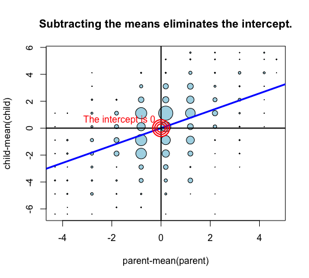

swirl Lesson 2: Introduction to Multivariable 
========

 Introduction to Multivariable Regression. (Slides for this and other Data Science courses may be found at github
 https://github.com/DataScienceSpecialization/courses. If you care to use them, they must be downloaded as a zip
 file and viewed locally. This lesson corresponds to Regression_Models/02_01_multivariate. Galton data is from
 John Verzani's Using R website, http://wiener.math.csi.cuny.edu/UsingR/)

 In this lesson we'll illustrate that regression in many variables amounts to a series of regressions in one.
 Using regression in one variable, we'll show how to eliminate any chosen regressor, thus reducing a regression in
 N variables, to a regression in N-1. Hence, if we know how to do a regression in 1 variable, we can do a
 regression in 2. Once we know how to do a regression in 2 variables, we can do a regression in 3, and so on. We
 begin with the galton data and a review of eliminating the intercept by subtracting the means.

When we perform a regression in one variable, such as lm(child ~ parent, galton), we get two coefficients, a
 slope and an intercept. The intercept is really the coefficient of a special regressor which has the same value,
 1, at every sample. The function, lm, includes this regressor by default.

 We'll demonstrate by substituting an all-ones regressor of our own. This regressor must have the same number of
 samples as galton (928.) Create such an object and name it ones, using ones <- rep(1, nrow(galton)), or some
 equivalent expression.
```r
> ones <- rep(1, nrow(galton))
```
 The galton data has already been loaded. The default intercept can be excluded by using -1 in the formula.
 Perform a regression which substitutes our regressor, ones, for the default using lm(child ~ ones + parent -1,
 galton). Since we want the result to print, don't assign it to a variable.
```r
> lm(child ~ ones + parent -1,galton)


Call:
lm(formula = child ~ ones + parent - 1, data = galton)

Coefficients:
   ones   parent  
23.9415   0.6463  
```
The coefficient of ones is 23.9415. Now use the default, lm(child ~ parent, galton), to show the intercept has
 the same value. This time, DO NOT suppress the intercept with -1.
```r
> lm(child ~ parent, galton)

Call:
lm(formula = child ~ parent, data = galton)

Coefficients:
(Intercept)       parent  
    23.9415       0.6463  
    ```

In earlier lessons we demonstrated that the regression line given by lm(child ~ parent, galton) goes through the
 point x=mean(parent), y=mean(child). We also showed that if we subtract the mean from each variable, the
 regression line goes through the origin, x=0, y=0, hence its intercept is zero. Thus, by subtracting the means,
 we eliminate one of the two regressors, the constant, leaving just one, parent. The coefficient of the remaining
 regressor is the slope.

 Subtracting the means to eliminate the intercept is a special case of a general technique which is sometimes
 called Gaussian Elimination. As it applies here, the general technique is to pick one regressor and to replace
 all other variables by the residuals of their regressions against that one.

Suppose, as claimed, that subtracting a variable's mean is a special case of replacing the variable with a
 residual. In this special case, it would be the residual of a regression against what?

1: The outcome
2: The variable itself
3: The constant, 1

Selection: 3


 The mean of a variable is the coefficient of its regression against the constant, 1. Thus, subtracting the mean
 is equivalent to replacing a variable by the residual of its regression against 1. In an R formula, the constant
 regressor can be represented by a 1 on the right hand side. Thus, the expression, lm(child ~ 1, galton),
 regresses child against the constant, 1. Recall that in the galton data, the mean height of a child was 68.09
 inches. Use lm(child ~ 1, galton) to compare the resulting coefficient (the intercept) and the mean height of
 68.09. Since we want the result to print, don't assign it a name.
```r
> lm(child ~ 1, galton)

Call:
lm(formula = child ~ 1, data = galton)

Coefficients:
(Intercept)  
      68.09  
```
      
The mean of a variable is equal to its regression against the constant, 1.

1: True
2: False

Selection: 1

To illustrate the general case we'll use the trees data from the datasets package. The idea is to predict the
 Volume of timber which a tree might produce from measurements of its Height and Girth. To avoid treating the
 intercept as a special case, we have added a column of 1's to the data which we shall use in its place. Please
 take a moment to inspect the data using either View(trees) or head(trees).


 A file of relevant code has been copied to your working directory and sourced. The file, elimination.R, should
 have appeared in your editor. If not, please open it manually.

```r
# Regress the given variable on the given predictor,
# suppressing the intercept, and return the residual.
regressOneOnOne <- function(predictor, other, dataframe){
  # Point A. Create a formula such as Girth ~ Height -1
  formula <- paste0(other, " ~ ", predictor, " - 1")
  # Use the formula in a regression and return the residual.
  resid(lm(formula, dataframe))
}

# Eliminate the specified predictor from the dataframe by
# regressing all other variables on that predictor
# and returning a data frame containing the residuals
# of those regressions.
eliminate <- function(predictor, dataframe){
  # Find the names of all columns except the predictor.
  others <- setdiff(names(dataframe), predictor)
  # Calculate the residuals of each when regressed against the given predictor
  temp <- sapply(others, function(other)regressOneOnOne(predictor, other, dataframe))
  # sapply returns a matrix of residuals; convert to a data frame and return.
  as.data.frame(temp)
}
```


The general technique is to pick one predictor and to replace all other variables by the residuals of their
 regressions against that one. The function, regressOneOnOne, in eliminate.R performs the first step of this
 process. Given the name of a predictor and one other variable, other, it returns the residual of other when
 regressed against predictor. In its first line, labeled Point A, it creates a formula. Suppose that predictor
 were 'Girth' and other were 'Volume'. What formula would it create?

1: Volume ~ Girth - 1
2: Girth ~ Volume - 1
3: Volume ~ Girth

Selection: 1

 The remaining function, eliminate, applies regressOneOnOne to all variables except a given predictor and collects
 the residuals in a data frame. We'll first show that when we eliminate one regressor from the data, a regression
 on the remaining will produce their correct coefficients. (Of course, the coefficient of the eliminated regressor
 will be missing, but more about that later.)

 For reference, create a model named fit, based on all three regressors, Girth, Height, and Constant, and assign
 the result to a variable named fit. Use an expression such as fit <- lm(Volume ~ Girth + Height + Constant -1,
 trees). Don't forget the -1, and be sure to name the model fit for later use.
```r
> fit <- lm(Volume ~ Girth + Height + Constant -1,trees)
```
Now let's eliminate Girth from the data set. Call the reduced data set trees2 to indicate it has only 2
 regressors. Use the expression trees2 <- eliminate("Girth", trees).
```r
> trees2 <- eliminate("Girth", trees)

> head(trees2)
   Constant   Height     Volume
1 0.4057735 24.38809  -9.793826
2 0.3842954 17.73947 -10.520109
3 0.3699767 14.64038 -11.104298
4 0.2482677 14.29818  -9.019900
5 0.2339490 22.19910  -7.104089
6 0.2267896 23.64956  -6.446183
```
Now create a model, called fit2, using the reduced data set. Use an expression such as fit2 <- lm(Volume ~ Height
 + Constant -1, trees2). Don't forget to use -1 in the formula.
```r
> fit2 <- lm(Volume ~ Height + Constant -1, trees2)
```
Use the expression lapply(list(fit, fit2), coef) to print coefficients of fit and fit2 for comparison.
```r
> lapply(list(fit, fit2), coef)
[[1]]
      Girth      Height    Constant 
  4.7081605   0.3392512 -57.9876589 

[[2]]
     Height    Constant 
  0.3392512 -57.9876589 
  ```
The coefficient of the eliminated variable is missing, of course. One way to get it would be to go back to the original data,
 trees, eliminate a different regressor, such as Height, and do another 2 variable regession, as above. There are much more
 efficient ways, but efficiency is not the point of this demonstration. We have shown how to reduce a regression in 3 variables to a
 regression in 2. We can go further and eliminate another variable, reducing a regression in 2 variables to a regression in 1.

Here is the final step. We have used eliminate("Height", trees2) to reduce the data to the outcome, Volume, and the Constant
 regressor. We have regressed Volume on Constant, and printed the coefficient as shown in the command above the answer. As you can
 see, the coefficient of Constant agrees with previous values.

```r
Call:
lm(formula = Volume ~ Constant - 1, data = eliminate("Height", 
    trees2))

Coefficients:
Constant  
  -57.99  
  ```
 Suppose we were given a multivariable regression problem involving an outcome and N regressors, where N > 1. Using only
 single-variable regression, how can the problem be reduced to a problem with only N-1 regressors?

1: Pick any regressor and replace the outcome and all other regressors by their residuals against the chosen one.
2: Subtract the mean from the outcome and each regressor.

Selection: 1

We have illustrated that regression in many variables amounts to a series of regressions in one. The actual algorithms used by
 functions such as lm are more efficient, but are computationally equivalent to what we have done. That is, the algorithms use
 equivalent steps but combine them more efficiently and abstractly. This completes the lesson.


