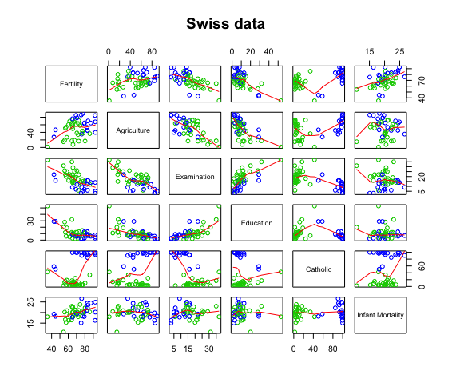

swirl Lesson 3: MultiVar Examples 
========


  MultiVar_Examples. (Slides for this and other Data Science courses may be found at github
  https://github.com/DataScienceSpecialization/courses. If you care to use them, they must be downloaded as a
  zip file and viewed locally. This lesson corresponds to Regression_Models/02_02_multivariateExamples.)




  In this lesson, we'll look at some examples of regression models with more than one variable. We'll begin
  with the Swiss data which we've taken the liberty to load for you. This data is part of R's datasets
  package. It was gathered in 1888, a time of demographic change in Switzerland, and measured six quantities
  in 47 French-speaking provinces of Switzerland. We used the code from the slides (the R function pairs) to
  display here a 6 by 6 array of scatterplots showing pairwise relationships between the variables. All of
  the variables, except for fertility, are proportions of population. For example, "Examination" shows the
  percentage of draftees receiving the highest mark on an army exam, and "Education" the percentage of
  draftees with education beyond primary school.
```r
> head(swiss)
             Fertility Agriculture Examination Education Catholic Infant.Mortality
Courtelary        80.2        17.0          15        12     9.96             22.2
Delemont          83.1        45.1           6         9    84.84             22.2
Franches-Mnt      92.5        39.7           5         5    93.40             20.2
Moutier           85.8        36.5          12         7    33.77             20.3
Neuveville        76.9        43.5          17        15     5.16             20.6
Porrentruy        76.1        35.3           9         7    90.57             26.6
```
First, use the R function lm to generate the linear model "all" in which Fertility is the variable
  dependent on all the others. Use the R shorthand "." to represent the five independent variables in the
  formula passed to lm.  Remember the data is "swiss".
```r
> all <- lm(Fertility ~ ., swiss)
```

Now look at the summary of the linear model all.
```r
> summary(all)

Call:
lm(formula = Fertility ~ ., data = swiss)

Residuals:
     Min       1Q   Median       3Q      Max 
-15.2743  -5.2617   0.5032   4.1198  15.3213 

Coefficients:
                 Estimate Std. Error t value Pr(> t )    
(Intercept)      66.91518   10.70604   6.250 1.91e-07 ***
Agriculture      -0.17211    0.07030  -2.448  0.01873 *  
Examination      -0.25801    0.25388  -1.016  0.31546    
Education        -0.87094    0.18303  -4.758 2.43e-05 ***
Catholic          0.10412    0.03526   2.953  0.00519 ** 
Infant.Mortality  1.07705    0.38172   2.822  0.00734 ** 
---
Signif. codes:  0 ‘***’ 0.001 ‘**’ 0.01 ‘*’ 0.05 ‘.’ 0.1 ‘ ’ 1

Residual standard error: 7.165 on 41 degrees of freedom
Multiple R-squared:  0.7067,	Adjusted R-squared:  0.671 
F-statistic: 19.76 on 5 and 41 DF,  p-value: 5.594e-10
```

  Recall that the Estimates are the coefficients of the independent variables of the linear model (all of
  which are percentages) and they reflect an estimated change in the dependent variable (fertility) when the
  corresponding independent variable changes. So, 
  
  - for every 1% increase in percent of males involved in agriculture as an occupation we expect a .17 decrease in fertility, holding all the other variables constant.
  - for every 1% increase in Catholicism, we expect a .10 increase in fertility, holding all other
  variables constant.

The "*" at the far end of the row indicates that the influence of Agriculture on Fertility is significant.
 At what alpha level is the t-test of Agriculture significant?

1: 0.1
2: 0.05
3: 0.01
4: R doesn't say

Selection: 2

Now generate the summary of another linear model (don't store it in a new variable) in which Fertility
 depends only on agriculture.
```r
> summary(lm(Fertility ~ Agriculture, swiss))

Call:
lm(formula = Fertility ~ Agriculture, data = swiss)

Residuals:
     Min       1Q   Median       3Q      Max 
-25.5374  -7.8685  -0.6362   9.0464  24.4858 

Coefficients:
            Estimate Std. Error t value Pr(>t)    
(Intercept) 60.30438    4.25126  14.185   <2e-16 ***
Agriculture  0.19420    0.07671   2.532   0.0149 *  
---
Signif. codes:  0 ‘***’ 0.001 ‘**’ 0.01 ‘*’ 0.05 ‘.’ 0.1 ‘ ’ 1

Residual standard error: 11.82 on 45 degrees of freedom
Multiple R-squared:  0.1247,	Adjusted R-squared:  0.1052 
F-statistic: 6.409 on 1 and 45 DF,  p-value: 0.01492
```

What is the coefficient of agriculture in this new model?

1: *
2: 0.07671
3: 60.30438
4: 0.19420

Selection: 4

The interesting point is that the sign of the Agriculture coefficient changed from negative (when all the
 variables were included in the model) to positive (when the model only considered Agriculture). Obviously
 the presence of the other factors affects the influence Agriculture has on Fertility.

Let's consider the relationship between some of the factors. How would you expect level Education and
 performance on an Examination to be related?

1: They would be correlated
2: I would not be able to guess without more information
3: They would be uncorrelated

Selection: 1

 Now check your intuition with the R command "cor". This computes the correlation between Examination and
 Education.
```r
> cor(swiss$Examination,swiss$Education)
[1] 0.6984153
```
The correlation of .6984 shows the two are correlated. Now find the correlation between Agriculture and
 Education.
```r
> cor(swiss$Agriculture,swiss$Education)
[1] -0.6395225
```
 The negative correlation (-.6395) between Agriculture and Education might be affecting Agriculture's
 influence on Fertility. I've loaded and sourced the file swissLMs.R in your working directory. In it is a
 function makelms() which generates a sequence of five linear models. Each model has one more independent
 variable than the preceding model, so the first has just one independent variable, Agriculture, and the
 last has all 5. I've tried loading the source code in your editor. If I haven't done this, open the file
 manually so you can look at the code.
```r
makelms <- function(){
  # Store the coefficient of linear models with different independent variables
  cf <- c(coef(lm(Fertility ~ Agriculture, swiss))[2], 
          coef(lm(Fertility ~ Agriculture + Catholic,swiss))[2],
          coef(lm(Fertility ~ Agriculture + Catholic + Education,swiss))[2],
          coef(lm(Fertility ~ Agriculture + Catholic + Education + Examination,swiss))[2],
          coef(lm(Fertility ~ Agriculture + Catholic + Education + Examination +Infant.Mortality, swiss))[2])
  print(cf)
}
```

Now we'll show what happens when we add a variable that provides no new linear information to a model.
 Create a variable ec that is the sum of swiss$Examination and swiss$Catholic.
```r
> ec <- swiss$Examination + swiss$Catholic


# Regressor generation process 1.
rgp1 <- function(){
  print("Processing. Please wait.")
  # number of samples per simulation
  n <- 100
  # number of simulations
  nosim <- 1000
  # set seed for reproducability
  set.seed(4321)
  # Point A:
  x1 <- rnorm(n)
  x2 <- rnorm(n)
  x3 <- rnorm(n)
  # Point B:
  betas <- sapply(1 : nosim, function(i)makelms(x1, x2, x3))
  round(apply(betas, 1, var), 5)
}

# Regressor generation process 2.
rgp2 <- function(){
  print("Processing. Please wait.")
  # number of samples per simulation
  n <- 100
  # number of simulations
  nosim <- 1000
  # set seed for reproducability
  set.seed(4321)
  # Point C:
  x1 <- rnorm(n)
  x2 <- x1/sqrt(2) + rnorm(n) /sqrt(2)
  x3 <- x1 * 0.95 + rnorm(n) * sqrt(1 - 0.95^2)
  # Point D:
  betas <- sapply(1 : nosim, function(i)makelms(x1, x2, x3))
  round(apply(betas, 1, var), 5)
}
```r
Now run the function makelms() to see how the addition of variables affects the coefficient of Agriculture
 in the models.

```r
> makelms()
Agriculture Agriculture Agriculture Agriculture Agriculture 
  0.1942017   0.1095281  -0.2030377  -0.2206455  -0.1721140 
  ```
The addition of which variable changes the sign of Agriculture's coefficient from positive to negative?

1: Education
2: Examination
3: Infant.Mortality
4: Catholic

Selection: 1  


Now generate a new model efit with Fertility as the dependent variable and the remaining 5 of the original
 variables AND ec as the independent variables. Use the R shorthand ". + ec" for the righthand side of the
 formula.
```r
> efit <- lm(Fertility ~ . + ec, swiss)
```
We'll see that R ignores this new term since it doesn't add any information to the model.
Subtract the efit coefficients from the coefficients of the first model you created, all.
```r
> all$coefficients - efit$coefficients
     (Intercept)      Agriculture      Examination        Education         Catholic Infant.Mortality 
               0                0                0                0                0                0 
              ec 
              NA 
Warning message:
In all$coefficients - efit$coefficients :
  longer object length is not a multiple of shorter object length
 ``` 
