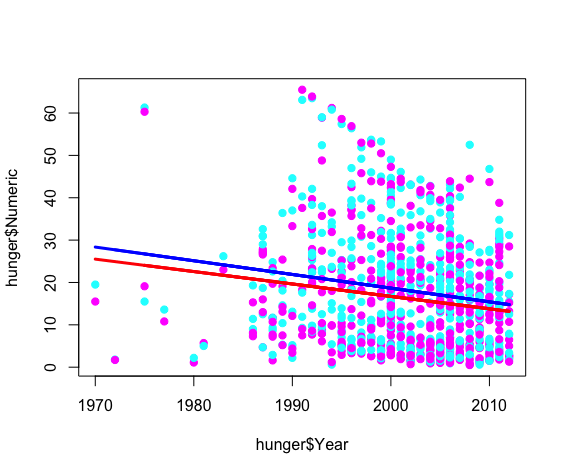
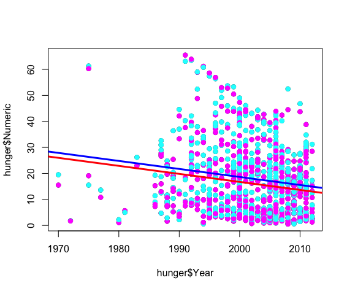

swirl Lesson 3: MultiVar Examples 
========

 MultiVar_Examples3. (Slides for this and other Data Science courses may be found at github
 https://github.com/DataScienceSpecialization/courses. If you care to use them, they must be downloaded as a
 zip file and viewed locally. This lesson corresponds to Regression_Models/02_02_multivariateExamples.)

This is the third and final lesson in which we'll look at regression models with more than one independent
 variable or predictor. We'll begin with WHO hunger data which we've taken the liberty to load for you. WHO
 is the World Health Organization and this data concerns young children from around the world and rates of
 hunger among them which the organization compiled over a number of years. The original csv file was very
 large and we've subsetted just the rows which identify the gender of the child as either male or female.
 We've read the data into the data frame "hunger" for you, so you can easily access it.

As we did in the last lesson let's first try to get a better understanding of the dataset. Use the R
 function dim to find the dimensions of hunger.
```r
> dim(hunger)
[1] 948  13
```
Now use the R function names to find out what the 13 columns of hunger represent.
```r
> names(hunger)
 [1] "X"              "Indicator"      "Data.Source"    "PUBLISH.STATES" "Year"           "WHO.region"    
 [7] "Country"        "Sex"            "Display.Value"  "Numeric"        "Low"            "High"          
[13] "Comments"   
```
The Numeric column for a particular row tells us the percentage of children under age 5 who were
 underweight when that sample was taken. This is one of the columns we'll be focussing on in this lesson. It
 will be the outcome (dependent variable) for the models we generate.

Let's first look at the rate of hunger and see how it's changed over time. Use the R function lm to
 generate the linear model in which the rate of hunger, Numeric, depends on the predictor, Year. Put the
 result in the variable fit.
```r
> fit <- lm(Numeric ~ Year, data = hunger)
```
Now look at the coef portion of the summary of fit.
```r
> summary(fit)$coef
              Estimate  Std. Error   t value     Pr(>t)
(Intercept) 634.479660 121.1445995  5.237375 2.007699e-07
Year         -0.308397   0.0605292 -5.095012 4.209412e-07
```
What is the coefficient of hunger$Year?

1: -0.30840
2: 634.47966
3: 0.06053
4: 121.14460

Selection: 1

Recall the meaning of the slope of a line. For every unit change in the independent variable (Year) there
 is a -.3084 change (decrease) in the dependent variable (percentage of hungry children).

1: As time goes on, the rate of hunger decreases
2: As time goes on, the rate of hunger increases
3: I haven't a clue

Selection: 1

Numeric gives a percentage of hungry children, and an intercept is the point at which a line intersects the
 axis. The axis represents a 0 value.

1: the percentage of hungry children at year 0
2: the number of hungry children at year 0
3: the number of children questioned in the survey

Selection: 1

Now let's use R's subsetting capability to look at the rates of hunger for the different genders to see
 how, or even if, they differ.  Once again use the R function lm to generate the linear model in which the
 rate of hunger (Numeric) for female children depends on Year. Put the result in the variable lmF. You'll
 have to use the R construct x[hunger$Sex=="Female"] to pick out both the correct Numerics and the correct
 Years.
```r
lmF <- lm(hunger$Numeric[hunger$Sex=="Female"] ~ hunger$Year[hunger$Sex=="Female"]) at the R prompt or
 more simply lmF <- lm(Numeric[Sex=="Female"] ~ Year[Sex=="Female"],hunger)

> lmF <- lm(Numeric[Sex=="Female"] ~ Year[Sex=="Female"],hunger)

```

Do the same for male children and put the result in lmM.
```r
> lmM <- lm(Numeric[Sex=="Male"] ~ Year[Sex=="Male"],hunger)
```
 Now we'll plot the data points and fitted lines using different colors to distinguish between 
 
 males (blue)
 females (pink).



We can see from the plot that the lines are not exactly parallel. On the right side of the graph (around
 the year 2010) they are closer together than on the left side (around 1970). Since they aren't parallel,
 their slopes must be different, though both are negative. Of the following R expressions which would
 confirm that the slope for males is negative?

1: lmM$coef[1]
2: lmM$coef[2]
3: lmF$coef[2]

Selection: 2

Create lmBoth now. Numeric is the dependent, Year and Sex are the independent variables. The data is
 "hunger". For lmBoth, make sure Year is first and Sex is second.
```r
> lmBoth <- lm(Numeric ~ Year + Sex, data = hunger)

> summary(lmBoth)

Call:
lm(formula = Numeric ~ Year + Sex, data = hunger)

Residuals:
    Min      1Q  Median      3Q     Max 
-25.472 -11.297  -1.848   7.058  45.990 

Coefficients:
            Estimate Std. Error t value Pr(>t)    
(Intercept) 633.5283   120.8950   5.240 1.98e-07 ***
Year         -0.3084     0.0604  -5.106 3.99e-07 ***
SexMale       1.9027     0.8576   2.219   0.0267 *  
---
Signif. codes:  0 ‘***’ 0.001 ‘**’ 0.01 ‘*’ 0.05 ‘.’ 0.1 ‘ ’ 1

Residual standard error: 13.2 on 945 degrees of freedom
Multiple R-squared:  0.03175,	Adjusted R-squared:  0.0297 
F-statistic: 15.49 on 2 and 945 DF,  p-value: 2.392e-07
```

Notice that three estimates are given, the intercept, one for Year and one for Male. What happened to the
 estimate for Female? Note that Male and Female are categorical variables hence they are factors in this
 model. Recall from the last lesson (and slides) that R treats the first (alphabetical) factor as the
 reference and its estimate is the intercept which represents the percentage of hungry females at year 0.
 The estimate given for the factor Male is a distance from the intercept (the estimate of the reference
 group Female). To calculate the percentage of hungry males at year 0 you have to add together the intercept
 and the male estimate given by the model.


What percentage of young Males were hungry at year 0?

1: 635.431
2: I can't tell since the data starts at 1970.
3: 633.2199
4: 1.9027

Selection: 1


What does the estimate for hunger$Year represent?

1: the annual decrease in percentage of hungry females
2: the annual decrease in percentage of hungry children of both genders
3: the annual decrease in percentage of hungry males

Selection: 2

Now we'll replot the data points along with two new lines using different colors.  The red line will have
 the female intercept and the blue line will have the male intercept.





The lines appear parallel. This is because

1: they have the same slope
2: I have no idea
3: they have slopes that are very close

Selection: 1

Now we'll consider the interaction between year and gender to see how that affects changes in rates of
 hunger. To do this we'll add a third term to the predictor portion of our model formula, the product of
 year and gender.

Create the model lmInter. Numeric is the outcome and the three predictors are Year, Sex, and Sex*Year. The
 data is "hunger".
```r
> lmInter <- lm(Numeric ~ Year + Sex + Sex*Year, data = hunger)


> summary(lmInter)

Call:
lm(formula = Numeric ~ Year + Sex + Sex * Year, data = hunger)

Residuals:
    Min      1Q  Median      3Q     Max 
-25.913 -11.248  -1.853   7.087  46.146 

Coefficients:
              Estimate Std. Error t value Pr(>t)    
(Intercept)  603.50580  171.05519   3.528 0.000439 ***
Year          -0.29340    0.08547  -3.433 0.000623 ***
SexMale       61.94772  241.90858   0.256 0.797946    
Year:SexMale  -0.03000    0.12087  -0.248 0.804022    
---
Signif. codes:  0 ‘***’ 0.001 ‘**’ 0.01 ‘*’ 0.05 ‘.’ 0.1 ‘ ’ 1

Residual standard error: 13.21 on 944 degrees of freedom
Multiple R-squared:  0.03181,	Adjusted R-squared:  0.02874 
F-statistic: 10.34 on 3 and 944 DF,  p-value: 1.064e-06
```

What is the percentage of hungry females at year 0?

1: 61.94772
2: The model doesn't say.
3: 603.5058 (Intercept)

Selection: 3 

What is the percentage of hungry males at year 0?

1: 61.94772
2: 603.5058
3: 665.4535 (Intercept) + SexMale
4: The model doesn't say.

What is the annual change in percentage of hungry females?

1: The model doesn't say.
2: 0.08547
3: -0.29340
4: -0.03000

Selection: 1

 What is the annual change in percentage of hungry males?

1: -0.03000
2: 0.12087
3: -0.32340 Year -0.29340  + Year:SexMale  -0.03000
4: The model doesn't say.

Selection: 3