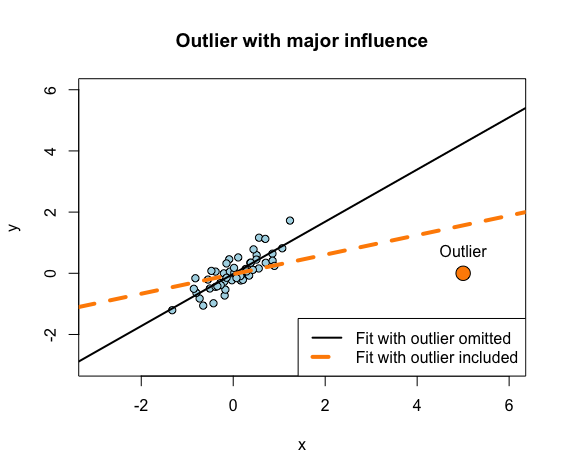

swirl Lesson 3: Residuals Diagnostics and Variation 
========

Residuals, Diagnostics, and Variation. (Slides for this and other Data Science courses may be found at
  github https://github.com/DataScienceSpecialization/courses. If you care to use them, they must be
  downloaded as a zip file and viewed locally. This lesson corresponds to
  Regression_Models/02_04_residuals_variation_diagnostics.)

In the accompanying figure there is a fairly obvious outlier. However obvious, it does not affect the fit
  very much as can be seen by comparing the orange line with the black. The orange line represents a fit in
  which the outlier is included in the data set, and the black line represents a fit in which the outlier is
  excluded. Including this outlier does not change the fit very much, so it is said to **lack influence**.


This next figure also has a fairly obvious outlier, but in this case including the outlier changes the fit
  a great deal. The slope and the residuals of the orange line are very different than those of the black
  line. This outlier is said to be **influential**.





Outliers may or may not belong in the data. They may represent real events or they may be spurious. In any
  case, they should be examined. In order to spot them, R provides various diagnostic plots and measures of
  influence. In this lesson we'll illustrate their meanings and use. The basic technique is to examine the
  effects of leaving one sample out, as we did in comparing the black and orange lines above. We'll use the
  influential outlier to illustrate, since leaving it out has clear effects.

The influential outlier is in a data frame named out2. It has two columns, labeled y and x, respectively.
  To begin, create a model named fit using fit <- lm(y ~ x, out2) or an equivalent expression.
```r
> fit <- lm(y ~ x, out2) 
```

The simplest diagnostic plot displays residuals versus fitted values. Residuals should be uncorrelated with
  the fit, independent and (almost) identically distributed with mean zero. Enter plot(fit, which=1) at the R
  prompt to see if this is the case.

```r
> plot(fit, which=1)
```


Do the residuals appear uncorrelated with the fit?

1: Yes
2: No. There is a linear pattern involving all but one residual and the fit.

Selection: 2

The Residuals vs Fitted plot labels certain points with their row names or numbers, numbers in our case.
  Which of the three labeled points would you guess is our influential outlier?

1: 13
2: 50
3: 1

Selection: 3

Our influential outlier is in row 1 of the data. To exclude it is just a matter using out2[-1, ] rather
  than out2 as data. Create a second model, named fitno for 'fit with no outlier', which excludes the
  outlier.

```r
> fitno <- lm(y ~ x, out2[-1, ]) 
```

Display a Residuals vs Fitted plot for fitno. Remember to use which=1.

```r
> plot(fitno, which=1)
```

This plot has none of the patterned appearance of the first. It looks as we would expect if residuals were
  independently and (almost) identically distributed with zero mean, and were uncorrelated with the fit.


The change which inclusion or exclusion of a sample induces in coefficents is a simple measure of its
  influence. Subtract coef(fitno) from coef(fit) to see the change induced by including the influential first
  sample.

```r
> coef(fit)- coef(fitno)
(Intercept)           x 
-0.01167866 -0.53363019 
```

**dfbeta**: The function, dfbeta, does the equivalent calculation for every sample in the data. The first row
  of dfbeta(fit) should match the difference we've just calculated. The second row is a similar calculation
  for the second sample, and so on. Since dfbeta returns a large matrix, use either head(dfbeta(fit)) or
  View(dfbeta(fit)) to examine the result.

```r
> head(dfbeta(fit))
   (Intercept)             x
1 -0.011678662 -0.5336301857
2  0.008636967  0.0045759242
3  0.010323864 -0.0003509441
4  0.003122096 -0.0033664451
5  0.001975966 -0.0008297575
6  0.002230518 -0.0005867041
```

Comparing the first row with those below it, we see that the first sample has a much larger effect on the
  slope (the x column) than other samples. In fact, the magnitude of its effect is about 100 times that of
  any other point. Its effect on the intercept is not very distinctive essentially because its y coordinate
  is 0, the mean of the other samples.

When a sample is included in a model, it pulls the regression line closer to itself (orange line) than that
  of the model which excludes it (black line.) Its residual, the difference between its actual y value and
  that of a regression line, is thus smaller in magnitude when it is included (orange dots) than when it is
  omitted (black dots.) The ratio of these two residuals, orange to black, is therefore small in magnitude
  for an influential sample. For a sample which is not influential the ratio would be close to 1. Hence, 
  
-  1 minus influence, 
-  near 0 not influential, 
-  near 1 influential
  


This measure is sometimes called **influence**, sometimes **leverage**, and sometimes **hat value**. Since it is 1
   minus the ratio of two residuals, to calculate it from scratch we must first obtain the two residuals. The
   ratio's numerator (orange dots) is the residual of the first sample of the model we called fit. The model
   fitno, which excludes this sample, also excludes its residual, so we will have to calculate its value. This
   is easily done. We use R's **predict** function to calculate fitno's predicted value of y and subtract it from
   the actual value. Use the expression resno <- out2[1, "y"] - predict(fitno, out2[1,]) to do the
   calculation.

```r
> resno <- out2[1, "y"] - predict(fitno, out2[1,])
```

Now calculate the influence of our outlier using 1-resid(fit)[1]/resno or an equivalent expression.

```r
> 1-resid(fit)[1]/resno
        1 
0.6311547 
```

**hatvalues**: The function, hatvalues, performs for every sample a calculation equivalent to the one you've
   just done. Thus the first entry of hatvalues(fit) should match the value which you have just calculated.
   Since there are quite a few samples, use head(hatvalues(fit)) or View(hatvalues(fit)) to compare the
   influence measure of our outlier to that of some other samples.

```r
> head(hatvalues(fit))
         1          2          3          4          5          6 
0.63115474 0.02324999 0.01962520 0.04326099 0.02255531 0.02071441 
```

Residuals of individual samples are sometimes treated as having the same variance, which is estimated as
   the sample variance of the entire set of residuals. Theoretically, however, residuals of individual samples
   have different variances and these differences can become large in the presence of outliers. Standardized
   and Studentized residuals attempt to compensate for this effect in two slightly different ways. Both use
   hat values.

We'll consider standardized residuals first. To begin, calculate the sample standard deviation of fit's
   residual by dividing fit's deviance, i.e., its residual sum of squares, by the residual degrees of freedom
   and taking the square root. Store the result in a variable called sigma.

```r
> sigma <- sqrt(deviance(fit)/df.residual(fit)) 
```

Ordinarily we would just divide fit's residual (which has mean 0) by sigma. In the present case we multiply
   sigma times sqrt(1-hatvalues(fit)) to estimate standard deviations of individual samples. Thus, instead of
   dividing resid(fit) by sigma, we divide by sigma*sqrt(1-hatvalues(fit)). The result is called the
   standardized residual. Compute fit's standardized residual and store it in a variable named rstd.

```r
> rstd <- resid(fit)/(sigma * sqrt(1-hatvalues(fit))) 
```

**rstandard**: The function, rstandard, computes the standardized residual which we have just computed step by
   step. Use head(cbind(rstd, rstandard(fit))) or View(cbind(rstd, rstandard(fit))) to compare the two
   calculations.

```r
> head(cbind(rstd, rstandard(fit)))
        rstd           
1 -5.1928156 -5.1928156
2  0.9389601  0.9389601
3  1.0450409  1.0450409
4  0.2682743  0.2682743
5  0.1893339  0.1893339
6  0.2186961  0.2186961
```

A Scale-Location plot shows the square root of standardized residuals against fitted values. Use plot(fit,
   which=3) to display it.

```r
> plot(fit,which=3)
```


```r
> plot(fitno,which=3)
```


Most of the diagnostic statistics under discussion were developed because of perceived shortcomings of
   other diagnostics and because their distributions under a null hypothesis could be characterized. The
   assumption that residuals are approximately normal is implicit in such characterizations. Since
   standardized residuals adjust for individual residual variances, a QQ plot of standardized residuals
   against normal with constant variance is of interest. Use plot(fit, which=2) to display this diagnostic
   plot.

```r
> plot(fit, which=2)
```


```r
> plot(fitno, which=2)
```


Look at the outlier's standardized residual, labeled 1 on the Normal QQ plot. About how many standard
   deviations from the mean is it? This would be its position on the vertical axis.

1: About -5 x
2: About -2

Selection: 1

Studentized residuals, (sometimes called externally Studentized residuals,) estimate the standard
   deviations of individual residuals using, in addition to individual hat values, the deviance of a model
   which leaves the associated sample out. We'll illustrate using the outlier. Recalling that the model we
   called fitno omits the outlier sample, calculate the sample standard deviation of fitno's residual by
   dividing its deviance, by its residual degrees of freedom and taking the square root. Store the result in a
   variable called sigma1.

```r
> sigma1 <- sqrt(deviance(fitno)/df.residual(fitno)) 
```

Calculate the Studentized residual for the outlier sample by dividing resid(fit)[1] by the product of
   sigma1 and sqrt(1-hatvalues(fit)[1]). There is no need to store this in a variable.

```r
> rstd <- resid(fit)[1]/(sigma1 * sqrt(1-hatvalues(fit)[1])) 
```

**rstudent**: The function, rstudent, calculates Studentized residuals for each sample using a procedure
   equivalent to that which we just used for the outlier. Thus rstudent(fit)[1] should match the value we
   calculated in the previous question. Use head(rstudent(fit)) or View(rstudent(fit)) to verify this and to
   compare the Studentized residual of the outlier with those of other samples.

```r
> head(rstudent(fit)) 
         1          2          3          4          5          6 
-7.6642608  0.9378046  1.0460451  0.2657179  0.1874606  0.2165588 
```

Cook's distance is the last influence measure we will consider. It is essentially the sum of squared
   differences between values fitted with and without a particular sample. It is normalized (divided by)
   residual sample variance times the number of predictors which is 2 in our case (the intercept and x.) It
   essentially tells how much a given sample changes a model. We'll illustrate once again by calculating
   Cook's distance for the outlier.

```r
> dy <- predict(fitno, out2) - predict(fit, out2)
```

Recall that we calculated the sample standard deviation of fit's residual, sigma, earlier. Divide the
   summed squares of dy by 2*sigma^2 to calculate the outlier's Cook's distance. There is no need to store the
   result in a variable.

```r
> sum(dy^2)/(2*sigma^2)
[1] 23.07105
```

**cooks.distance**: The function, cooks.distance, will calculate Cook's distance for each sample. Rather than
   verify that cooks.distance(fit)[1] is equal to the value just calculated, because that sort of thing must
   be getting tedious by now, display a diagnostic plot which uses Cook's distance using plot(fit, which=5).

```r
> plot(fit, which=5)
```


```r
> plot(fitno, which=5)
```
