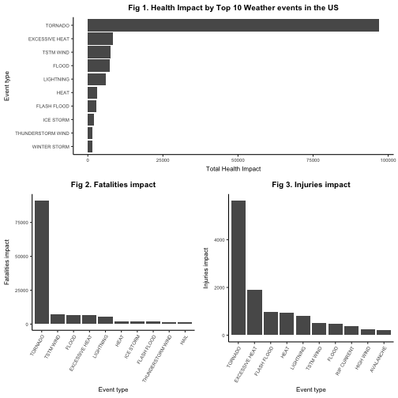
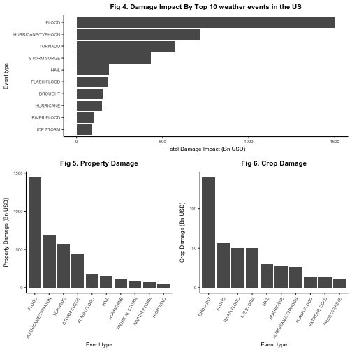
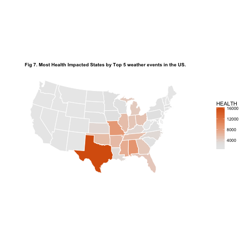
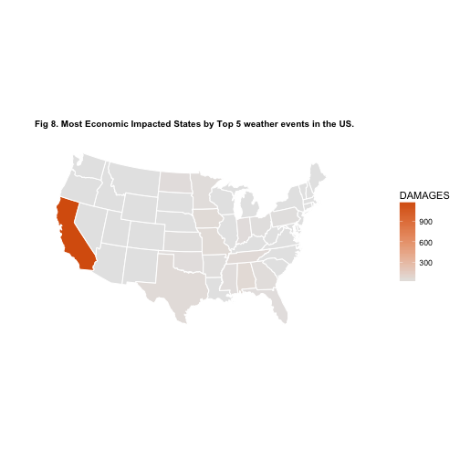
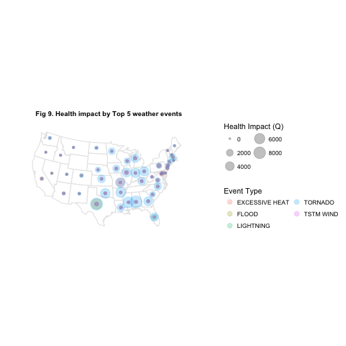
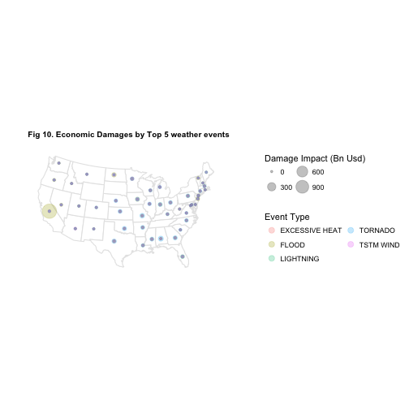

## 1. Synopsis

To find out which weather types caused the most economical damage and damage to human health in the USA between 1950 and 2011, the NOAA Storm Database was explored. The set consists of property damage, crop damage, injuries and fatalities for all registered weather events in the USA for this period. This report shows how the data was processed, analyzed and visualized. Analysis shows that tornado’s cause most damage to properties, crops, and human health. Floods cause much property damage and drought causes most damage to crops. 

## 2. Data Processing

From the the U.S. National Oceanic and Atmospheric Administration's (NOAA) we obtained storm database. This database tracks characteristics of major storms and weather events in the United States, including when and where they occur, as well as estimates of any fatalities, injuries, and property damage. The events in the database start in the year 1950 and end in November 2011. In the earlier years of the database there are generally fewer events recorded, most likely due to a lack of good records. More recent years should be considered more complete.

#### 2.1 Reading data

We first read in data from the file compressed via the bzip2 algorithm. The data is a delimited file were fields are delimited with the "," character and missing values are coded as blank fields. Initially we do read the header data.
                  

```r
noaa0.raw <- read.csv(bzfile("repdata%2Fdata%2FStormData.csv.bz2"), comment.char = "#", header = TRUE, sep = ",", na.strings = "", stringsAsFactors = FALSE)

head(noaa0.raw[,2:8])
```

```
##             BGN_DATE BGN_TIME TIME_ZONE COUNTY COUNTYNAME STATE  EVTYPE
## 1  4/18/1950 0:00:00     0130       CST     97     MOBILE    AL TORNADO
## 2  4/18/1950 0:00:00     0145       CST      3    BALDWIN    AL TORNADO
## 3  2/20/1951 0:00:00     1600       CST     57    FAYETTE    AL TORNADO
## 4   6/8/1951 0:00:00     0900       CST     89    MADISON    AL TORNADO
## 5 11/15/1951 0:00:00     1500       CST     43    CULLMAN    AL TORNADO
## 6 11/15/1951 0:00:00     2000       CST     77 LAUDERDALE    AL TORNADO
```


```r
dim(noaa0.raw)
```

```
## [1] 902297     37
```

```r
dim0 <- strsplit(as.character(dim(noaa0.raw))," ")
```

After reading, we check the first few rows (there are **`902297`**) observations and **`37`** variables in this dataset.


#### 2.2 Identify interested data

Here we extract full variables names to identify those of our interest.


```r
names(noaa0.raw)
```

```
##  [1] "STATE__"    "BGN_DATE"   "BGN_TIME"   "TIME_ZONE"  "COUNTY"    
##  [6] "COUNTYNAME" "STATE"      "EVTYPE"     "BGN_RANGE"  "BGN_AZI"   
## [11] "BGN_LOCATI" "END_DATE"   "END_TIME"   "COUNTY_END" "COUNTYENDN"
## [16] "END_RANGE"  "END_AZI"    "END_LOCATI" "LENGTH"     "WIDTH"     
## [21] "F"          "MAG"        "FATALITIES" "INJURIES"   "PROPDMG"   
## [26] "PROPDMGEXP" "CROPDMG"    "CROPDMGEXP" "WFO"        "STATEOFFIC"
## [31] "ZONENAMES"  "LATITUDE"   "LONGITUDE"  "LATITUDE_E" "LONGITUDE_"
## [36] "REMARKS"    "REFNUM"
```

There are 7 variables that interest us to solve the questions asked:

- `EVTYPE` as a measure of event type (e.g. tornado, snow, heat etc.)
- `FATALITIES` as a measure of harm to human health
- `INJURIES` as a measure of harm to human health
- `PROPDMG` as a measure of property damage and hence economic damage in USD
- `PROPDMGEXP` as a measure of magnitude of property damage (e.g. thousands, millions USD, etc.)
- `CROPDMG` as a measure of crop damage and hence economic damage in USD
- `CROPDMGEXP` as a measure of magnitude of crop damage (e.g. thousands, millions USD, etc.)

We define a subset with the interested variables from raw data.


```r
# Select columns of interest from the noaa0.raw dataset
noaa.data <- select(noaa0.raw, EVTYPE, STATE, FATALITIES, INJURIES, PROPDMG, PROPDMGEXP, CROPDMG, CROPDMGEXP)
```

#### 2.3 Tidy and clean data subset

The following trasformations are applied to subset as follow:

- To replace with zero the data characters and missing values coded as blank fields.
- To Identify data for Damage exponent values (Combination of numeric and alphanumeric values) to converted into numerical values.
- To create new variables PROPDMG.mnt, CROPDMG.mnt representing the absolute total values of property and crop damages.

#### 2.3.1 Normalize blank an NA values

Replace with zero the data characters and missing values coded as blank fields as follow.


```r
# replace blank fields with 0
noaa.data$FATALITIES[(noaa.data$FATALITIES == "")] <- 0
noaa.data$INJURIES[(noaa.data$INJURIES == "")] <- 0
noaa.data$PROPDMG[(noaa.data$PROPDMG == "")] <- 0
noaa.data$CROPDMG[(noaa.data$CROPDMG == "")] <- 0

# replace NA values  with 0
noaa.data$INJURIES[is.na(noaa.data$INJURIES)] <- 0
noaa.data$FATALITIES[is.na(noaa.data$FATALITIES)] <- 0

# replace blank fields DMG with 0
noaa.data$PROPDMGEXP[(noaa.data$PROPDMGEXP == "")] <- 0
noaa.data$CROPDMGEXP[(noaa.data$PROPDMGEXP == "")] <- 0

# replace NA values DMG with 0
noaa.data$PROPDMGEXP[is.na(noaa.data$PROPDMGEXP)] <- 0
noaa.data$CROPDMGEXP[is.na(noaa.data$CROPDMGEXP)] <- 0
```

#### 2.3.2 Normalize property damage data

NationalWeatherService_Project2.pdf, Page 12 explains Damage exponent values, stored as a Factor in a combination of numeric and alphanumeric values. Once the exponents and levels have been identified, we transform them to numerical data using regular expressions. Total property damage is calculated by multiplying Property Damage data with modified Exponent.


```r
# Identify the property damage exponents and levels
unique(noaa.data$PROPDMGEXP)
```

```
##  [1] "K" "M" "0" "B" "m" "+" "5" "6" "?" "4" "2" "3" "h" "7" "H" "-" "1"
## [18] "8"
```

```r
# Normalize Damage exponents values into absolute values 
noaa.data$PROPDMGEXP.numeric <- noaa.data$PROPDMGEXP

noaa.data$PROPDMGEXP.numeric <- gsub( "?|-|+|0", "0",noaa.data$PROPDMGEXP.numeric)
noaa.data$PROPDMGEXP.numeric <- gsub("1"    , "10" ,noaa.data$PROPDMGEXP.numeric)
noaa.data$PROPDMGEXP.numeric <- gsub("H|h|2", "100" ,noaa.data$PROPDMGEXP.numeric)
noaa.data$PROPDMGEXP.numeric <- gsub("K|k|3", "1000" ,noaa.data$PROPDMGEXP.numeric)
noaa.data$PROPDMGEXP.numeric <- gsub("4"    , "10000" ,noaa.data$PROPDMGEXP.numeric)
noaa.data$PROPDMGEXP.numeric <- gsub("5"    , "100000" ,noaa.data$PROPDMGEXP.numeric)
noaa.data$PROPDMGEXP.numeric <- gsub("M|m|6", "1000000" ,noaa.data$PROPDMGEXP.numeric)
noaa.data$PROPDMGEXP.numeric <- gsub("7"    , "10000000" ,noaa.data$PROPDMGEXP.numeric)
noaa.data$PROPDMGEXP.numeric <- gsub("8"    , "100000000" ,noaa.data$PROPDMGEXP.numeric)
noaa.data$PROPDMGEXP.numeric <- gsub("B|b"  , "1000000000" ,noaa.data$PROPDMGEXP.numeric)

# Transform normalized char values representation into numeric values
noaa.data$PROPDMGEXP.numeric <- as.numeric(noaa.data$PROPDMGEXP.numeric)
```

```
## Warning: NAs introduced by coercion
```

```r
# Replace NA values to 0
noaa.data$PROPDMGEXP.numeric[is.na(noaa.data$PROPDMGEXP.numeric)] <- 0

# Calculate the property damage amounts in new variable expressed in (Bn USD)
noaa.data$PROPDMG.mnt <- (noaa.data$PROPDMG * noaa.data$PROPDMGEXP.numeric)/10^9
```

#### 2.3.3 Normalize crop damage data

NationalWeatherService_Project2.pdf, Page 12 explains Crop exponent values, stored as a Factor in a combination of numeric and alphanumeric values. Once the exponents and levels have been identified, we transform them to numerical data using regular expressions. Total Crop damage is calculated by multiplying Crop Damage data with modified Exponent.


```r
# Identify the crop damage exponents and levels
unique(noaa.data$CROPDMGEXP)
```

```
## [1] "0" "M" "K" "m" "B" "?" "k" "2"
```

```r
# Normalize Damage exponents values into absolute values 
noaa.data$CROPDMGEXP.numeric <- noaa.data$CROPDMGEXP

noaa.data$CROPDMGEXP.numeric <- gsub( "?|0", "0",noaa.data$CROPDMGEXP.numeric)
noaa.data$CROPDMGEXP.numeric <- gsub("2", "100" ,noaa.data$CROPDMGEXP.numeric)
noaa.data$CROPDMGEXP.numeric <- gsub("K|k", "1000" ,noaa.data$CROPDMGEXP.numeric)
noaa.data$CROPDMGEXP.numeric <- gsub("M|m", "1000000" ,noaa.data$CROPDMGEXP.numeric)
noaa.data$CROPDMGEXP.numeric <- gsub("B"  , "1000000000" ,noaa.data$CROPDMGEXP.numeric)

# Transform normalized char values representation into numeric values
noaa.data$CROPDMGEXP.numeric <- as.numeric(noaa.data$CROPDMGEXP.numeric)
```

```
## Warning: NAs introduced by coercion
```

```r
# Replace NA values to 0
noaa.data$CROPDMGEXP.numeric[is.na(noaa.data$CROPDMGEXP.numeric)] <- 0

# Calculate the crop damage amounts in new variable expressed in (Bn USD)
noaa.data$CROPDMG.mnt <- noaa.data$CROPDMG * noaa.data$CROPDMGEXP.numeric/1e9
```
This is a portion of the tidy and normalized subset.


```r
head(noaa.data)
```

```
##    EVTYPE STATE FATALITIES INJURIES PROPDMG PROPDMGEXP CROPDMG CROPDMGEXP
## 1 TORNADO    AL          0       15    25.0          K       0          0
## 2 TORNADO    AL          0        0     2.5          K       0          0
## 3 TORNADO    AL          0        2    25.0          K       0          0
## 4 TORNADO    AL          0        2     2.5          K       0          0
## 5 TORNADO    AL          0        2     2.5          K       0          0
## 6 TORNADO    AL          0        6     2.5          K       0          0
##   PROPDMGEXP.numeric PROPDMG.mnt CROPDMGEXP.numeric CROPDMG.mnt
## 1              10000     2.5e-04                  0           0
## 2              10000     2.5e-05                  0           0
## 3              10000     2.5e-04                  0           0
## 4              10000     2.5e-05                  0           0
## 5              10000     2.5e-05                  0           0
## 6              10000     2.5e-05                  0           0
```

#### 2.3.4 Summarizing totals of each incident by event type.

The most straight-forward approach to identify the harmful events for population health is to compare the total fatalities and injuries identified in variables **FATALITIES** and **INJURIES**. 
Then for each variables (Fatalities,Injuries), the total values were estimated, sorted per event type and code as follows.


```r
## Summarize Injuries
noaa.data.Injuries <- select(noaa.data,EVTYPE,INJURIES)  %>% 
      group_by(EVTYPE) %>% 
      summarise(HEALTH = sum(INJURIES)) %>%
      arrange(desc(HEALTH)) 

## Summarize Fatalities
noaa.data.Fatalities <- select(noaa.data,EVTYPE,FATALITIES)  %>% 
      group_by(EVTYPE) %>% 
      summarise(HEALTH = sum(FATALITIES)) %>%
      arrange(desc(HEALTH))

## Summarize Total health
noaa.data.Health <- rbind(noaa.data.Injuries,noaa.data.Fatalities) %>% 
      group_by(EVTYPE) %>% 
      summarise(HEALTH = sum(HEALTH)) %>%
      arrange(desc(HEALTH))  %>%
      top_n(n=10,wt=HEALTH) 
```

The most straight-forward approach to identify the greatest economic consequences events is to compare the total  crops and properties damages calculated in variables **PROPDMG.mnt** and **CROPDMG.mnt**.
Then for each event (Property damage and Crop damage), the total values were estimated, sorted per event type and code as follows.


```r
## Summarize Property Damages
noaa.data.PropDmg <- select(noaa.data,EVTYPE,PROPDMG.mnt)  %>% 
      group_by(EVTYPE) %>% 
      summarise(DAMAGES = round(sum(PROPDMG.mnt),digits=2)) %>%
      arrange(desc(DAMAGES))

## Summarize Crops Damages
noaa.data.CropDmg <- select(noaa.data,EVTYPE,CROPDMG.mnt)  %>% 
      group_by(EVTYPE) %>% 
      summarise(DAMAGES = round(sum(CROPDMG.mnt),digits=2)) %>%
      arrange(desc(DAMAGES))

## Summarize Total Damages
noaa.data.Damages <- rbind(noaa.data.PropDmg,noaa.data.CropDmg) %>% 
      group_by(EVTYPE) %>% 
      summarise(DAMAGES = round(sum(DAMAGES),digits=2)) %>%
      arrange(desc(DAMAGES)) %>%
      top_n(n=10,wt=DAMAGES) 
```


#### 2.3.5 Subset and order data to plot. 

The data is prepared to resume and order in subsets of ten observations for injuries, fatalities, Property damage and crop damage. This subsets are use in plots generation.


```r
# Order Top 10 Injuries data for ggplot
noaa.data.Injuries.top10 <- head(noaa.data.Injuries,10)
noaa.data.Injuries.top10$EVTYPE <- factor(noaa.data.Injuries.top10$EVTYPE, levels = noaa.data.Injuries.top10$EVTYPE[order(noaa.data.Injuries.top10$HEALTH,decreasing = TRUE)])

# Order Top 10 Fatalities data for ggplot
noaa.data.Fatalities.top10 <- head(noaa.data.Fatalities,10)
noaa.data.Fatalities.top10$EVTYPE <- factor(noaa.data.Fatalities.top10$EVTYPE, levels = noaa.data.Fatalities.top10$EVTYPE[order(noaa.data.Fatalities.top10$HEALTH,decreasing = TRUE)])

# Order Top 10 Property data for ggplot
noaa.data.PropDmg.top10 <- head(noaa.data.PropDmg,10)
noaa.data.PropDmg.top10$EVTYPE <- factor(noaa.data.PropDmg.top10$EVTYPE, levels = noaa.data.PropDmg.top10$EVTYPE[order(noaa.data.PropDmg.top10$DAMAGES,decreasing = TRUE)])

# Order Top 10 Crop data for ggplot
noaa.data.CropDmg.top10 <- head(noaa.data.CropDmg,10)
noaa.data.CropDmg.top10$EVTYPE <- factor(noaa.data.CropDmg.top10$EVTYPE, levels = noaa.data.CropDmg.top10$EVTYPE[order(noaa.data.CropDmg.top10$DAMAGES,decreasing = TRUE)])
```

## 3. Results

Now that we have a handy and tidy subset of the dataset, the data will be prepared to investigate the storm effects on populations health and the economic consequences and answer the following questions:

- Across the United States, which types of events are most harmful to population health?

- Across the United States, which types of events have the greatest economic consequences?

#### 3.1 Harmful events for population health

From all weather event types, tornadoes were most significant harmful events for population health with *`96979`* people affected (*`91346` injured and `5633` fatalities*) as shown in *Figure 1*, follow by excessive heat (*`8428 affected`*), tstm wind (*`7461 affected`*) and floods (*`7259 affected`*). *Table 1* shows the top 10 weather events quantities per event type.

*Note: The full code used to generate Tables is included in the section, Appendix A, Data Tables code*.  


```r
datatable(noaa.data.Health, caption = 'Table 1. Health impact by Top 10 weather events in the US', extensions = 'Scroller', rownames = FALSE,  class = 'cell-border stripe', colnames = c('Event Type', 'Health Impact'))
```

```
## Error in loadNamespace(name): there is no package called 'webshot'
```

<br>
For the case of the injuries the main causes are tornadoes followed by tstm winds and floods as shown in *Figure2*. *Table 2* shows the injuries weather events quantities per event type.


```r
datatable(noaa.data.Injuries, caption = 'Table 2. Injuries Impact by Weather Events in the US', extensions = 'Scroller', rownames = FALSE,  class = 'cell-border stripe', colnames = c('Event Type', 'Injuries'))
```

```
## Error in loadNamespace(name): there is no package called 'webshot'
```
<br>
Unquestionably Tornadoes, heat and floods caused the most fatalities as shown in *Figure3*. *Table 2* shows the fatalities weather events quantities per event type.  


```r
datatable(noaa.data.Fatalities, caption = 'Table 3. Fatalities Impact by weather events in the US', extensions = 'Scroller', rownames = FALSE,  class = 'cell-border stripe', colnames = c('Event Type', 'Fatalities'))
```

```
## Error in loadNamespace(name): there is no package called 'webshot'
```
 
<br><br> 

Plots shows, that for injuries and fatalities, tornadoes are by far the most dangerous events when it comes to population health.

*Note: The full code used to generate Figures is included in the section, Appendix A, Plots code*.  
  

```r
# Plot general health impact
ploth0 <- ggplot(data=noaa.data.Health, aes(x=reorder(EVTYPE, HEALTH), y=HEALTH)) +   geom_bar(stat="identity")  + coord_flip() +  
    ylab("Total Health Impact") + xlab("Event type") +
    ggtitle("Fig 1. Health Impact by Top 10 Weather events in the US") +
    theme_classic() + 
    theme(plot.title = element_text(size=10,lineheight=.8, face="bold", hjust = 0.5))  +
    theme(axis.text = element_text(size = 6)) + theme(axis.title = element_text(size = 8)) 

# Plot injuries impact
ploth1 <- ggplot(noaa.data.Injuries.top10, aes(x = EVTYPE, y = HEALTH)) + 
    geom_bar(stat = "identity") +
    labs(x="Event type", y = "Fatalities impact")  +
    ggtitle("Fig 2. Fatalities impact") +
    theme_classic() +
    theme(plot.title = element_text(size=10,lineheight=.8, face="bold", hjust = 0.5)) +
    theme(axis.text.x = element_text(angle = 60, hjust = 1, size = 6)) +
    theme(axis.text.y = element_text(size = 6)) + theme(axis.title = element_text(size = 8)) 

# Plot fatalities impact
ploth2 <- ggplot(noaa.data.Fatalities.top10, aes(x = EVTYPE, y = HEALTH)) + 
    geom_bar(stat = "identity") + 
    labs(x="Event type", y = "Injuries impact")  +
    ggtitle("Fig 3. Injuries impact") +
    theme_classic() +
    theme(plot.title = element_text(size=10,lineheight=.8, face="bold", hjust = 0.5)) +
    theme(axis.text.x = element_text(angle = 60, hjust = 1, size = 6)) +
    theme(axis.text.y = element_text(size = 6)) +
    theme(axis.title = element_text(size = 8)) 


grid.arrange(ploth0, arrangeGrob(ploth1,ploth2, ncol=2), heights=c(4, 5), ncol=1)
```




#### 3.2 Greatest economic consequences

In general from all weather event types floods caused the most significant economic consequences with **`1503.2 Billion Dollars`** in damages in the US as shown in *Figure 4*, follow by hurricanes/typhons (*`719.14 Bn`*) and tornadoes (*`573.62 Bn`*). *Table 4* shows the top 10 economic impact expressed in Billions USD per event type.

*Note: The full code used to generate Tables is included in the section, Appendix A, Data Tables code*. 


```r
datatable(noaa.data.Damages, caption = 'Table 4. Economic impact by Top 10 weather events in the US', extensions = 'Scroller',  rownames = FALSE,  class = 'cell-border stripe', colnames = c('Event Type', 'Damages (Bn USD)'))
```

```
## Error in loadNamespace(name): there is no package called 'webshot'
```
<br>
Unquestionably floods cause the main property damage (*`1446.58 Bn`*) followed by hurricanes/thypons and tornadoes as shown in *Figure5*. *Table 5* shows the top 10 economic impact to properties in US, expressed in Billions USD per event type.


```r
datatable(noaa.data.PropDmg.top10, caption = 'Table 5. Property impact by Top 10 weather events in the US', extensions = 'Scroller', rownames = FALSE,  class = 'cell-border stripe', colnames = c('Event Type', 'Property Damages (Bn USD)'))
```

```
## Error in loadNamespace(name): there is no package called 'webshot'
```
<br>
For the case of the crop damages (*`139.73 Bn`*) the main causes are drougths followed by floods and river floods as shown in *Figure6*. *Table 6* shows the top 10 economic impact to crops in US, expressed in Billions USD per event type.


```r
datatable(noaa.data.CropDmg.top10, caption = 'Table 6. Crops impact by Top 10 weather events in the US', extensions = 'Scroller', rownames = FALSE,  class = 'cell-border stripe', colnames = c('Event Type', 'Crop Damages (Bn USD)'))
```

```
## Error in loadNamespace(name): there is no package called 'webshot'
```
<br><br> 

Plots shows, that for properties and crops, floods cause the greatest economic consequences.

*Note: The full code used to generate Figures is included in the section, Appendix A, Plots code*.  
  

```r
plotd0 <- ggplot(data=noaa.data.Damages, aes(x=reorder(EVTYPE, DAMAGES), y=DAMAGES)) +   geom_bar(stat="identity")  + coord_flip() +  
    ylab("Total Damage Impact (Bn USD)") +
    xlab("Event type") +
    ggtitle("Fig 4. Damage Impact By Top 10 weather events in the US") +
    theme_classic() +
    theme(plot.title = element_text(size=10, lineheight=.8, face="bold", hjust = 0.5)) +
    theme(axis.text = element_text(size = 6)) +
    theme(axis.title = element_text(size = 8)) 

plotd1 <- ggplot(noaa.data.PropDmg.top10, aes(x = EVTYPE, y = DAMAGES)) + 
    geom_bar(stat = "identity") +
    labs(x="Event type", y = "Property Damage (Bn USD)") +
    ggtitle("Fig 5. Property Damage") +
    theme_classic() +
    theme(plot.title = element_text(size=10,lineheight=.8, face="bold", hjust = 0.5)) +
    theme(axis.text.x = element_text(angle = 60, hjust = 1, size = 6)) +
    theme(axis.text.y = element_text(size = 6)) +
    theme(axis.title = element_text(size = 8)) 

plotd2 <- ggplot(noaa.data.CropDmg.top10, aes(x = EVTYPE, y = DAMAGES)) + 
    geom_bar(stat = "identity") + 
    labs(x="Event type", y = "Crop Damage (Bn USD)")  +
    ggtitle("Fig 6. Crop Damage") +
    theme_classic() +
    theme(plot.title = element_text(size=10,lineheight=.8, face="bold", hjust = 0.5)) +
    theme(axis.text.x = element_text(angle = 60, hjust = 1, size = 6)) +
    theme(axis.text.y = element_text(size = 6)) +
    theme(axis.title = element_text(size = 8)) 


grid.arrange(plotd0, arrangeGrob(plotd1,plotd2, ncol=2), heights=c(4, 5), ncol=1 )
```



## Appendix A.

#### Knitr Setup

```r

# Load libraries
library(ggplot2, quietly = TRUE)
library(dplyr, quietly = TRUE)
library(gridExtra, quietly = TRUE)
library(grid, quietly = TRUE)
library(DT, quietly = TRUE)
library(ggmap, quietly = TRUE)
library(plotly, quietly = TRUE)

# Data table options Setup
options(DT.options = list(
    deferRender = TRUE,
    scrollY = 200,
    scroller = TRUE,
    sDom  = '<"top">lrt<"bottom">ip'
))

```

#### Plots code

The code used to generate plots for figures is included as follow  
  
**Figure 1.** Health Impact by Top 10 Weather events in the US *(ploth0)*  
**Figure 2.** Fatalities impact by Top 10 Weather events in the US *(ploth1)*  
**Figure 3.** Injuries impact by Top 10 Weather events in the US *(ploth2)*  

```r

# Plot general health impact
ploth0 <- ggplot(data=noaa.data.Health, aes(x=reorder(EVTYPE, HEALTH), y=HEALTH)) +   geom_bar(stat="identity")  + coord_flip() +  
    ylab("Total Health Impact") + xlab("Event type") +
    ggtitle("Fig 1. Health Impact by Top 10 Weather events in the US") +
    theme_classic() + 
    theme(plot.title = element_text(size=10,lineheight=.8, face="bold", hjust = 0.5))  +
    theme(axis.text = element_text(size = 6)) + theme(axis.title = element_text(size = 8)) 

# Plot injuries impact
ploth1 <- ggplot(noaa.data.Injuries.top10, aes(x = EVTYPE, y = HEALTH)) + 
    geom_bar(stat = "identity") +
    labs(x="Event type", y = "Fatalities impact")  +
    ggtitle("Fig 2. Fatalities impact") +
    theme_classic() +
    theme(plot.title = element_text(size=10,lineheight=.8, face="bold", hjust = 0.5)) +
    theme(axis.text.x = element_text(angle = 60, hjust = 1, size = 6)) +
    theme(axis.text.y = element_text(size = 6)) + theme(axis.title = element_text(size = 8)) 

# Plot fatalities impact
ploth2 <- ggplot(noaa.data.Fatalities.top10, aes(x = EVTYPE, y = HEALTH)) + 
    geom_bar(stat = "identity") + 
    labs(x="Event type", y = "Injuries impact")  +
    ggtitle("Fig 3. Injuries impact") +
    theme_classic() +
    theme(plot.title = element_text(size=10,lineheight=.8, face="bold", hjust = 0.5)) +
    theme(axis.text.x = element_text(angle = 60, hjust = 1, size = 6)) +
    theme(axis.text.y = element_text(size = 6)) +
    theme(axis.title = element_text(size = 8)) 


grid.arrange(ploth0, arrangeGrob(ploth1,ploth2, ncol=2), heights=c(4, 5), ncol=1)

```

**Figure 4.** Damage Impact By Top 10 weather events in the US *(plotd0)*  
**Figure 5.** Property Damage by Top 10 Weather events in the US *(plotd1)*  
**Figure 6.** Crop damage by Top 10 Weather events in the US *(plotd2)*  

```r

# Plot general economic damages
plotd0 <- ggplot(data=noaa.data.Damages, aes(x=reorder(EVTYPE, DAMAGES), y=DAMAGES)) +   geom_bar(stat="identity")  + coord_flip() +  
    ylab("Total Damage Impact (Bn USD)") +
    xlab("Event type") +
    ggtitle("Fig 4. Damage Impact By Top 10 weather events in the US") +
    theme_classic() +
    theme(plot.title = element_text(size=10, lineheight=.8, face="bold", hjust = 0.5)) +
    theme(axis.text = element_text(size = 6)) +
    theme(axis.title = element_text(size = 8)) 

# Plot property damages
plotd1 <- ggplot(noaa.data.PropDmg.top10, aes(x = EVTYPE, y = DAMAGES)) + 
    geom_bar(stat = "identity") +
    labs(x="Event type", y = "Property Damage (Bn USD)") +
    ggtitle("Fig 5. Property Damage") +
    theme_classic() +
    theme(plot.title = element_text(size=10,lineheight=.8, face="bold", hjust = 0.5)) +
    theme(axis.text.x = element_text(angle = 60, hjust = 1, size = 6)) +
    theme(axis.text.y = element_text(size = 6)) +
    theme(axis.title = element_text(size = 8)) 

# Plot crop damages
plotd2 <- ggplot(noaa.data.CropDmg.top10, aes(x = EVTYPE, y = DAMAGES)) + 
    geom_bar(stat = "identity") + 
    labs(x="Event type", y = "Crop Damage (Bn USD)")  +
    ggtitle("Fig 6. Crop Damage") +
    theme_classic() +
    theme(plot.title = element_text(size=10,lineheight=.8, face="bold", hjust = 0.5)) +
    theme(axis.text.x = element_text(angle = 60, hjust = 1, size = 6)) +
    theme(axis.text.y = element_text(size = 6)) +
    theme(axis.title = element_text(size = 8)) 


grid.arrange(plotd0, arrangeGrob(plotd1,plotd2, ncol=2), heights=c(4, 5), ncol=1)

```

#### Data tables code

The code used to generate tables is included as follow  
  
**Table 1.** Health impact by Top 10 weather events in the US.   
**Table 2.** Injuries impact by weather events in the US.   
**Table 3.** Fatalities impact by weather events in the US.   

```r
# Table 1 Health impact by Top 10 weather events in the US.   
datatable(noaa.data.Health, caption = 'Table 1. Health impact by Top 10 weather events in the US', extensions = 'Scroller', rownames = FALSE,  class = 'cell-border stripe', colnames = c('Event Type', 'Health Impact'))

# Table 2. Injuries impact by weather events in the US.   
datatable(noaa.data.Injuries, caption = 'Table 2. Injuries impact by weather events in the US', extensions = 'Scroller', rownames = FALSE,  class = 'cell-border stripe', colnames = c('Event Type', 'Injuries'))

# Table 3. Fatalities impact by weather events in the US.  
datatable(noaa.data.Fatalities, caption = 'Table 3. Fatalities impact by weather events in the US', extensions = 'Scroller', rownames = FALSE,  class = 'cell-border stripe', colnames = c('Event Type', 'Fatalities'))

```

**Table 4.** Economic impact by Top 10 weather events in the US  
**Table 5.** Property impact by Top 10 weather events in the US  
**Table 6.** Crops impact by Top 10 weather events in the US  

```r

# Table 4. Economic impact by Top 10 weather events in the US  
datatable(noaa.data.Damages, caption = 'Table 4. Economic impact by Top 10 weather events in the US', extensions = 'Scroller',  rownames = FALSE,  class = 'cell-border stripe', colnames = c('Event Type', 'Damages (Bn USD)'))

# Table 5. Property impact by Top 10 weather events in the US 
datatable(noaa.data.PropDmg.top10, caption = 'Table 5. Property impact by Top 10 weather events in the US', extensions = 'Scroller', rownames = FALSE,  class = 'cell-border stripe', colnames = c('Event Type', 'Property Damages (Bn USD)'))

# Table 6. Crops impact by Top 10 weather events in the US 
datatable(noaa.data.CropDmg.top10, caption = 'Table 6. Crops impact by Top 10 weather events in the US', extensions = 'Scroller', rownames = FALSE,  class = 'cell-border stripe', colnames = c('Event Type', 'Crop Damages (Bn USD)'))

```

## Appendix B.

#### Geographical Results

From the American National Standards Institute (ANSI) State Codes, we obtained National FIPS and GNIS Codes File (https://www.census.gov/geo/reference/ansi_statetables.html)

The U.S. National Oceanic and Atmospheric Administration's (NOAA) storm database contains a variable with the State abbreviation `STATE`, from this reference variable we are going to merge GNIS's data to get the full state names. Then we merge this results with two different geographical position, the first one is obtain from R map data libraries to define the geo contours of every State and the second one from Google Api through ploty R library to identify and approx. geo position center for every State.

    


```
## Warning: geocode failed with status ZERO_RESULTS, location = "South Dakota"
```

```
## Warning: geocode failed with status ZERO_RESULTS, location = "Tennessee"
```

```
## Warning: geocode failed with status ZERO_RESULTS, location = "Wyoming"
```

```
## Warning: geocode failed with status ZERO_RESULTS, location = "U.S. Virgin
## Islands"
```

Group NOOA data by State and Event Type and prepare subsets to central States geographical positions


```r
# Summarize Injuries grouped by (STATE, EVTYPE)
noaa.data.State <- select(noaa.data,STATE,EVTYPE,INJURIES,FATALITIES,PROPDMG.mnt,CROPDMG.mnt)  %>%
filter(EVTYPE %in% c("TORNADO", "TSTM WIND","FLOOD","EXCESSIVE HEAT","LIGHTNING")) %>%
mutate(HEALTH=INJURIES+FATALITIES) %>% 
mutate(DAMAGES=PROPDMG.mnt+CROPDMG.mnt) 


noaa.data.State.central <- group_by(noaa.data.State,STATE,EVTYPE) %>% 
summarise(DAMAGES = round(sum(DAMAGES),digits=2), HEALTH = sum(HEALTH))

noaa.data.State.contour <- group_by(noaa.data.State, STATE) %>% 
summarise(DAMAGES = round(sum(DAMAGES),digits=2), HEALTH = sum(HEALTH))


# Merge states.raw <-----> states.pos by index
states.geodata <- select(cbind(states.raw,LONGOOG=states.pos[1],LAT=states.pos[2]),STUSAB,lonGoog,latGoog)

# Merge noaa.data.State.central <----> states.geodata 
noaa.data.State.central <- noaa.data.State.central %>% 
    merge(states.geodata, by.x=1, by.y=1)

# Exclude coord. outside of main zoom 
noaa.data.State.central <- filter(noaa.data.State.central,latGoog<60 & latGoog > 26)
noaa.data.State.central <- filter(noaa.data.State.central,lonGoog>(-148) & lonGoog < (-50))


noaa.data.State.contour <- merge(noaa.data.State.contour,select(states.raw,STUSAB,STATE_NAME), by.x="STATE", by.y="STUSAB")
noaa.data.State.contour <- mutate(noaa.data.State.contour, STATE_NAME = tolower(STATE_NAME))

noaa.data.State.contour <- merge(noaa.data.State.contour,states.data, by.x="STATE_NAME", by.y="region")
noaa.data.State.contour <- arrange(noaa.data.State.contour, group, order)


plot.health.1 <- ggplot(noaa.data.State.contour, aes(x=long, y=lat, group=group, fill=HEALTH)) +
    geom_polygon(colour="white") +
    scale_fill_gradient2(low="#ffffff", mid="grey90", high="#d95f0e", 
                         midpoint=median(noaa.data.State.contour$HEALTH)) +
    coord_map("polyconic") +
    ggtitle("Fig 7. Most Health Impacted States by Top 5 weather events in the US. ") +
    theme_classic() +
    theme(plot.title = element_text(size=10,lineheight=.8, face="bold", hjust = 0.5))  +
    theme(axis.line = element_blank()) +
    theme(axis.title = element_blank()) +
    theme(axis.text = element_blank()) +
    theme(axis.ticks = element_blank()) 


plot.health.2 <- ggplot(noaa.data.State.contour, aes(x=long, y=lat, group=group)) +
    geom_polygon(fill = "white", colour = "grey90") +
    coord_map("polyconic") + 
    scale_size_continuous(range=c(1,8)) + 
    geom_point(aes(x=lonGoog, y=latGoog, colour=EVTYPE, group=EVTYPE, size=HEALTH), data=noaa.data.State.central, alpha=0.25) +
    guides(colour = guide_legend(override.aes = list(size=7)))+
    guides(colour = guide_legend(title="Event Type", override.aes = list(size=3), ncol=2),
           size = guide_legend(title="Health Impact (Q)", ncol=2)) +
    ggtitle("Fig 9. Health impact by Top 5 weather events") +
    theme_classic() +
    theme(plot.title = element_text(size=10,lineheight=.8, face="bold", hjust = 0.5))  +
    theme(axis.line = element_blank()) +
    theme(axis.title = element_blank()) +
    theme(axis.text = element_blank()) +
    theme(axis.ticks = element_blank()) 

plot.damage.1 <- ggplot(noaa.data.State.contour, aes(x=long, y=lat, group=group, fill=DAMAGES)) +
    geom_polygon(colour="white") +
    scale_fill_gradient2(low="#ffffff", mid="grey90", high="#d95f0e", 
                         midpoint=median(noaa.data.State.contour$DAMAGES)) +
    coord_map("polyconic") +
    ggtitle("Fig 8. Most Economic Impacted States by Top 5 weather events in the US. ") +
    theme_classic() +
    theme(plot.title = element_text(size=10,lineheight=.8, face="bold", hjust = 0.5))  +
    theme(axis.line = element_blank()) +
    theme(axis.title = element_blank()) +
    theme(axis.text = element_blank()) +
    theme(axis.ticks = element_blank()) 

plot.damage.2 <- ggplot(noaa.data.State.contour, aes(x=long, y=lat, group=group)) +
    geom_polygon(fill = "white", colour = "grey90") +
    coord_map("polyconic") + 
    scale_size_continuous(range=c(1,8)) + 
    geom_point(aes(x=lonGoog, y=latGoog, colour=EVTYPE, group=EVTYPE, size=DAMAGES), data=noaa.data.State.central, alpha=0.25) +
    guides(colour = guide_legend(override.aes = list(size=7)))+
    guides(colour = guide_legend(title="Event Type", override.aes = list(size=3), ncol=2),
           size = guide_legend(title="Damage Impact (Bn Usd)", ncol=2))+
    ggtitle("Fig 10. Economic Damages by Top 5 weather events") +
    theme_classic() +
    theme(plot.title = element_text(size=10,lineheight=.8, face="bold", hjust = 0.5)) +
    theme(axis.line = element_blank()) +
    theme(axis.title = element_blank()) +
    theme(axis.text = element_blank()) +
    theme(axis.ticks = element_blank()) 
```

The *Fig. 7* shows geographical distribution across the united States of health impact especially in the south and midwest with most impact in Texas.


```r
plot.health.1
```



The *Fig. 8* shows geographical distribution across the united States of Economic damages with most impact in California State.


```r
plot.damage.1
```



The *Fig. 9* shows geographical distribution across the united States of health impact and its size by the top 5 weather events. The map shows that Tornadoes have greatly affected the eastern states.


```r
plot.health.2
```



The *Fig. 10* shows geographical distribution across the united States of economic damages and its size by the top 5 weather events. The map shows that floods have have affected to a great extent the State of California respect to all the other states that have presented damages in crops and properties.


```r
plot.damage.2
```




