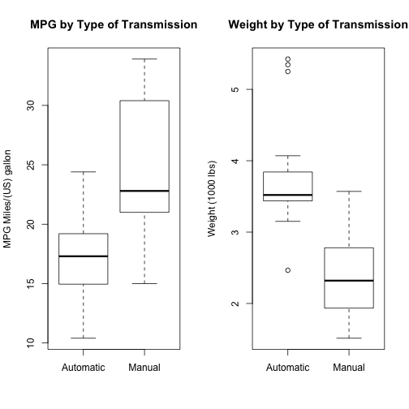
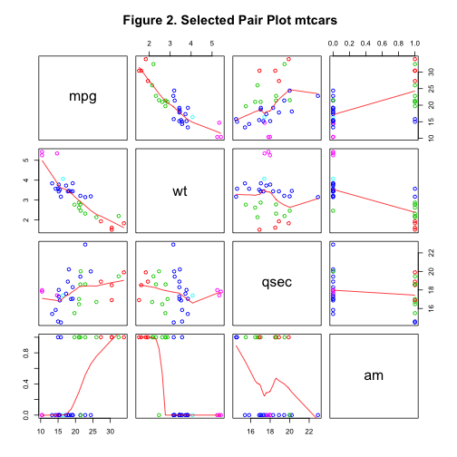
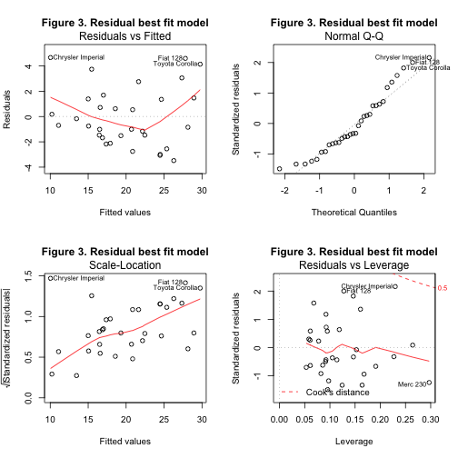
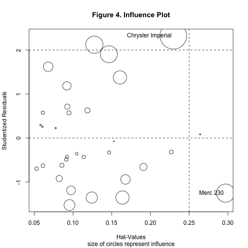

## 1. Executive Summary

The analysis attempts to find out the relationship between miles-per-gallon (Mpg) and other variables in the mtcars data set. In particular, to determine whether an automatic or manual transmission is better for Mpg, and quantifies the Mpg difference. The Analysis focuses on inference with a simple linear regression model and a multiple regression model. Both models support the conclusion that the cars in this study with manual transmissions have on average significantly higher MPG’s than cars with automatic transmissions. This conclusion holds whether we consider the relationship between `Mpg` and transmission type `am` alone or transmission type together with `weight` and `qsec` as aditional predictors. In the multiple regression model selected as best fit model, the MPG difference is **`2.9358`** Mpg in Manual transmission than those with automatic transmission.


## 2. Exploratory Data Analysis

The data was extracted from the 1974 Motor Trend US magazine, and comprises fuel consumption and 10 aspects of automobile design and performance for 32 automobiles (1973–74 models).


#### 2.1 Reading data

load our dataset from the library *datasets* in R

We first read in data from from the library *datasets* in R. The data is the data frame `mtcars (Motor Trend Car Road Tests)`  Initially we do read the header data.
                  

```r
data(mtcars)
head(mtcars)
```

```
##                    mpg cyl disp  hp drat    wt  qsec vs am gear carb
## Mazda RX4         21.0   6  160 110 3.90 2.620 16.46  0  1    4    4
## Mazda RX4 Wag     21.0   6  160 110 3.90 2.875 17.02  0  1    4    4
## Datsun 710        22.8   4  108  93 3.85 2.320 18.61  1  1    4    1
## Hornet 4 Drive    21.4   6  258 110 3.08 3.215 19.44  1  0    3    1
## Hornet Sportabout 18.7   8  360 175 3.15 3.440 17.02  0  0    3    2
## Valiant           18.1   6  225 105 2.76 3.460 20.22  1  0    3    1
```

The variables of dataset are as follow:

- `mpg` as a measure of Miles/(US) gallon
- `cyl` as a measure of Number of cylinders
- `disp` as a measure of Displacement (cu.in.)
- `hp` as a measure of Gross horsepower
- `drat` as a measure of Rear axle ratio
- `wt` as a measure of Weight (1000 lbs)
- `qsec` as a measure of 1/4 mile time
- `vs` as a measure of V/S
- `am` as a measure of Transmission (0 = automatic, 1 = manual)
- `gear` as a measure of Number of forward gears
- `carb` as a measure of Number of carburetors


```r
dim(mtcars)
```

```
## [1] 32 11
```

```r
dim0 <- strsplit(as.character(dim(mtcars))," ")

mt <- mtcars
```

After reading, we check (there are **`32`**) observations and **`11`** variables in this dataset. 19 observations are for automatic transmission cars and 13 for manual transmission cars. There are no variables which allow us to compare manual vs automatic transmission directly.

#### 2.2 Identify interested data

According to the box plot in *Figure 1*, manual transmission (1) yields a higher Mpg and there is another interesting variable `weight` thats shows in the box plot (weight ~ am) that cars with manual transmission have less weigth than those with automatic transmission. 

The above suggests that Mpg performance depends not only on the type of transimision `am` but also on additional variables that must be included in the model like `wt` and `qsec`.

In *Figure 2*, a pair graph is used to generate scatterplots to show the relationship between variables selected best fit model variables. *Figure 3* shows the Residual best fit model mtcars in dataset.
 
 
## 3. Regression Analysis

First build different regression models using different variables in the model and find the best model fit using `step` R function, then perform analysis of residuals with the selected model.

#### 3.1 Model selection

#### 3.1.1 Basic Model `mpg ~ am`

The basic model includes `mpg` as intercept and the interest variable `am` as predictor.


```r
lm.basic.model <- lm(mpg ~ am, mt)
summary(lm.basic.model)
```

```
## 
## Call:
## lm(formula = mpg ~ am, data = mt)
## 
## Residuals:
##     Min      1Q  Median      3Q     Max 
## -9.3923 -3.0923 -0.2974  3.2439  9.5077 
## 
## Coefficients:
##             Estimate Std. Error t value Pr(>|t|)    
## (Intercept)   17.147      1.125  15.247 1.13e-15 ***
## am             7.245      1.764   4.106 0.000285 ***
## ---
## Signif. codes:  0 '***' 0.001 '**' 0.01 '*' 0.05 '.' 0.1 ' ' 1
## 
## Residual standard error: 4.902 on 30 degrees of freedom
## Multiple R-squared:  0.3598,	Adjusted R-squared:  0.3385 
## F-statistic: 16.86 on 1 and 30 DF,  p-value: 0.000285
```

With the basic model `lm(formula = mpg ~ am, data = mt)`, a car with an automatic transmission has an average of **`17.147`**  Mpg, and manual transmission increases mpg by **`7.245`**. However, this model has an Adjusted R-Squared of **`0.3597989`**, which means the model can only explain about **`35.97%`** of the variance of the MPG. 

#### 3.1.2 Stepwise Model 

With stepwise model selection we use `step` R function that runs the linear models multiple times, build RMs, and select the best variables using forward selection and backward elimination methods with the AIC algorithm. 


```r
summary(lm.best.model)
```

```
## 
## Call:
## lm(formula = mpg ~ wt + qsec + am, data = mt)
## 
## Residuals:
##     Min      1Q  Median      3Q     Max 
## -3.4811 -1.5555 -0.7257  1.4110  4.6610 
## 
## Coefficients:
##             Estimate Std. Error t value Pr(>|t|)    
## (Intercept)   9.6178     6.9596   1.382 0.177915    
## wt           -3.9165     0.7112  -5.507 6.95e-06 ***
## qsec          1.2259     0.2887   4.247 0.000216 ***
## am            2.9358     1.4109   2.081 0.046716 *  
## ---
## Signif. codes:  0 '***' 0.001 '**' 0.01 '*' 0.05 '.' 0.1 ' ' 1
## 
## Residual standard error: 2.459 on 28 degrees of freedom
## Multiple R-squared:  0.8497,	Adjusted R-squared:  0.8336 
## F-statistic: 52.75 on 3 and 28 DF,  p-value: 1.21e-11
```

The result of `step` analysis shows that the best fit model is `lm(formula = mpg ~ wt + qsec + am, data = mt)` consists of three variables `wt` and `qsec`  as confounders and variable `am` as independent variable. The Adjusted R-Squared value is **`0.8496636`**, which means the model can explain about **`84.96%`** of the variance of the MPG.


#### 3.1 Selected Model Examination

The best fit model is `lm(mpg ~ wt + qsec + am, data = mt)` 

**Analysis of Variance Table (ANOVA)**

The model include for the analysis are as follow:

`Model 1` Full model with full variables  
`Model 2` Best fit model from step function  lm(mpg ~ wt + qsec + am, data = mt)
`Model 3` Model with mpg ~ wt + qsec  
`Model 4` Model with mpg ~ wt  
`Model 5` Model with mpg ~ wt  

Since the p-value analysis for Model 2 is  `0.4432` is highly significant, we reject the null hypothesis and conclude that the three confounders `wt`, `qsec` and `am` contribute significantly to the model.


```r
# Analysis of variance (ANOVA)
anova(lm.full.model, lm.best.model, lm.basic.model3, lm.basic.model, lm.basic.model2 )
```

```
## Analysis of Variance Table
## 
## Model 1: mpg ~ cyl + disp + hp + drat + wt + qsec + vs + am + gear + carb
## Model 2: mpg ~ wt + qsec + am
## Model 3: mpg ~ wt + qsec
## Model 4: mpg ~ am
## Model 5: mpg ~ wt
##   Res.Df    RSS Df Sum of Sq       F    Pr(>F)    
## 1     21 147.49                                   
## 2     28 169.29 -7    -21.79  0.4432   0.86361    
## 3     29 195.46 -1    -26.18  3.7271   0.06715 .  
## 4     30 720.90 -1   -525.43 74.8102 2.305e-08 ***
## 5     30 278.32  0    442.57                      
## ---
## Signif. codes:  0 '***' 0.001 '**' 0.01 '*' 0.05 '.' 0.1 ' ' 1
```

**Model Coefficients**

The best fit regression model shows that the coefficient for Manual transmission type is `2.9 Mpg` extra compared to automatic transmission. 


```r
coef(lm.best.model)
```

```
## (Intercept)          wt        qsec          am 
##    9.617781   -3.916504    1.225886    2.935837
```

**Residuals and Diagnostics**

In the residual plots (*Figure 3.*) we can verify the independence condition by looking at the Residuals vs. Fitted plot and verifying the randomness of the scatter of points but there is a bit of a curve, so that it departs slightly from normality. The residuals for the  Merc 230, and Chrysler Imperial are called out because they exert potential influence as shown in *Figure 4.*.


```r
# Potential leverages
fit.leverage <- hatvalues(lm.best.model)
tail(sort(fit.leverage),5)
```

```
##       Maserati Bora  Cadillac Fleetwood   Chrysler Imperial 
##           0.1909815           0.2270069           0.2296338 
## Lincoln Continental            Merc 230 
##           0.2642151           0.2970422
```

The potential influencers in coefficent values are 


```r
# Potential influencers
fit.influence <- dfbetas(lm.best.model)
tail(sort(fit.influence),5)
```

```
## [1] 0.4765680 0.4968861 0.5481272 0.5626418 1.0938422
```

QQ Plot verify the normality condition for the regression residuals as the points in the plot mostly fall on the normal line. 

The points in the Scale-Location are scattered in a constant pattern which verifies the constant variance condition. Using the Residuals vs. Leverage plot we can visually identify some outliers. 

#### 4. Conclusions

- Manual transmission is better for Mpg, holding all other parameters constant (wt, qsec), will increase an average of **`2.94`** more MPG than those with automatic transmission.

- The best fit model `mpg ~ wt + qsec + am` conclude that (with a p < 0.05 confidence) cars with manual transmission have **`2.9358`** more miles per gallon than automatic transmissions. The model seems clean with a p < 0.05 and a Multiple R-squared can explain about  **`84.97%`** of the variance of the MPG.


## Appendix Figures.

#### Figure 1. Boxplot of Mpg & Weight by transmission type


```r
par(mfrow=c(1,2))
boxplot(mpg ~ am, data=mtcars,
        names = c("Automatic","Manual"),
        main = "MPG by Type of Transmission",
        ylab = "MPG Miles/(US) gallon")

boxplot(wt ~ am, data=mtcars,
        names = c("Automatic", "Manual"),
        main ="Weight by Type of Transmission",
        ylab = "Weight (1000 lbs)")
```



#### Figure 2. Pair plot mtcars

This is a pair plot for selected variables correlations associated with the best fit model with variables `mpg`, `wt`, `qsec` and `am`


```r
mtcars_interested <- mtcars[, c(1, 6, 7, 9)]

mar.default <- par()$mar  
par(mar = c(1, 1, 1, 1))  
pairs(mtcars_interested, panel = panel.smooth, col = 9 + mtcars$wt, main=" Figure 2. Selected Pair Plot mtcars")
```



#### Figure 3. Residual best fit model mtcars

This is a pair plot for selected variables correlations associated with the best fit model with variables `mpg`, `wt`, `qsec` and `am`


```r
par(mfrow=c(2,2))
plot(lm.best.model, main="Figure 3. Residual best fit model")
```



#### Figure 4. Influence Plot

This is a pair plot for selected variables correlations associated with the best fit model with variables `mpg`, `wt`, `qsec` and `am`


```r
par(mfrow=c(1,1))
influencePlot(lm.best.model, main="Figure 4. Influence Plot",
              sub = "size of circles represent influence")
```



```
##                     StudRes       Hat     CookD
## Merc 230          -1.251106 0.2970422 0.1620827
## Chrysler Imperial  2.323119 0.2296338 0.3475974
```


