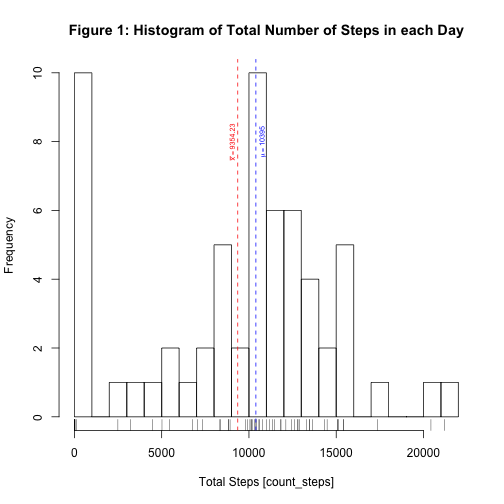
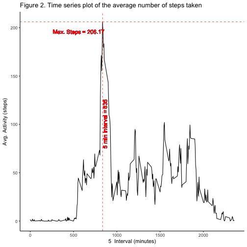
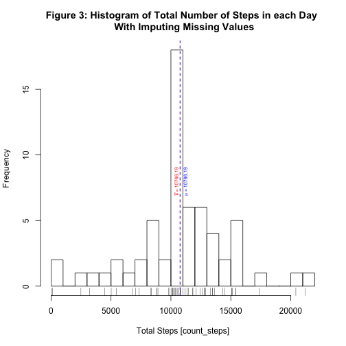
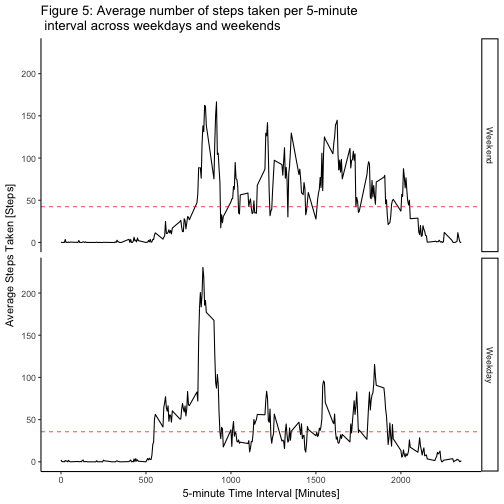

## Loading and preprocessing the data


### Library dependencies

```r
library(lubridate)
```

```
## 
## Attaching package: 'lubridate'
```

```
## The following object is masked from 'package:base':
## 
##     date
```

```r
library(ggplot2)
library(plyr);
```

```
## 
## Attaching package: 'plyr'
```

```
## The following object is masked from 'package:lubridate':
## 
##     here
```

```r
library(dplyr)
```

```
## 
## Attaching package: 'dplyr'
```

```
## The following objects are masked from 'package:plyr':
## 
##     arrange, count, desc, failwith, id, mutate, rename, summarise,
##     summarize
```

```
## The following objects are masked from 'package:lubridate':
## 
##     intersect, setdiff, union
```

```
## The following objects are masked from 'package:stats':
## 
##     filter, lag
```

```
## The following objects are masked from 'package:base':
## 
##     intersect, setdiff, setequal, union
```


### Load raw data

Load raw data from `activity.csv`


```r
activityRawSet <- read.csv("activity.csv",sep = ",", na.strings = "NA", stringsAsFactors = FALSE)

head(activityRawSet)
```

```
##   steps       date interval
## 1    NA 2012-10-01        0
## 2    NA 2012-10-01        5
## 3    NA 2012-10-01       10
## 4    NA 2012-10-01       15
## 5    NA 2012-10-01       20
## 6    NA 2012-10-01       25
```

### Prepare data

Create a data frame from `activityRawSet` and mutate date column as date object


```r
activitySet_df <- tbl_df(activityRawSet)
# add mutate date as date object
activitySet_df <- mutate(activitySet_df, date = as.Date(activitySet_df$date, "%Y-%m-%d") )
```

create data frame grouped by date and add `count_steps` variable including NA values.


```r
# create df group by date
activity_steps_taken <- activitySet_df %>%
    group_by(date) %>%
    summarize(count_steps = sum(steps,na.rm=TRUE)
    )
```

Part of data is shown as follow:


```r
# show data
activity_steps_taken
```

```
## # A tibble: 61 x 2
##          date count_steps
##        <date>       <int>
##  1 2012-10-01           0
##  2 2012-10-02         126
##  3 2012-10-03       11352
##  4 2012-10-04       12116
##  5 2012-10-05       13294
##  6 2012-10-06       15420
##  7 2012-10-07       11015
##  8 2012-10-08           0
##  9 2012-10-09       12811
## 10 2012-10-10        9900
## # ... with 51 more rows
```

## What is mean total number of steps taken per day?

The mean and median of total steps taken per day were calculated, using `mean()` and `median()` functions with `activity_steps_taken$count_steps` as parameter including observations with `NA` values.


```r
activity_mean <- mean(activity_steps_taken$count_steps)
activity_median <- median(activity_steps_taken$count_steps)
```

The mean total number of steps taken per day is:  **`9354.23`** and the median total number of steps taken per day is: **`10395`**.

*Figure 1*, shows the histogram of the total number of steps taken each day including its total mean and median values represented by red and blue doted lines respectively.


```r
# Generate histogram
hist(activity_steps_taken$count_steps, breaks=25, main="Figure 1: Histogram of Total Number of Steps in each Day", xlab="Total Steps [count_steps]")
rug(activity_steps_taken$count_steps)
abline(v = activity_mean, col = "red", lwd = 1, lty = 2)
abline(v = activity_median, col = "blue", lwd = 1, lty = 2)
text(activity_mean-0.3e3, 8, bquote(bar(x) == .(activity_mean)), col = "red", srt = 90,cex=0.6)
text(activity_median+0.4e3, 8,  bquote(mu == .(activity_median)), col = "blue", srt = 90,cex=0.6)
```




## What is the average daily activity pattern?

Grouped dataset by time interval to obtain the total number and average number of steps taken per interval, averaged across all days.


```r
# Avg number of steps grouped by interval
# create count_steps and avg_steps variables 
# include NA values
activity_time <- activitySet_df %>%
    group_by(interval) %>%
    summarize(count_steps = sum(steps,na.rm=TRUE),
              avg_steps = mean(steps,na.rm=TRUE)
    )
```

Portion of `activity_time` dataset 


```
## # A tibble: 288 x 3
##    interval count_steps avg_steps
##       <int>       <int>     <dbl>
##  1        0          91 1.7169811
##  2        5          18 0.3396226
##  3       10           7 0.1320755
##  4       15           8 0.1509434
##  5       20           4 0.0754717
##  6       25         111 2.0943396
##  7       30          28 0.5283019
##  8       35          46 0.8679245
##  9       40           0 0.0000000
## 10       45          78 1.4716981
## # ... with 278 more rows
```

The summary of `activity_time$avg_steps` shows on average the maximum number of steps in the column (`Max.`) 


```
##    Min. 1st Qu.  Median    Mean 3rd Qu.    Max. 
##   0.000   2.486  34.110  37.380  52.830 206.200
```

The 5-minute interval that on average, contains the maximum number of steps is calculated as follow:


```r
# Get the index value from the max avg_steps value of activity_time dataset 
# set result to max_interval object
max_interval<-activity_time[which.max(activity_time$avg_steps), ]
max_interval
```

```
## # A tibble: 1 x 3
##   interval count_steps avg_steps
##      <int>       <int>     <dbl>
## 1      835       10927  206.1698
```

Across all the days in the dataset, the 5-minute interval of **`835`** minutes , with a total of **`10927`** steps, on average contains a maximum of **`206.17`** steps.

*Figure 2*, shows the time series plot of the average number of steps taken, including the 5-minute interval that on average, contains the maximum number of steps (Doted red vertical line).


```r
    g2 <- ggplot(activity_time, aes(interval, avg_steps))
    g2 + geom_line() + ggtitle("Figure 2. Time series plot of the average number of steps taken") + 
    
    # Label axis
    xlab("5  Interval (minutes)") +  ylab("Avg. Activity (steps)") + 
    
    
    # Add doted lines
    geom_vline(aes(xintercept=max_interval$interval), color="red", linetype="dashed", size=1/3) +
    
    geom_hline(aes(yintercept=max_interval$avg_steps), color="red", linetype="dashed", size=1/3) + 
    
    # Add label to doted lines
    geom_text(aes(x=550, label=paste(" Max. Steps =", round(max_interval$avg_steps, digits=2),  sep=" "), y=max_interval$avg_steps-0.1e2), colour="red", size=3) + 
    
    geom_text(aes(x=max_interval$interval+0.3e2, label=paste(" 5 min Interval =", round(max_interval$interval, digits=2),  sep=" "), y=100), colour="red", angle=90, size=3) + theme_classic()
```




## Imputing missing values

Note that there are a number of days/intervals where there are missing values (coded as 𝙽𝙰). The presence of missing days may introduce bias into some calculations or summaries of the data. The total number of observations containing missing values are calculated as follow.


```r
activity_count_na_values <- sum(is.na(activityRawSet$steps))
```

The total number of observations containing missing values in steps variable is **`2304`** 

The strategy for filling in all of the missing values in the dataset is replacing NA values with the mean of 5-minute time interval and create a new dataset `activity_fill_na` that is equal to the original dataset `activitySet_df` but with the missing data filled in.


```r
# Group activitySet_df by interval
# Replace NA values in steps variable with the mean() by interval
activity_fill_na <- activitySet_df %>%
    group_by(interval)  %>%
    mutate(steps= ifelse(is.na(steps), mean(steps, na.rm=TRUE), steps))
```

Check  `activity_fill_na` dataset with 0 `NA` values


```
##    steps     date interval 
##        0        0        0
```

Portion of `activity_fill_na` dataset after imputing NA values


```
## Source: local data frame [17,568 x 3]
## Groups: interval [288]
## 
## # A tibble: 17,568 x 3
##        steps       date interval
##        <dbl>     <date>    <int>
##  1 1.7169811 2012-10-01        0
##  2 0.3396226 2012-10-01        5
##  3 0.1320755 2012-10-01       10
##  4 0.1509434 2012-10-01       15
##  5 0.0754717 2012-10-01       20
##  6 2.0943396 2012-10-01       25
##  7 0.5283019 2012-10-01       30
##  8 0.8679245 2012-10-01       35
##  9 0.0000000 2012-10-01       40
## 10 1.4716981 2012-10-01       45
## # ... with 17,558 more rows
```

Summary to compare `activity_steps_taken_im` dataset with imputed missing values and the original dataset `activity_steps_taken` 


```
##    Min. 1st Qu.  Median    Mean 3rd Qu.    Max. 
##       0    6778   10400    9354   12810   21190
```

```
##    Min. 1st Qu.  Median    Mean 3rd Qu.    Max. 
##      41    9819   10770   10770   12810   21190
```


*Figure 3*, Shows Histogram of the total number of steps taken each day after missing values are imputed including its total mean and median values represented by red and blue doted lines respectively. In this case after imputed **`2304`** missing values generates a slight increase in the values of the average and the median (compares original dataset with NA values) which causes both values, the mean and the median to be equals **`10776.19`**.


```r
# Generate histogram
hist(activity_steps_taken_im$count_steps, breaks=25, main="Figure 3: Histogram of Total Number of Steps in each Day \n With Imputing Missing Values", xlab="Total Steps [count_steps]")
rug(activity_steps_taken_im$count_steps)
abline(v = activity_mean_imp, col = "red", lwd = 1, lty = 2)
abline(v = activity_median_imp, col = "blue", lwd = 1, lty = 2)
text(activity_mean_imp-0.3e3, 8, bquote(bar(x) == .(activity_mean_imp)), col = "red", srt = 90,cex=0.6)
text(activity_median_imp+0.5e3, 8,  bquote(mu == .(activity_median_imp)), col = "blue", srt = 90,cex=0.6)
```




*Figure 4*, Shows two histograms to compare the total number of steps taken each day, the first one shows the distribution before imputing and the second one shows the distribution after imputing missing values.


```r
#Generate Histograms
par(mfrow = c(2, 1), oma = c(2, 2, 2, 2) , mar = c(2, 2, 2, 2))

# Generate histogram without imputing values (Original)
hist(activity_steps_taken$count_steps, breaks=25, main="Dataset Before Imputing Missing Values", xlab="Total Steps [count_steps]")
rug(activity_steps_taken$count_steps)
abline(v = activity_mean, col = "red", lwd = 1, lty = 2)
abline(v = activity_median, col = "blue", lwd = 1, lty = 2)
text(activity_mean-0.3e3, 8, bquote(bar(x) == .(activity_mean)), col = "red", srt = 90,cex=0.6)
text(activity_median+0.4e3, 8,  bquote(mu == .(activity_median)), col = "blue", srt = 90,cex=0.6)

# Generate histogram with imputing values
hist(activity_steps_taken_im$count_steps, breaks=25, main="Dataset After Imputing Missing Values", xlab="Total Steps [count_steps]")
rug(activity_steps_taken_im$count_steps)
abline(v = activity_mean_imp, col = "red", lwd = 1, lty = 2)
abline(v = activity_median_imp, col = "blue", lwd = 1, lty = 2)
text(activity_mean_imp-0.3e3, 8, bquote(bar(x) == .(activity_mean_imp)), col = "red", srt = 90,cex=0.6)
text(activity_median_imp+0.4e3, 8,  bquote(mu == .(activity_median_imp)), col = "blue", srt = 90,cex=0.6)

title("Figure 4: Histogram of Total Number of Steps in each Day ", outer=TRUE)
```


## Are there differences in activity patterns between weekdays and weekends?


The summary of mean and median by group (weekends and weekdays) is as follow:


```
##   day_type activity_mean
## 1  Weekend      42.36640
## 2  Weekday      35.61058
```

```
##   day_type activity_median
## 1  Weekend        32.33962
## 2  Weekday        25.80314
```

*Figure 5*, Shows Panel plot comparing the average number of steps taken per 5-minute interval across weekdays and weekends including the mean for every group.

The number of steps taken per 5-minute shows that on average, there is more activity on weekends (**42.37 Steps**)  than weekdays (**35.61 Steps**). 

Activity during weekdays starts much earlier than on weekends. On weekdays the activity take place between 8:30 and 9:30 in the morning surpassing its own average during this period and although during the weekends begins activity around 8.30 only it is observed that it surpasses its own average around the 09:30




