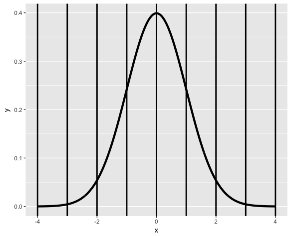
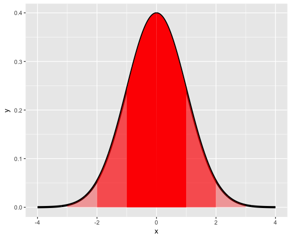
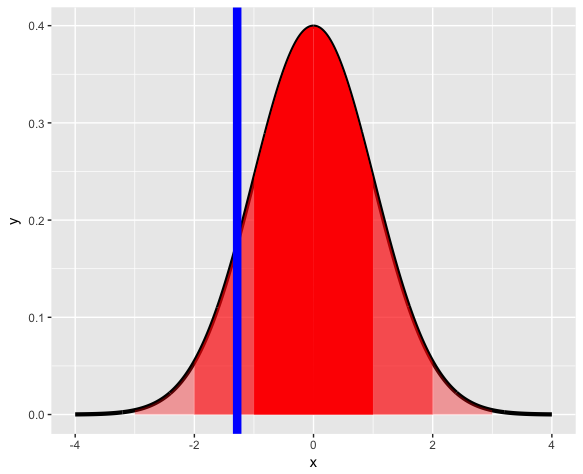

Practice Programming Assignment: swirl Lesson : Common Distributions.
=========================

Common Distributions. (Slides for this and other Data Science courses may be found at github
 https://github.com/DataScienceSpecialization/courses/. If you care to use them, they must be downloaded
 as a zip file and viewed locally. This lesson corresponds to 06_Statistical_Inference/06_CommonDistros.)

The first distribution we'll examine is the Bernoulli which is associated with experiments which have
 only 2 possible outcomes. These are also called (by people in the know) binary trials.

For simplicity, we usually say that Bernoulli random variables take only the values 1 and 0. Suppose we
 also specify that the probability that the Bernoulli outcome of 1 is p. Which of the following represents
 the probability of a 0 outcome?
```r
1: p^2
2: p
3: p(1-p)
4: 1-p

Selection: 4
```

 If the probability of a 1 is p and the probability of a 0 is 1-p which of the following represents the
 PMF of a Bernoulli distribution? Recall that the PMF is the function representing the probability that
 X=x.
```r
1: p^x * (1-p)^(1-x)
2: x*(1-x)
3: p^(1-x) *(1-p)*(1-x)
4: p*(1-p)

Selection: 1
```

Recall the definition of the expectation of a random variable. Suppose we have a Bernoulli random
 variable and, as before, the probability it equals 1 (a success) is p and probability it equals 0 (a
 failure) is 1-p. What is its mean?
```r
1: 1-p
2: p(1-p)
3: p
4: p^2

Selection: 3
```

Given the same Bernoulli random variable above, which of the following represents E(X^2)
```r
1: p(1-p)
2: p
3: 1-p
4: (1-p)^2
5: p^2

Selection: 2
```

Use the answers of the last two questions to find the variance of the Bernoulli random variable. Recall
 Var = E(X^2)-(E(X))^2
```r
1: p(1-p)
2: p(p-1)
3: p^2-p
4: p^2*(1-p)^2

Selection: 1
```

Binomial random variables are obtained as the sum of iid Bernoulli trials.  Specifically, let X_1, ...,
 X_n be iid Bernoulli(p) random variables; then X = X_1 + X_2 + ... X_n is a binomial random variable.
 Binomial random variables represent the number of successes, k, out of n independent Bernoulli trials.
 Each of the trials has probability p.

 The PMF of a binomial random variable X is the function representing the probability that X=x. In other
 words, that there are x successes out of n independent trials. Which of the following represents the PMF
 of a binomial distribution? Here x, the number of successes, goes from 0 to n, the number of trials, and
 choose(n,x) represents the binomial coefficient 'n choose x' which is the number of ways x successes out
 of n trials can occur regardless of order.
```r
1: choose(n,x) * p^x * (1-p)^(n-x)
2: p^x
3: choose(n,x) * p*x*(1-p)*(1-x)
4: choose(n,x) * p^(n-x) * (1-p)^x

Selection: 1
```

 Suppose we were going to flip a biased coin 5 times. The probability of tossing a head is .8 and a tail
 .2. What is the probability that you'll toss at least 3 heads.
 
```r
> choose(5,3)*(.8)^3*(.2)^(5-3) + choose(5,4)*(.8)^4*(.2)^(5-4) + choose(5,5)*(.8)^5*(.2)^(5-5)
[1] 0.94208
```
 Now you can verify your answer with the R function pbinom. The quantile is 2, the size is 5, the prob is
 .8 and the lower.tail is FALSE. Try it now.
 
```r
> pbinom(2,size = 5,prob = .8,lower.tail = FALSE)
[1] 0.94208
```
Another very common distribution is the normal or Gaussian. It has a complicated density function
 involving its mean mu and variance sigma^2. The key fact of the density formula is that when plotted, it
 forms a bell shaped curve, symmetric about its mean mu. The variance sigma^2 corresponds to the width of
 the bell, the higher the variance, the fatter the bell. We denote a normally distributed random variable
 X as X ~ N(mu, sigma^2).

 When mu = 0 and sigma = 1 the resulting distribution is called the standard normal distribution and it is
 often labeled Z.

Here's a picture of the density function of a standard normal distribution. It's centered at its mean 0
 and the vertical lines (at the integer points of the x-axis) indicate the standard deviations.





Approximately 68%, 95% and 99% of the normal density lie within 1, 2 and 3 standard deviations from the
 mean, respectively. These are shown in the three shaded areas of the figure. For example, the darkest
 portion (between -1 and 1) represents 68% of the area.



 The R function qnorm(prob) returns the value of x (quantile) for which the area under the standard normal
 distribution to the left of x equals the parameter prob. (Recall that the entire area under the curve is
 1.) Use qnorm now to find the 10th percentile of the standard normal. Remember the argument prob must be
 between 0 and 1. You don't have to specify any of the other parameters since the default is the standard
 normal.
```r
> qnorm(.1)
[1] -1.281552
```



 We'll see this now by drawing the vertical line at the quantile -1.281552.

Which of the following would you expect to be the 1st percentile?
```r
1: 0
2: -2.33
3: 2.33
4: -1.28
5: -1.0

Selection: 2
```

By looking at the picture can you say what the 50th percentile is?
```r
> 0
[1] 0
```

We can use the symmetry of the bell curve to determine other quantiles. Given that 2.5% of the area under
 the curve falls to the left of x=-1.96, what is the 97.5 percentile for the standard normal?
```r
1: -1.28
2: 2.33
3: 2
4: 1.96

Selection: 4
```
Here are two useful facts concerning normal distributions. If X is a normal random variable with mean mu
and variance sigma^2, i.e., X ~ N(mu,sigma^2), then the random variable Z defined as Z = (X -mu)/sigma is normally distributed with mean 0 and variance 1, i.e., Z ~ N(0, 1). (Z is standard normal.)

The converse is also true. If Z is standard normal, i.e., Z ~ N(0,1), then the random variable X defined
as X = mu + sigma*Z is normally distributed with mean mu and variance sigma^2, i.e., X ~ N(mu, sigma^2)

These formulae allow you to easily compute quantiles (and thus percentiles) for ANY normally distributed
variable if you know its mean and variance. We'll show how to find the 97.5th percentile of a normal
distribution with mean 3 and variance 4.

Again, we can use R's qnorm function and simply specify the mean and standard deviation (the square root
of the variance). Do this now. Find the 97.5th percentile of a normal distribution with mean 3 and
standard deviation 2.
```r
> qnorm(.975,mean = 3,sd = 2)
[1] 6.919928
```
Let's check it using the formula above, X = mu + sigma*Z. Here we'll use the 97.5th percentile for the
 standard normal as the value Z in the formula. Recall that we previously calculated this to be 1.96.
 Let's multiply this by the standard deviation of the given normal distribution (2) and add in its mean
 (3) to see if we get a result close to the one qnorm gave us.
```r
> 3 + 2*1.96
[1] 6.92
```
Suppose you have a normal distribution with mean 1020 and standard deviation of 50 and you want to
 compute the probability that the associated random variable X > 1200. The easiest way to do this is to
 use R's pnorm function in which you specify the quantile (1200), the mean (1020) and standard deviation
 (50). You also must specify that the lower.tail is FALSE since we're asking for a probability that the
 random variable is greater than our quantile. Do this now.
```r
> pnorm(1200,mean=1020,sd=50,lower.tail=FALSE)
[1] 0.0001591086
```
Alternatively, we could use the formula above to transform the given distribution to a standard normal.
 We compute the number of standard deviations the specified number (1200) is from the mean with Z = (X
 -mu)/sigma. This is our new quantile. We can then use the standard normal distribution and the default
 values of pnorm. Remember to specify that lower.tail is FALSE.  Do this now.
```r
> pnorm((1200 - 1020) / 50, lower.tail = FALSE)
[1] 0.0001591086
```
For practice, using the same distribution, find the 75% percentile. Use qnorm and specify the probability
 (.75), the mean (1020) and standard deviation (50). Since we want to include the left part of the curve
 we can use the default lower.tail=TRUE.
```r
> qnorm(.75,mean = 1020,sd = 50, lower.tail = TRUE)
[1] 1053.724
```
**Note that R functions pnorm and qnorm are inverses.** What would you expect pnorm(qnorm(.53)) to return?
```r
> pnorm(qnorm(.53))
[1] 0.53
```
How about qnorm(pnorm(.53))?
```r
> qnorm(pnorm(.53))
[1] 0.53
```
Now let's talk about our last common distribution, the Poisson. This is, as Wikipedia tells us, "a
 discrete probability distribution that expresses the probability of a given number of events occurring in
 a fixed interval of time and/or space if these events occur with a known average rate and independently
 of the time since the last event."

In other words, the Poisson distribution models counts or number of event in some interval of time. From
 Wikipedia, "Any variable that is Poisson distributed only takes on integer values."

The PMF of the Poisson distribution has one parameter, lambda. As with the other distributions the PMF
 calculates the probability that the Poisson distributed random variable X takes the value x.
 Specifically, P(X=x)=(lambda^x)e^(-lambda)/x!. Here x ranges from 0 to infinity.

The mean and variance of the Poisson distribution are both lambda.

Poisson random variables are used to model rates such as the rate of hard drive failures. We write
 X~Poisson(lambda*t) where lambda is the expected count per unit of time and t is the total monitoring
 time.
```r
> ppois(3,2.5 * 4)
[1] 0.01033605
```
Finally, the Poisson distribution approximates the binomial distribution in certain cases. Recall that
 the binomial distribution is the discrete distribution of the number of successes, k, out of n
 independent binary trials, each with probability p. If n is large and p is small then the Poisson
 distribution with lambda equal to n*p is a good approximation to the binomial distribution.
```r
> pbinom(q = 5, size = 1000, prob = .01, lower.tail = TRUE, log.p = FALSE)
[1] 0.06613951
```
Now use the function ppois with quantile equal to 5 and lambda equal to n*p to see if you get a similar
 result.
```r
> ppois(q = 5, lambda = 1000 * .01, lower.tail = TRUE, log.p = FALSE)
[1] 0.06708596
```
See how they're close? Pretty cool, right? This worked because n was large (1000) and p was small (.01).


